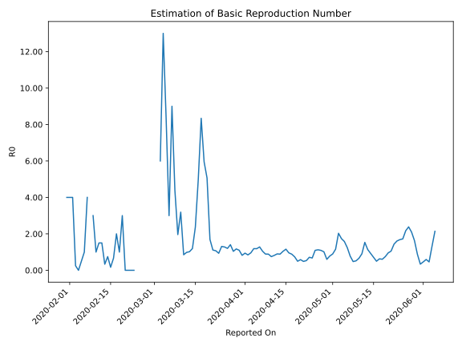

# Country Figures: Time Series for Basic Reproduction Number of Malaysia 

| Reported On | &Delta; Confirmed | Total &Delta; Confirmed First Interval | Total &Delta; Confirmed Second Interval | Estimated Basic Reproduction Number R0 | 
|-------------|-------------------|----------------------------------------|-----------------------------------------|---------------------------------------------------|
| 2020-05-07 | 39 |  252  |  325  |  0.78  | 
| 2020-05-06 | 45 |  312  |  251  |  1.24  | 
| 2020-05-05 | 30 |  351  |  222  |  1.58  | 
| 2020-05-04 | 55 |  353  |  203  |  1.74  | 
| 2020-05-03 | 122 |  325  |  160  |  2.03  | 
| 2020-05-02 | 105 |  251  |  217  |  1.16  | 
| 2020-05-01 | 69 |  222  |  248  |  0.90  | 
| 2020-04-30 | 57 |  203  |  260  |  0.78  | 
| 2020-04-29 | 94 |  160  |  266  |  0.60  | 
| 2020-04-28 | 31 |  217  |  214  |  1.01  | 
| 2020-04-27 | 40 |  248  |  227  |  1.09  | 
| 2020-04-26 | 38 |  260  |  231  |  1.13  | 
| 2020-04-25 | 51 |  266  |  243  |  1.09  | 
| 2020-04-24 | 88 |  214  |  317  |  0.68  | 
| 2020-04-23 | 71 |  227  |  318  |  0.71  | 
| 2020-04-22 | 50 |  231  |  434  |  0.53  | 
| 2020-04-21 | 57 |  243  |  499  |  0.49  | 
| 2020-04-20 | 36 |  317  |  542  |  0.58  | 
| 2020-04-19 | 84 |  318  |  641  |  0.50  | 
| 2020-04-18 | 54 |  434  |  589  |  0.74  | 
| 2020-04-17 | 69 |  499  |  564  |  0.88  | 
| 2020-04-16 | 110 |  542  |  567  |  0.96  | 
| 2020-04-15 | 85 |  641  |  553  |  1.16  | 
| 2020-04-14 | 170 |  589  |  566  |  1.04  | 
| 2020-04-13 | 134 |  564  |  636  |  0.89  | 
| 2020-04-12 | 153 |  567  |  630  |  0.90  | 
| 2020-04-11 | 184 |  553  |  677  |  0.82  | 
| 2020-04-10 | 118 |  566  |  754  |  0.75  | 
| 2020-04-09 | 109 |  636  |  717  |  0.89  | 
| 2020-04-08 | 156 |  630  |  707  |  0.89  | 
| 2020-04-07 | 170 |  677  |  646  |  1.05  | 
| 2020-04-06 | 131 |  754  |  588  |  1.28  | 
| 2020-04-05 | 179 |  717  |  605  |  1.19  | 
| 2020-04-04 | 150 |  707  |  595  |  1.19  | 
| 2020-04-03 | 217 |  646  |  674  |  0.96  | 
| 2020-04-02 | 208 |  588  |  696  |  0.84  | 
| 2020-04-01 | 142 |  605  |  643  |  0.94  | 
| 2020-03-31 | 140 |  595  |  725  |  0.82  | 
| 2020-03-30 | 156 |  674  |  613  |  1.10  | 
| 2020-03-29 | 150 |  696  |  594  |  1.17  | 
| 2020-03-28 | 159 |  643  |  618  |  1.04  | 
| 2020-03-27 | 130 |  725  |  516  |  1.41  | 
| 2020-03-26 | 235 |  613  |  510  |  1.20  | 
| 2020-03-25 | 172 |  594  |  464  |  1.28  | 
| 2020-03-24 | 106 |  618  |  472  |  1.31  | 
| 2020-03-23 | 212 |  516  |  552  |  0.93  | 
| 2020-03-22 | 123 |  510  |  476  |  1.07  | 
| 2020-03-21 | 153 |  464  |  417  |  1.11  | 
| 2020-03-20 | 130 |  472  |  279  |  1.69  | 
| 2020-03-19 | 110 |  552  |  109  |  5.06  | 
| 2020-03-18 | 117 |  476  |  80  |  5.95  | 
| 2020-03-17 | 107 |  417  |  50  |  8.34  | 
| 2020-03-16 | 138 |  279  |  56  |  4.98  | 
| 2020-03-15 | 190 |  109  |  46  |  2.37  | 
| 2020-03-14 | 41 |  80  |  67  |  1.19  | 
| 2020-03-13 | 48 |  50  |  49  |  1.02  | 
| 2020-03-12 | 0 |  56  |  57  |  0.98  | 
| 2020-03-11 | 20 |  46  |  54  |  0.85  | 
| 2020-03-10 | 12 |  67  |  21  |  3.19  | 
| 2020-03-09 | 18 |  49  |  25  |  1.96  | 
| 2020-03-08 | 6 |  57  |  13  |  4.38  | 
| 2020-03-07 | 10 |  54  |  6  |  9.00  | 
| 2020-03-06 | 33 |  21  |  7  |  3.00  | 
| 2020-03-05 | 0 |  25  |  3  |  8.33  | 
| 2020-03-04 | 14 |  13  |  1  |  13.00  | 
| 2020-03-03 | 7 |  6  |  1  |  6.00  | 
| 2020-03-02 | 0 |  7  |  None  |  None  | 
| 2020-03-01 | 4 |  3  |  None  |  None  | 
| 2020-02-29 | 2 |  1  |  None  |  None  | 
| 2020-02-28 | 0 |  1  |  None  |  None  | 
| 2020-02-27 | 1 |  None  |  None  |  None  | 
| 2020-02-26 | 0 |  None  |  None  |  None  | 
| 2020-02-25 | 0 |  None  |  None  |  None  | 
| 2020-02-24 | 0 |  None  |  None  |  None  | 
| 2020-02-23 | 0 |  None  |  3  |  None  | 
| 2020-02-22 | 0 |  None  |  3  |  None  | 
| 2020-02-21 | 0 |  None  |  4  |  None  | 
| 2020-02-20 | 0 |  None  |  4  |  None  | 
| 2020-02-19 | 0 |  3  |  1  |  3.00  | 
| 2020-02-18 | 0 |  3  |  3  |  1.00  | 
| 2020-02-17 | 0 |  4  |  2  |  2.00  | 
| 2020-02-16 | 0 |  4  |  6  |  0.67  | 
| 2020-02-15 | 3 |  1  |  6  |  0.17  | 
| 2020-02-14 | 0 |  3  |  4  |  0.75  | 
| 2020-02-13 | 1 |  2  |  6  |  0.33  | 
| 2020-02-12 | 0 |  6  |  4  |  1.50  | 
| 2020-02-11 | 0 |  6  |  4  |  1.50  | 
| 2020-02-10 | 2 |  4  |  4  |  1.00  | 
| 2020-02-09 | 0 |  6  |  2  |  3.00  | 
| 2020-02-08 | 4 |  4  |  None  |  None  | 
| 2020-02-07 | 0 |  4  |  1  |  4.00  | 
| 2020-02-06 | 0 |  4  |  4  |  1.00  | 
| 2020-02-05 | 2 |  2  |  4  |  0.50  | 
| 2020-02-04 | 2 |  None  |  4  |  None  | 
| 2020-02-03 | 0 |  1  |  4  |  0.25  | 
| 2020-02-02 | 0 |  4  |  1  |  4.00  | 
| 2020-02-01 | 0 |  4  |  1  |  4.00  | 
| 2020-01-31 | 0 |  4  |  1  |  4.00  | 
| 2020-01-30 | 1 |  4  |  None  |  None  | 
| 2020-01-29 | 3 |  1  |  None  |  None  | 
| 2020-01-28 | 0 |  1  |  None  |  None  | 
| 2020-01-27 | 0 |  1  |  None  |  None  | 
| 2020-01-26 | 1 |  None  |  None  |  None  | 
| 2020-01-25 | None |  None  |  None  |  None  | 
| 2020-01-23 | None |  None  |  None  |  None  | 

