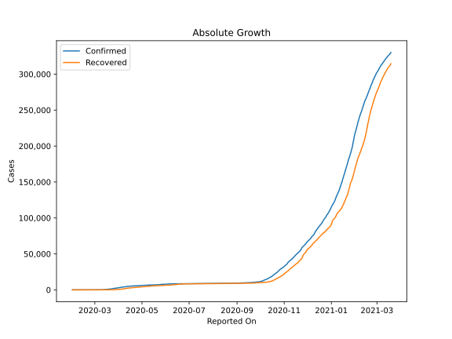
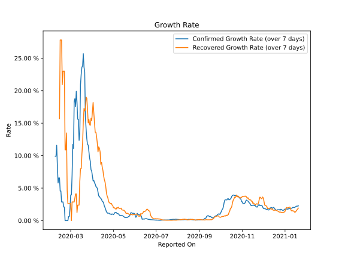

# Country Figures: Growth Rate for Malaysia 

The growth rates below are calculated based on
* an exponential growth assumption
* for time difference of past seven (7) days.
The growth rate is to be understood as on "growth per day".

The first growth rate indicates the increase of confirmed (infected) cases.

The second growth rate indicates the increase of recovered (healed) cases.

| Reported On | Confirmed | Growth Rate (Confirmed) | Recovered | Growth Rate (Recovered) |
|-------------|-----------|-------------------------|-----------|-------------------------|
| 2020-04-04 | 3483 |  5.80 %  | 915 |  15.009 %  | 
| 2020-04-03 | 3333 |  6.19 %  | 827 |  16.585 %  | 
| 2020-04-02 | 3116 |  6.11 %  | 767 |  18.169 %  | 
| 2020-04-01 | 2908 |  6.88 %  | 645 |  16.799 %  | 
| 2020-03-31 | 2766 |  7.61 %  | 537 |  15.379 %  | 
| 2020-03-30 | 2626 |  7.83 %  | 479 |  15.754 %  | 
| 2020-03-29 | 2470 |  9.10 %  | 388 |  14.665 %  | 
| 2020-03-28 | 2320 |  9.62 %  | 320 |  14.745 %  | 
| 2020-03-27 | 2161 |  10.59 %  | 259 |  15.585 %  | 
| 2020-03-26 | 2031 |  11.63 %  | 215 |  15.045 %  | 
| 2020-03-25 | 1796 |  11.73 %  | 199 |  17.128 %  | 
| 2020-03-24 | 1624 |  12.58 %  | 183 |  18.824 %  | 
| 2020-03-23 | 1518 |  14.09 %  | 159 |  19.018 %  | 
| 2020-03-22 | 1306 |  15.94 %  | 139 |  17.097 %  | 
| 2020-03-21 | 1183 |  22.91 %  | 114 |  16.869 %  | 
| 2020-03-20 | 1030 |  23.63 %  | 87 |  17.254 %  | 
| 2020-03-19 | 900 |  25.69 %  | 75 |  15.134 %  | 
| 2020-03-18 | 790 |  23.83 %  | 60 |  11.946 %  | 
| 2020-03-17 | 673 |  23.60 %  | 49 |  10.197 %  | 
| 2020-03-16 | 566 |  22.52 %  | 42 |  7.995 %  | 
| 2020-03-15 | 428 |  20.91 %  | 42 |  7.995 %  | 
| 2020-03-14 | 238 |  13.42 %  | 35 |  5.998 %  | 
| 2020-03-13 | 197 |  12.35 %  | 26 |  2.386 %  | 
| 2020-03-12 | 149 |  15.60 %  | 26 |  2.386 %  | 
| 2020-03-11 | 149 |  15.60 %  | 26 |  2.386 %  | 
| 2020-03-10 | 129 |  18.23 %  | 24 |  1.243 %  | 
| 2020-03-09 | 117 |  19.93 %  | 24 |  4.110 %  | 
| 2020-03-08 | 99 |  17.54 %  | 24 |  4.110 %  | 
| 2020-03-07 | 93 |  18.77 %  | 23 |  3.502 %  | 
| 2020-03-06 | 83 |  18.33 %  | 22 |  2.867 %  | 
| 2020-03-05 | 50 |  11.09 %  | 22 |  2.867 %  | 
| 2020-03-04 | 50 |  11.73 %  | 22 |  2.867 %  | 
| 2020-03-03 | 36 |  7.04 %  | 22 |  2.867 %  | 
| 2020-03-02 | 29 |  3.95 %  | 18 |  None  | 
| 2020-03-01 | 29 |  3.95 %  | 18 |  2.605 %  | 
| 2020-02-29 | 25 |  1.83 %  | 18 |  2.605 %  | 
| 2020-02-28 | 23 |  0.64 %  | 18 |  2.605 %  | 
| 2020-02-27 | 23 |  0.64 %  | 18 |  2.605 %  | 
| 2020-02-26 | 22 |  None  | 18 |  2.605 %  | 
| 2020-02-25 | 22 |  None  | 18 |  4.649 %  | 
| 2020-02-24 | 22 |  None  | 18 |  13.492 %  | 
| 2020-02-23 | 22 |  None  | 15 |  10.888 %  | 
| 2020-02-22 | 22 |  None  | 15 |  10.888 %  | 
| 2020-02-21 | 22 |  2.09 %  | 15 |  22.992 %  | 
| 2020-02-20 | 22 |  2.09 %  | 15 |  22.992 %  | 
| 2020-02-19 | 22 |  2.87 %  | 15 |  22.992 %  | 
| 2020-02-18 | 22 |  2.87 %  | 13 |  20.948 %  | 
| 2020-02-17 | 22 |  2.87 %  | 7 |  27.799 %  | 
| 2020-02-16 | 22 |  4.55 %  | 7 |  27.799 %  | 
| 2020-02-15 | 22 |  4.55 %  | 7 |  27.799 %  | 
| 2020-02-14 | 19 |  6.56 %  | 3 |  15.694 %  | 
| 2020-02-13 | 19 |  6.56 %  | 3 |  None  | 
| 2020-02-12 | 18 |  5.79 %  | 3 |  None  | 
| 2020-02-11 | 18 |  8.40 %  | 3 |  None  | 
| 2020-02-10 | 18 |  11.58 %  | 1 |  None  | 
| 2020-02-09 | 16 |  9.90 %  | 1 |  None  | 
| 2020-02-08 | 16 |  9.90 %  | 1 |  None  | 
| 2020-02-07 | 12 |  None  | 1 |  None  | 
| 2020-02-06 | 12 |  None  | 0 |  None  | 
| 2020-02-05 | 12 |  None  | 0 |  None  | 
| 2020-02-04 | 10 |  None  | 0 |  None  | 
| 2020-02-03 | 8 |  None  | 0 |  None  | 
| 2020-02-02 | 8 |  None  | 0 |  None  | 
| 2020-02-01 | 8 |  None  | 0 |  None  | 

