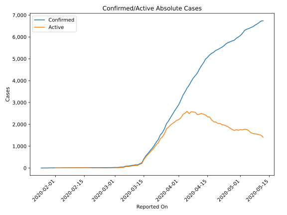
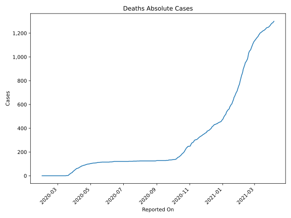
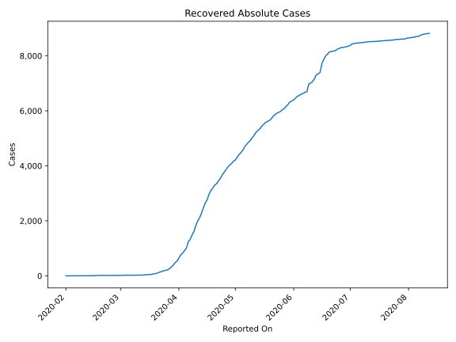
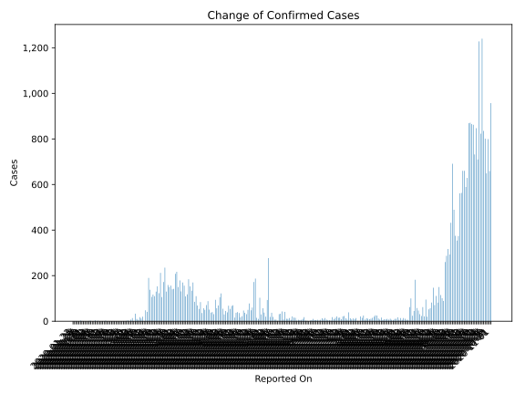
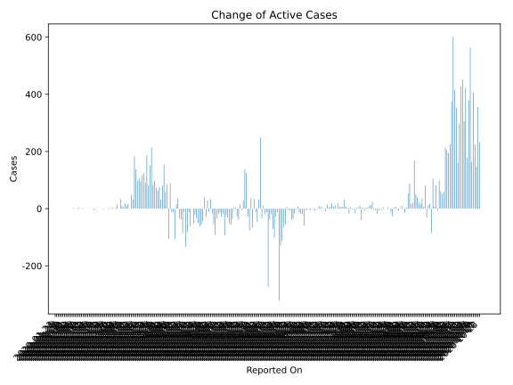
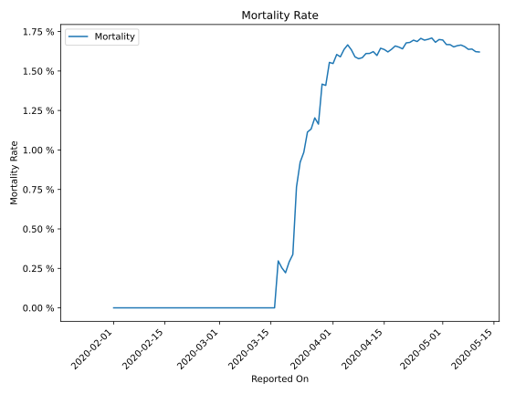

# Country Figures: Time Series for Malaysia 

| Reported On | Confirmed | Deaths | Recovered | Active | Mortality | &Delta; Confirmed | &Delta; Deaths | &Delta; Recovered | &Delta; Active | % Active of Population |
|-------------|-----------|--------|-----------|--------|-----------|-------------------|----------------|-------------------|----------------|------------------------|
| 2020-04-14 | 4987 | 82 | 2478 | 2427 |  1.64 %  | 170 | 5 | 202 | -37 |  0.008 %  | 
| 2020-04-13 | 4817 | 77 | 2276 | 2464 |  1.60 %  | 134 | 1 | 168 | -35 |  0.008 %  | 
| 2020-04-12 | 4683 | 76 | 2108 | 2499 |  1.62 %  | 153 | 3 | 113 | 37 |  0.008 %  | 
| 2020-04-11 | 4530 | 73 | 1995 | 2462 |  1.61 %  | 184 | 3 | 165 | 16 |  0.008 %  | 
| 2020-04-10 | 4346 | 70 | 1830 | 2446 |  1.61 %  | 118 | 3 | 222 | -107 |  0.008 %  | 
| 2020-04-09 | 4228 | 67 | 1608 | 2553 |  1.58 %  | 109 | 2 | 121 | -14 |  0.008 %  | 
| 2020-04-08 | 4119 | 65 | 1487 | 2567 |  1.58 %  | 156 | 2 | 166 | -12 |  0.008 %  | 
| 2020-04-07 | 3963 | 63 | 1321 | 2579 |  1.59 %  | 170 | 1 | 80 | 89 |  0.008 %  | 
| 2020-04-06 | 3793 | 62 | 1241 | 2490 |  1.63 %  | 131 | 1 | 236 | -106 |  0.008 %  | 
| 2020-04-05 | 3662 | 61 | 1005 | 2596 |  1.67 %  | 179 | 4 | 90 | 85 |  0.008 %  | 
| 2020-04-04 | 3483 | 57 | 915 | 2511 |  1.64 %  | 150 | 4 | 88 | 58 |  0.008 %  | 
| 2020-04-03 | 3333 | 53 | 827 | 2453 |  1.59 %  | 217 | 3 | 60 | 154 |  0.008 %  | 
| 2020-04-02 | 3116 | 50 | 767 | 2299 |  1.60 %  | 208 | 5 | 122 | 81 |  0.007 %  | 
| 2020-04-01 | 2908 | 45 | 645 | 2218 |  1.55 %  | 142 | 2 | 108 | 32 |  0.007 %  | 
| 2020-03-31 | 2766 | 43 | 537 | 2186 |  1.55 %  | 140 | 6 | 58 | 76 |  0.007 %  | 
| 2020-03-30 | 2626 | 37 | 479 | 2110 |  1.41 %  | 156 | 2 | 91 | 63 |  0.007 %  | 
| 2020-03-29 | 2470 | 35 | 388 | 2047 |  1.42 %  | 150 | 8 | 68 | 74 |  0.006 %  | 
| 2020-03-28 | 2320 | 27 | 320 | 1973 |  1.16 %  | 159 | 1 | 61 | 97 |  0.006 %  | 
| 2020-03-27 | 2161 | 26 | 259 | 1876 |  1.20 %  | 130 | 3 | 44 | 83 |  0.006 %  | 
| 2020-03-26 | 2031 | 23 | 215 | 1793 |  1.13 %  | 235 | 3 | 16 | 216 |  0.006 %  | 
| 2020-03-25 | 1796 | 20 | 199 | 1577 |  1.11 %  | 172 | 4 | 16 | 152 |  0.005 %  | 
| 2020-03-24 | 1624 | 16 | 183 | 1425 |  0.99 %  | 106 | 2 | 24 | 80 |  0.005 %  | 
| 2020-03-23 | 1518 | 14 | 159 | 1345 |  0.92 %  | 212 | 4 | 20 | 188 |  0.004 %  | 
| 2020-03-22 | 1306 | 10 | 139 | 1157 |  0.77 %  | 123 | 6 | 25 | 92 |  0.004 %  | 
| 2020-03-21 | 1183 | 4 | 114 | 1065 |  0.34 %  | 153 | 1 | 27 | 125 |  0.003 %  | 
| 2020-03-20 | 1030 | 3 | 87 | 940 |  0.29 %  | 130 | 1 | 12 | 117 |  0.003 %  | 
| 2020-03-19 | 900 | 2 | 75 | 823 |  0.22 %  | 110 | 0 | 15 | 95 |  0.003 %  | 
| 2020-03-18 | 790 | 2 | 60 | 728 |  0.25 %  | 117 | 0 | 11 | 106 |  0.002 %  | 
| 2020-03-17 | 673 | 2 | 49 | 622 |  0.30 %  | 107 | 2 | 7 | 98 |  0.002 %  | 
| 2020-03-16 | 566 | 0 | 42 | 524 |  None  | 138 | 0 | 0 | 138 |  0.002 %  | 
| 2020-03-15 | 428 | 0 | 42 | 386 |  None  | 190 | 0 | 7 | 183 |  0.001 %  | 
| 2020-03-14 | 238 | 0 | 35 | 203 |  None  | 41 | 0 | 9 | 32 |  0.001 %  | 
| 2020-03-13 | 197 | 0 | 26 | 171 |  None  | 48 | 0 | 0 | 48 |  0.001 %  | 
| 2020-03-12 | 149 | 0 | 26 | 123 |  None  | 0 | 0 | 0 | 0 |  0.000 %  | 
| 2020-03-11 | 149 | 0 | 26 | 123 |  None  | 20 | 0 | 2 | 18 |  0.000 %  | 
| 2020-03-10 | 129 | 0 | 24 | 105 |  None  | 12 | 0 | 0 | 12 |  0.000 %  | 
| 2020-03-09 | 117 | 0 | 24 | 93 |  None  | 18 | 0 | 0 | 18 |  0.000 %  | 
| 2020-03-08 | 99 | 0 | 24 | 75 |  None  | 6 | 0 | 1 | 5 |  0.000 %  | 
| 2020-03-07 | 93 | 0 | 23 | 70 |  None  | 10 | 0 | 1 | 9 |  0.000 %  | 
| 2020-03-06 | 83 | 0 | 22 | 61 |  None  | 33 | 0 | 0 | 33 |  0.000 %  | 
| 2020-03-05 | 50 | 0 | 22 | 28 |  None  | 0 | 0 | 0 | 0 |  0.000 %  | 
| 2020-03-04 | 50 | 0 | 22 | 28 |  None  | 14 | 0 | 0 | 14 |  0.000 %  | 
| 2020-03-03 | 36 | 0 | 22 | 14 |  None  | 7 | 0 | 4 | 3 |  0.000 %  | 
| 2020-03-02 | 29 | 0 | 18 | 11 |  None  | 0 | 0 | 0 | 0 |  0.000 %  | 
| 2020-03-01 | 29 | 0 | 18 | 11 |  None  | 4 | 0 | 0 | 4 |  0.000 %  | 
| 2020-02-29 | 25 | 0 | 18 | 7 |  None  | 2 | 0 | 0 | 2 |  0.000 %  | 
| 2020-02-28 | 23 | 0 | 18 | 5 |  None  | 0 | 0 | 0 | 0 |  0.000 %  | 
| 2020-02-27 | 23 | 0 | 18 | 5 |  None  | 1 | 0 | 0 | 1 |  0.000 %  | 
| 2020-02-26 | 22 | 0 | 18 | 4 |  None  | 0 | 0 | 0 | 0 |  0.000 %  | 
| 2020-02-25 | 22 | 0 | 18 | 4 |  None  | 0 | 0 | 0 | 0 |  0.000 %  | 
| 2020-02-24 | 22 | 0 | 18 | 4 |  None  | 0 | 0 | 3 | -3 |  0.000 %  | 
| 2020-02-23 | 22 | 0 | 15 | 7 |  None  | 0 | 0 | 0 | 0 |  0.000 %  | 
| 2020-02-22 | 22 | 0 | 15 | 7 |  None  | 0 | 0 | 0 | 0 |  0.000 %  | 
| 2020-02-21 | 22 | 0 | 15 | 7 |  None  | 0 | 0 | 0 | 0 |  0.000 %  | 
| 2020-02-20 | 22 | 0 | 15 | 7 |  None  | 0 | 0 | 0 | 0 |  0.000 %  | 
| 2020-02-19 | 22 | 0 | 15 | 7 |  None  | 0 | 0 | 2 | -2 |  0.000 %  | 
| 2020-02-18 | 22 | 0 | 13 | 9 |  None  | 0 | 0 | 6 | -6 |  0.000 %  | 
| 2020-02-17 | 22 | 0 | 7 | 15 |  None  | 0 | 0 | 0 | 0 |  0.000 %  | 
| 2020-02-16 | 22 | 0 | 7 | 15 |  None  | 0 | 0 | 0 | 0 |  0.000 %  | 
| 2020-02-15 | 22 | 0 | 7 | 15 |  None  | 3 | 0 | 4 | -1 |  0.000 %  | 
| 2020-02-14 | 19 | 0 | 3 | 16 |  None  | 0 | 0 | 0 | 0 |  0.000 %  | 
| 2020-02-13 | 19 | 0 | 3 | 16 |  None  | 1 | 0 | 0 | 1 |  0.000 %  | 
| 2020-02-12 | 18 | 0 | 3 | 15 |  None  | 0 | 0 | 0 | 0 |  0.000 %  | 
| 2020-02-11 | 18 | 0 | 3 | 15 |  None  | 0 | 0 | 2 | -2 |  0.000 %  | 
| 2020-02-10 | 18 | 0 | 1 | 17 |  None  | 2 | 0 | 0 | 2 |  0.000 %  | 
| 2020-02-09 | 16 | 0 | 1 | 15 |  None  | 0 | 0 | 0 | 0 |  0.000 %  | 
| 2020-02-08 | 16 | 0 | 1 | 15 |  None  | 4 | 0 | 0 | 4 |  0.000 %  | 
| 2020-02-07 | 12 | 0 | 1 | 11 |  None  | 0 | 0 | 1 | -1 |  0.000 %  | 
| 2020-02-06 | 12 | 0 | 0 | 12 |  None  | 0 | 0 | 0 | 0 |  0.000 %  | 
| 2020-02-05 | 12 | 0 | 0 | 12 |  None  | 2 | 0 | 0 | 2 |  0.000 %  | 
| 2020-02-04 | 10 | 0 | 0 | 10 |  None  | 2 | 0 | 0 | 2 |  0.000 %  | 
| 2020-02-03 | 8 | 0 | 0 | 8 |  None  | 0 | 0 | 0 | 0 |  0.000 %  | 
| 2020-02-02 | 8 | 0 | 0 | 8 |  None  | 0 | 0 | 0 | 0 |  0.000 %  | 
| 2020-02-01 | 8 | 0 | 0 | 8 |  None  | 0 | None | None | None |  0.000 %  | 
| 2020-01-31 | 8 | None | None | None |  None  | 0 | None | None | None |  n/a  | 
| 2020-01-30 | 8 | None | None | None |  None  | 1 | None | None | None |  n/a  | 
| 2020-01-29 | 7 | None | None | None |  None  | 3 | None | None | None |  n/a  | 
| 2020-01-28 | 4 | None | None | None |  None  | 0 | None | None | None |  n/a  | 
| 2020-01-27 | 4 | None | None | None |  None  | 0 | None | None | None |  n/a  | 
| 2020-01-26 | 4 | None | None | None |  None  | 1 | None | None | None |  n/a  | 
| 2020-01-25 | 3 | None | None | None |  None  | None | None | None | None |  n/a  | 
| 2020-01-23 | None | None | None | None |  None  | None | None | None | None |  n/a  | 

