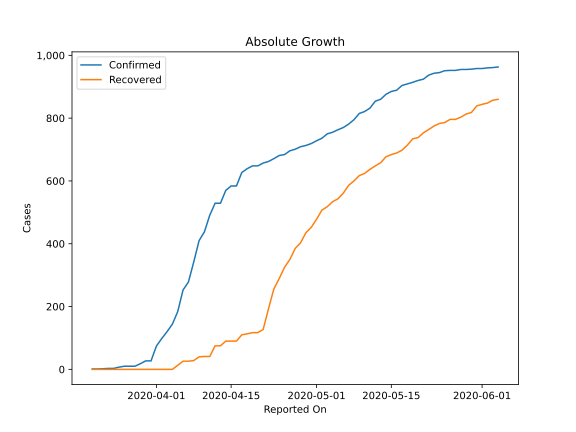
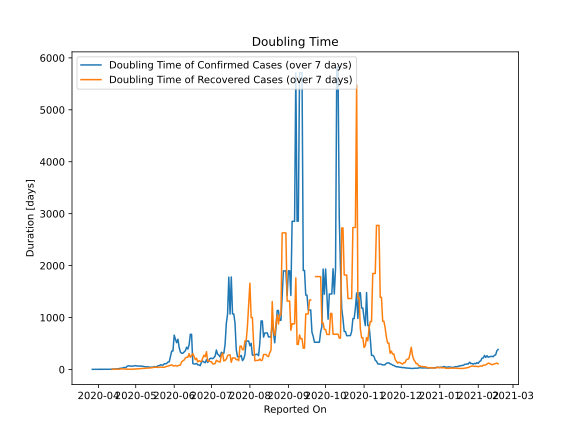

# Country Figures: Doubling Time of Infections for Niger 

The doubling time below are calculated based on
* an exponential growth assumption
* for time difference of past seven (7) days.
The doubling time's unit is "days".

The first doubling time indicates the increase of confirmed (infected)
cases. There, the *higher* the number is, the better is to take control
of the disease.

The second doubling time indicates the increase of recovered (healed)
cases. There, the *lower* the number is, the better it is to take
control of the disease.

| Reported On | Confirmed | Doubling Time (Confirmed) | Recovered | Doubling Time (Recovered) |
|-------------|-----------|---------------------------|-----------|---------------------------|
| 2020-04-25 | 684 |  71.6 days  | 325 |  4.9 days  | 
| 2020-04-24 | 681 |  59.1 days  | 289 |  5.4 days  | 
| 2020-04-23 | 671 |  35.3 days  | 256 |  5.0 days  | 
| 2020-04-22 | 662 |  39.0 days  | 193 |  6.7 days  | 
| 2020-04-21 | 657 |  34.5 days  | 127 |  14.4 days  | 
| 2020-04-20 | 648 |  24.3 days  | 117 |  11.3 days  | 
| 2020-04-19 | 648 |  24.3 days  | 117 |  11.3 days  | 
| 2020-04-18 | 639 |  18.8 days  | 113 |  5.1 days  | 
| 2020-04-17 | 627 |  13.9 days  | 110 |  5.3 days  | 
| 2020-04-16 | 584 |  14.1 days  | 90 |  6.3 days  | 
| 2020-04-15 | 584 |  9.4 days  | 90 |  4.5 days  | 
| 2020-04-14 | 570 |  7.1 days  | 90 |  4.2 days  | 
| 2020-04-13 | 529 |  6.9 days  | 75 |  4.9 days  | 
| 2020-04-12 | 529 |  4.9 days  | 75 |  3.1 days  | 
| 2020-04-11 | 491 |  4.3 days  | 41 |  None  | 
| 2020-04-10 | 438 |  4.1 days  | 41 |  None  | 
| 2020-04-09 | 410 |  3.7 days  | 40 |  None  | 
| 2020-04-08 | 342 |  3.5 days  | 28 |  None  | 
| 2020-04-07 | 278 |  2.4 days  | 26 |  None  | 
| 2020-04-06 | 253 |  2.5 days  | 26 |  None  | 
| 2020-04-05 | 184 |  2.4 days  | 13 |  None  | 
| 2020-04-04 | 144 |  2.1 days  | 0 |  None  | 
| 2020-04-03 | 120 |  2.3 days  | 0 |  None  | 
| 2020-04-02 | 98 |  2.5 days  | 0 |  None  | 
| 2020-04-01 | 74 |  2.4 days  | 0 |  None  | 
| 2020-03-31 | 27 |  2.5 days  | 0 |  None  | 
| 2020-03-30 | 27 |  2.5 days  | 0 |  None  | 
| 2020-03-29 | 18 |  2.5 days  | 0 |  None  | 
| 2020-03-28 | 10 |  2.4 days  | 0 |  None  | 
| 2020-03-27 | 10 |  2.4 days  | 0 |  None  | 
| 2020-03-26 | 10 |  None  | 0 |  None  | 
| 2020-03-25 | 7 |  None  | 0 |  None  | 
| 2020-03-24 | 3 |  None  | 0 |  None  | 
| 2020-03-23 | 3 |  None  | 0 |  None  | 
| 2020-03-22 | 2 |  None  | 0 |  None  | 
| 2020-03-21 | 1 |  None  | 0 |  None  | 
| 2020-03-20 | 1 |  None  | 0 |  None  | 

