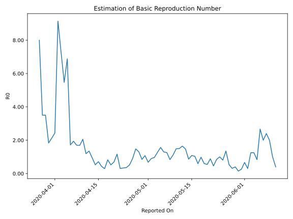

# Country Figures: Time Series for Basic Reproduction Number of Niger 

| Reported On | &Delta; Confirmed | Total &Delta; Confirmed First Interval | Total &Delta; Confirmed Second Interval | Estimated Basic Reproduction Number R0 | 
|-------------|-------------------|----------------------------------------|-----------------------------------------|---------------------------------------------------|
| 2020-05-05 | 8 |  36  |  23  |  1.57  | 
| 2020-05-04 | 5 |  37  |  29  |  1.28  | 
| 2020-05-03 | 14 |  27  |  28  |  0.96  | 
| 2020-05-02 | 8 |  27  |  30  |  0.90  | 
| 2020-05-01 | 9 |  23  |  34  |  0.68  | 
| 2020-04-30 | 6 |  29  |  27  |  1.07  | 
| 2020-04-29 | 4 |  28  |  33  |  0.85  | 
| 2020-04-28 | 8 |  30  |  23  |  1.30  | 
| 2020-04-27 | 5 |  34  |  23  |  1.48  | 
| 2020-04-26 | 12 |  27  |  30  |  0.90  | 
| 2020-04-25 | 3 |  33  |  64  |  0.52  | 
| 2020-04-24 | 10 |  23  |  64  |  0.36  | 
| 2020-04-23 | 9 |  23  |  69  |  0.33  | 
| 2020-04-22 | 5 |  30  |  98  |  0.31  | 
| 2020-04-21 | 9 |  64  |  55  |  1.16  | 
| 2020-04-20 | 0 |  64  |  93  |  0.69  | 
| 2020-04-19 | 9 |  69  |  132  |  0.52  | 
| 2020-04-18 | 12 |  98  |  119  |  0.82  | 
| 2020-04-17 | 43 |  55  |  187  |  0.29  | 
| 2020-04-16 | 0 |  93  |  213  |  0.44  | 
| 2020-04-15 | 14 |  132  |  185  |  0.71  | 
| 2020-04-14 | 41 |  119  |  226  |  0.53  | 
| 2020-04-13 | 0 |  187  |  198  |  0.94  | 
| 2020-04-12 | 38 |  213  |  158  |  1.35  | 
| 2020-04-11 | 53 |  185  |  155  |  1.19  | 
| 2020-04-10 | 28 |  226  |  110  |  2.05  | 
| 2020-04-09 | 68 |  198  |  117  |  1.69  | 
| 2020-04-08 | 64 |  158  |  93  |  1.70  | 
| 2020-04-07 | 25 |  155  |  80  |  1.94  | 
| 2020-04-06 | 69 |  110  |  64  |  1.72  | 
| 2020-04-05 | 40 |  117  |  17  |  6.88  | 
| 2020-04-04 | 24 |  93  |  17  |  5.47  | 
| 2020-04-03 | 22 |  80  |  11  |  7.27  | 
| 2020-04-02 | 24 |  64  |  7  |  9.14  | 
| 2020-04-01 | 47 |  17  |  7  |  2.43  | 
| 2020-03-31 | 0 |  17  |  8  |  2.12  | 
| 2020-03-30 | 9 |  11  |  6  |  1.83  | 
| 2020-03-29 | 8 |  7  |  2  |  3.50  | 
| 2020-03-28 | 0 |  7  |  2  |  3.50  | 
| 2020-03-27 | 0 |  8  |  1  |  8.00  | 
| 2020-03-26 | 3 |  6  |  None  |  None  | 
| 2020-03-25 | 4 |  2  |  None  |  None  | 
| 2020-03-24 | 0 |  2  |  None  |  None  | 
| 2020-03-23 | 1 |  1  |  None  |  None  | 
| 2020-03-22 | 1 |  None  |  None  |  None  | 
| 2020-03-21 | 0 |  None  |  None  |  None  | 
| 2020-03-20 | None |  None  |  None  |  None  | 

