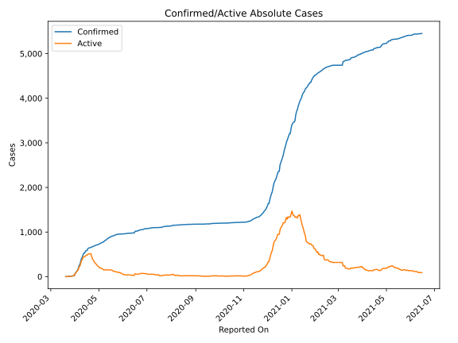
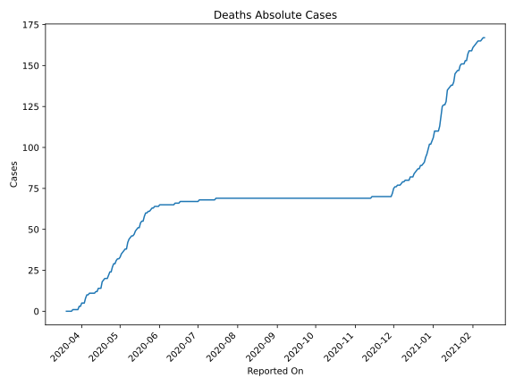
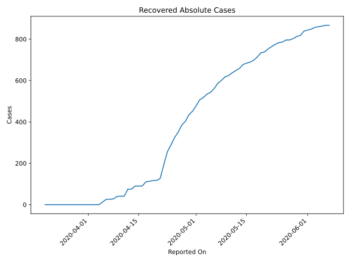
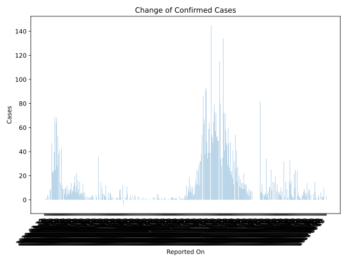
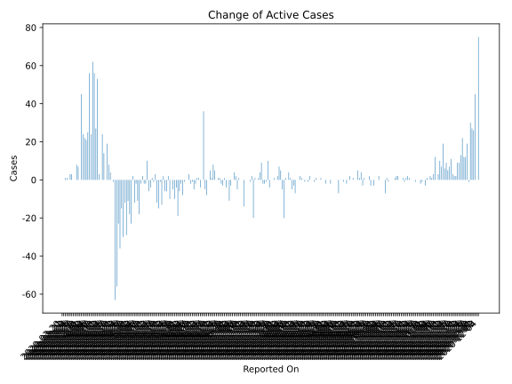
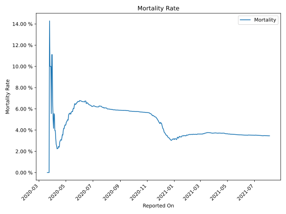

# Country Figures: Time Series for Niger 

| Reported On | Confirmed | Deaths | Recovered | Active | Mortality | &Delta; Confirmed | &Delta; Deaths | &Delta; Recovered | &Delta; Active | % Active of Population |
|-------------|-----------|--------|-----------|--------|-----------|-------------------|----------------|-------------------|----------------|------------------------|
| 2020-05-07 | 781 | 42 | 586 | 153 |  5.38 %  | 11 | 4 | 25 | -18 |  0.001 %  | 
| 2020-05-06 | 770 | 38 | 561 | 171 |  4.94 %  | 7 | 0 | 18 | -11 |  0.001 %  | 
| 2020-05-05 | 763 | 38 | 543 | 182 |  4.98 %  | 8 | 1 | 9 | -2 |  0.001 %  | 
| 2020-05-04 | 755 | 37 | 534 | 184 |  4.90 %  | 5 | 1 | 16 | -12 |  0.001 %  | 
| 2020-05-03 | 750 | 36 | 518 | 196 |  4.80 %  | 14 | 1 | 11 | 2 |  0.001 %  | 
| 2020-05-02 | 736 | 35 | 507 | 194 |  4.76 %  | 8 | 2 | 29 | -23 |  0.001 %  | 
| 2020-05-01 | 728 | 33 | 478 | 217 |  4.53 %  | 9 | 1 | 26 | -18 |  0.001 %  | 
| 2020-04-30 | 719 | 32 | 452 | 235 |  4.45 %  | 6 | 0 | 17 | -11 |  0.001 %  | 
| 2020-04-29 | 713 | 32 | 435 | 246 |  4.49 %  | 4 | 1 | 32 | -29 |  0.001 %  | 
| 2020-04-28 | 709 | 31 | 403 | 275 |  4.37 %  | 8 | 2 | 18 | -12 |  0.001 %  | 
| 2020-04-27 | 701 | 29 | 385 | 287 |  4.14 %  | 5 | 0 | 35 | -30 |  0.001 %  | 
| 2020-04-26 | 696 | 29 | 350 | 317 |  4.17 %  | 12 | 2 | 25 | -15 |  0.001 %  | 
| 2020-04-25 | 684 | 27 | 325 | 332 |  3.95 %  | 3 | 3 | 36 | -36 |  0.001 %  | 
| 2020-04-24 | 681 | 24 | 289 | 368 |  3.52 %  | 10 | 0 | 33 | -23 |  0.002 %  | 
| 2020-04-23 | 671 | 24 | 256 | 391 |  3.58 %  | 9 | 2 | 63 | -56 |  0.002 %  | 
| 2020-04-22 | 662 | 22 | 193 | 447 |  3.32 %  | 5 | 2 | 66 | -63 |  0.002 %  | 
| 2020-04-21 | 657 | 20 | 127 | 510 |  3.04 %  | 9 | 0 | 10 | -1 |  0.002 %  | 
| 2020-04-20 | 648 | 20 | 117 | 511 |  3.09 %  | 0 | 0 | 0 | 0 |  0.002 %  | 
| 2020-04-19 | 648 | 20 | 117 | 511 |  3.09 %  | 9 | 1 | 4 | 4 |  0.002 %  | 
| 2020-04-18 | 639 | 19 | 113 | 507 |  2.97 %  | 12 | 1 | 3 | 8 |  0.002 %  | 
| 2020-04-17 | 627 | 18 | 110 | 499 |  2.87 %  | 43 | 4 | 20 | 19 |  0.002 %  | 
| 2020-04-16 | 584 | 14 | 90 | 480 |  2.40 %  | 0 | 0 | 0 | 0 |  0.002 %  | 
| 2020-04-15 | 584 | 14 | 90 | 480 |  2.40 %  | 14 | 0 | 0 | 14 |  0.002 %  | 
| 2020-04-14 | 570 | 14 | 90 | 466 |  2.46 %  | 41 | 2 | 15 | 24 |  0.002 %  | 
| 2020-04-13 | 529 | 12 | 75 | 442 |  2.27 %  | 0 | 0 | 0 | 0 |  0.002 %  | 
| 2020-04-12 | 529 | 12 | 75 | 442 |  2.27 %  | 38 | 1 | 34 | 3 |  0.002 %  | 
| 2020-04-11 | 491 | 11 | 41 | 439 |  2.24 %  | 53 | 0 | 0 | 53 |  0.002 %  | 
| 2020-04-10 | 438 | 11 | 41 | 386 |  2.51 %  | 28 | 0 | 1 | 27 |  0.002 %  | 
| 2020-04-09 | 410 | 11 | 40 | 359 |  2.68 %  | 68 | 0 | 12 | 56 |  0.002 %  | 
| 2020-04-08 | 342 | 11 | 28 | 303 |  3.22 %  | 64 | 0 | 2 | 62 |  0.001 %  | 
| 2020-04-07 | 278 | 11 | 26 | 241 |  3.96 %  | 25 | 1 | 0 | 24 |  0.001 %  | 
| 2020-04-06 | 253 | 10 | 26 | 217 |  3.95 %  | 69 | 0 | 13 | 56 |  0.001 %  | 
| 2020-04-05 | 184 | 10 | 13 | 161 |  5.43 %  | 40 | 2 | 13 | 25 |  0.001 %  | 
| 2020-04-04 | 144 | 8 | 0 | 136 |  5.56 %  | 24 | 3 | 0 | 21 |  0.001 %  | 
| 2020-04-03 | 120 | 5 | 0 | 115 |  4.17 %  | 22 | 0 | 0 | 22 |  0.001 %  | 
| 2020-04-02 | 98 | 5 | 0 | 93 |  5.10 %  | 24 | 0 | 0 | 24 |  0.000 %  | 
| 2020-04-01 | 74 | 5 | 0 | 69 |  6.76 %  | 47 | 2 | 0 | 45 |  0.000 %  | 
| 2020-03-31 | 27 | 3 | 0 | 24 |  11.11 %  | 0 | 0 | 0 | 0 |  0.000 %  | 
| 2020-03-30 | 27 | 3 | 0 | 24 |  11.11 %  | 9 | 2 | 0 | 7 |  0.000 %  | 
| 2020-03-29 | 18 | 1 | 0 | 17 |  5.56 %  | 8 | 0 | 0 | 8 |  0.000 %  | 
| 2020-03-28 | 10 | 1 | 0 | 9 |  10.00 %  | 0 | 0 | 0 | 0 |  0.000 %  | 
| 2020-03-27 | 10 | 1 | 0 | 9 |  10.00 %  | 0 | 0 | 0 | 0 |  0.000 %  | 
| 2020-03-26 | 10 | 1 | 0 | 9 |  10.00 %  | 3 | 0 | 0 | 3 |  0.000 %  | 
| 2020-03-25 | 7 | 1 | 0 | 6 |  14.29 %  | 4 | 1 | 0 | 3 |  0.000 %  | 
| 2020-03-24 | 3 | 0 | 0 | 3 |  None  | 0 | 0 | 0 | 0 |  0.000 %  | 
| 2020-03-23 | 3 | 0 | 0 | 3 |  None  | 1 | 0 | 0 | 1 |  0.000 %  | 
| 2020-03-22 | 2 | 0 | 0 | 2 |  None  | 1 | 0 | 0 | 1 |  0.000 %  | 
| 2020-03-21 | 1 | 0 | 0 | 1 |  None  | 0 | 0 | 0 | 0 |  0.000 %  | 
| 2020-03-20 | 1 | 0 | 0 | 1 |  None  | None | None | None | None |  0.000 %  | 

