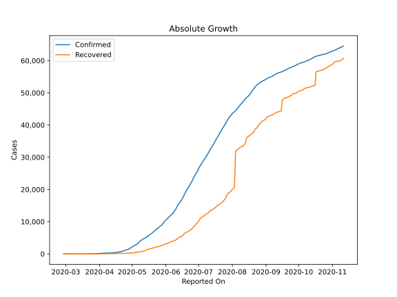
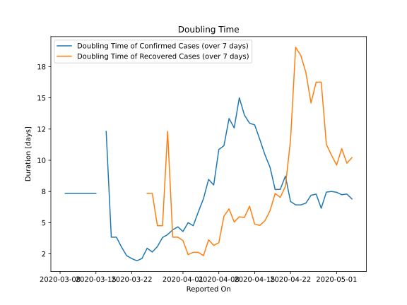

# Country Figures: Doubling Time of Infections for Nigeria 

The doubling time below are calculated based on
* an exponential growth assumption
* for time difference of past seven (7) days.
The doubling time's unit is "days".

The first doubling time indicates the increase of confirmed (infected)
cases. There, the *higher* the number is, the better is to take control
of the disease.

The second doubling time indicates the increase of recovered (healed)
cases. There, the *lower* the number is, the better it is to take
control of the disease.

| Reported On | Confirmed | Doubling Time (Confirmed) | Recovered | Doubling Time (Recovered) |
|-------------|-----------|---------------------------|-----------|---------------------------|
| 2020-04-24 | 1095 |  6.4 days  | 208 |  18.4 days  | 
| 2020-04-23 | 981 |  6.4 days  | 197 |  19.1 days  | 
| 2020-04-22 | 873 |  6.7 days  | 197 |  11.6 days  | 
| 2020-04-21 | 665 |  8.7 days  | 188 |  7.9 days  | 
| 2020-04-20 | 665 |  7.7 days  | 188 |  7.0 days  | 
| 2020-04-19 | 627 |  7.7 days  | 170 |  7.3 days  | 
| 2020-04-18 | 542 |  9.4 days  | 166 |  6.0 days  | 
| 2020-04-17 | 493 |  10.4 days  | 159 |  5.2 days  | 
| 2020-04-16 | 442 |  11.7 days  | 152 |  4.8 days  | 
| 2020-04-15 | 407 |  12.8 days  | 128 |  4.9 days  | 
| 2020-04-14 | 373 |  13.0 days  | 99 |  6.3 days  | 
| 2020-04-13 | 343 |  13.6 days  | 91 |  5.4 days  | 
| 2020-04-12 | 323 |  15.0 days  | 85 |  5.5 days  | 
| 2020-04-11 | 318 |  12.6 days  | 70 |  5.1 days  | 
| 2020-04-10 | 305 |  13.3 days  | 58 |  6.1 days  | 
| 2020-04-09 | 288 |  11.2 days  | 51 |  5.5 days  | 
| 2020-04-08 | 276 |  10.9 days  | 44 |  3.4 days  | 
| 2020-04-07 | 254 |  8.0 days  | 44 |  3.2 days  | 
| 2020-04-06 | 238 |  8.5 days  | 35 |  3.6 days  | 
| 2020-04-05 | 232 |  6.9 days  | 33 |  2.4 days  | 
| 2020-04-04 | 214 |  5.9 days  | 25 |  2.6 days  | 
| 2020-04-03 | 210 |  4.8 days  | 25 |  2.6 days  | 
| 2020-04-02 | 184 |  5.0 days  | 20 |  2.4 days  | 
| 2020-04-01 | 174 |  4.3 days  | 9 |  3.6 days  | 
| 2020-03-31 | 135 |  4.7 days  | 8 |  3.8 days  | 
| 2020-03-30 | 131 |  4.4 days  | 8 |  3.8 days  | 
| 2020-03-29 | 111 |  4.0 days  | 3 |  12.3 days  | 
| 2020-03-28 | 89 |  3.8 days  | 3 |  4.8 days  | 
| 2020-03-27 | 70 |  3.1 days  | 3 |  4.8 days  | 
| 2020-03-26 | 65 |  2.6 days  | 2 |  7.3 days  | 
| 2020-03-25 | 51 |  3.0 days  | 2 |  7.3 days  | 
| 2020-03-24 | 44 |  2.1 days  | 2 |  None  | 
| 2020-03-23 | 40 |  1.9 days  | 2 |  None  | 
| 2020-03-22 | 30 |  2.1 days  | 2 |  None  | 
| 2020-03-21 | 22 |  2.4 days  | 1 |  None  | 
| 2020-03-20 | 12 |  3.0 days  | 1 |  None  | 
| 2020-03-19 | 8 |  3.8 days  | 1 |  None  | 
| 2020-03-18 | 8 |  3.8 days  | 1 |  None  | 
| 2020-03-17 | 3 |  12.3 days  | 0 |  None  | 
| 2020-03-16 | 2 |  None  | 0 |  None  | 
| 2020-03-15 | 2 |  7.3 days  | 0 |  None  | 
| 2020-03-14 | 2 |  7.3 days  | 0 |  None  | 
| 2020-03-13 | 2 |  7.3 days  | 0 |  None  | 
| 2020-03-12 | 2 |  7.3 days  | 0 |  None  | 
| 2020-03-11 | 2 |  7.3 days  | 0 |  None  | 
| 2020-03-10 | 2 |  7.3 days  | 0 |  None  | 
| 2020-03-09 | 2 |  7.3 days  | 0 |  None  | 
| 2020-03-08 | 1 |  None  | 0 |  None  | 
| 2020-03-07 | 1 |  None  | 0 |  None  | 
| 2020-03-06 | 1 |  None  | 0 |  None  | 
| 2020-03-05 | 1 |  None  | 0 |  None  | 
| 2020-03-04 | 1 |  None  | 0 |  None  | 
| 2020-03-03 | 1 |  None  | 0 |  None  | 
| 2020-03-02 | 1 |  None  | 0 |  None  | 
| 2020-03-01 | 1 |  None  | 0 |  None  | 
| 2020-02-29 | 1 |  None  | 0 |  None  | 
| 2020-02-28 | 1 |  None  | 0 |  None  | 

