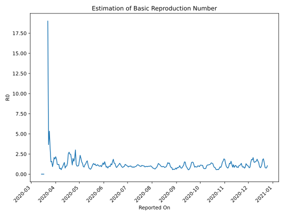

# Country Figures: Time Series for Basic Reproduction Number of Nigeria 

| Reported On | &Delta; Confirmed | Total &Delta; Confirmed First Interval | Total &Delta; Confirmed Second Interval | Estimated Basic Reproduction Number R0 | 
|-------------|-------------------|----------------------------------------|-----------------------------------------|---------------------------------------------------|
| 2020-04-27 | 64 |  400  |  331  |  1.21  | 
| 2020-04-26 | 91 |  517  |  172  |  3.01  | 
| 2020-04-25 | 87 |  430  |  223  |  1.93  | 
| 2020-04-24 | 114 |  354  |  220  |  1.61  | 
| 2020-04-23 | 108 |  331  |  169  |  1.96  | 
| 2020-04-22 | 208 |  172  |  150  |  1.15  | 
| 2020-04-21 | 0 |  223  |  119  |  1.87  | 
| 2020-04-20 | 38 |  220  |  89  |  2.47  | 
| 2020-04-19 | 85 |  169  |  68  |  2.49  | 
| 2020-04-18 | 49 |  150  |  55  |  2.73  | 
| 2020-04-17 | 51 |  119  |  47  |  2.53  | 
| 2020-04-16 | 35 |  89  |  64  |  1.39  | 
| 2020-04-15 | 34 |  68  |  67  |  1.01  | 
| 2020-04-14 | 30 |  55  |  56  |  0.98  | 
| 2020-04-13 | 20 |  47  |  62  |  0.76  | 
| 2020-04-12 | 5 |  64  |  44  |  1.45  | 
| 2020-04-11 | 13 |  67  |  54  |  1.24  | 
| 2020-04-10 | 17 |  56  |  58  |  0.97  | 
| 2020-04-09 | 12 |  62  |  79  |  0.78  | 
| 2020-04-08 | 22 |  44  |  79  |  0.56  | 
| 2020-04-07 | 16 |  54  |  73  |  0.74  | 
| 2020-04-06 | 6 |  58  |  85  |  0.68  | 
| 2020-04-05 | 18 |  79  |  65  |  1.22  | 
| 2020-04-04 | 4 |  79  |  66  |  1.20  | 
| 2020-04-03 | 26 |  73  |  60  |  1.22  | 
| 2020-04-02 | 10 |  85  |  45  |  1.89  | 
| 2020-04-01 | 39 |  65  |  30  |  2.17  | 
| 2020-03-31 | 4 |  66  |  35  |  1.89  | 
| 2020-03-30 | 20 |  60  |  29  |  2.07  | 
| 2020-03-29 | 22 |  45  |  32  |  1.41  | 
| 2020-03-28 | 19 |  30  |  32  |  0.94  | 
| 2020-03-27 | 5 |  35  |  22  |  1.59  | 
| 2020-03-26 | 14 |  29  |  19  |  1.53  | 
| 2020-03-25 | 7 |  32  |  10  |  3.20  | 
| 2020-03-24 | 4 |  32  |  6  |  5.33  | 
| 2020-03-23 | 10 |  22  |  6  |  3.67  | 
| 2020-03-22 | 8 |  19  |  1  |  19.00  | 
| 2020-03-21 | 10 |  10  |  None  |  None  | 
| 2020-03-20 | 4 |  6  |  None  |  None  | 
| 2020-03-19 | 0 |  6  |  None  |  None  | 
| 2020-03-18 | 5 |  1  |  None  |  None  | 
| 2020-03-17 | 1 |  None  |  1  |  None  | 
| 2020-03-16 | 0 |  None  |  1  |  None  | 
| 2020-03-15 | 0 |  None  |  1  |  None  | 
| 2020-03-14 | 0 |  None  |  1  |  None  | 
| 2020-03-13 | 0 |  1  |  None  |  None  | 
| 2020-03-12 | 0 |  1  |  None  |  None  | 
| 2020-03-11 | 0 |  1  |  None  |  None  | 
| 2020-03-10 | 0 |  1  |  None  |  None  | 
| 2020-03-09 | 1 |  None  |  None  |  None  | 
| 2020-03-08 | 0 |  None  |  None  |  None  | 
| 2020-03-07 | 0 |  None  |  None  |  None  | 
| 2020-03-06 | 0 |  None  |  None  |  None  | 
| 2020-03-05 | 0 |  None  |  None  |  None  | 
| 2020-03-04 | 0 |  None  |  None  |  None  | 
| 2020-03-03 | 0 |  None  |  None  |  None  | 
| 2020-03-02 | 0 |  None  |  None  |  None  | 
| 2020-03-01 | 0 |  None  |  None  |  None  | 
| 2020-02-29 | 0 |  None  |  None  |  None  | 
| 2020-02-28 | None |  None  |  None  |  None  | 

