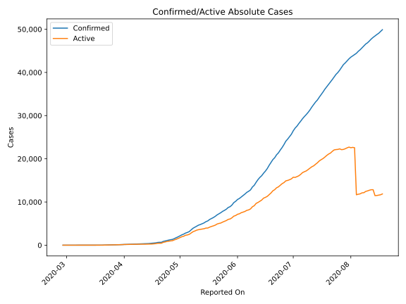
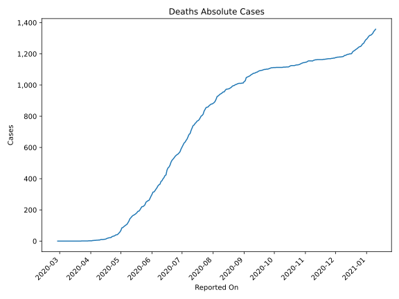
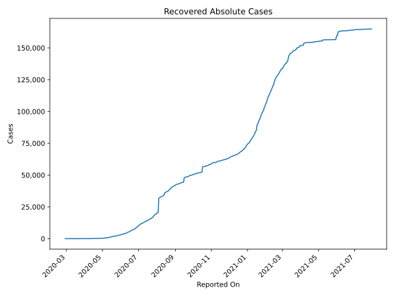
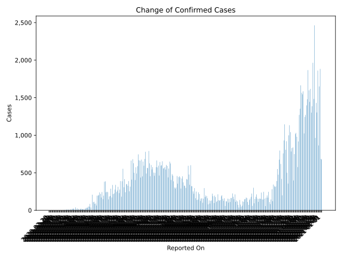
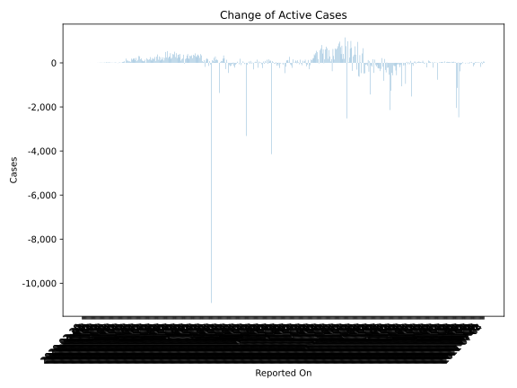
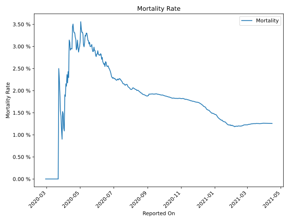

# Country Figures: Time Series for Nigeria 

| Reported On | Confirmed | Deaths | Recovered | Active | Mortality | &Delta; Confirmed | &Delta; Deaths | &Delta; Recovered | &Delta; Active | % Active of Population |
|-------------|-----------|--------|-----------|--------|-----------|-------------------|----------------|-------------------|----------------|------------------------|
| 2020-04-26 | 1273 | 40 | 239 | 994 |  3.14 %  | 91 | 5 | 17 | 69 |  0.001 %  | 
| 2020-04-25 | 1182 | 35 | 222 | 925 |  2.96 %  | 87 | 3 | 14 | 70 |  0.000 %  | 
| 2020-04-24 | 1095 | 32 | 208 | 855 |  2.92 %  | 114 | 1 | 11 | 102 |  0.000 %  | 
| 2020-04-23 | 981 | 31 | 197 | 753 |  3.16 %  | 108 | 3 | 0 | 105 |  0.000 %  | 
| 2020-04-22 | 873 | 28 | 197 | 648 |  3.21 %  | 208 | 6 | 9 | 193 |  0.000 %  | 
| 2020-04-21 | 665 | 22 | 188 | 455 |  3.31 %  | 0 | 0 | 0 | 0 |  0.000 %  | 
| 2020-04-20 | 665 | 22 | 188 | 455 |  3.31 %  | 38 | 1 | 18 | 19 |  0.000 %  | 
| 2020-04-19 | 627 | 21 | 170 | 436 |  3.35 %  | 85 | 2 | 4 | 79 |  0.000 %  | 
| 2020-04-18 | 542 | 19 | 166 | 357 |  3.51 %  | 49 | 2 | 7 | 40 |  0.000 %  | 
| 2020-04-17 | 493 | 17 | 159 | 317 |  3.45 %  | 51 | 4 | 7 | 40 |  0.000 %  | 
| 2020-04-16 | 442 | 13 | 152 | 277 |  2.94 %  | 35 | 1 | 24 | 10 |  0.000 %  | 
| 2020-04-15 | 407 | 12 | 128 | 267 |  2.95 %  | 34 | 1 | 29 | 4 |  0.000 %  | 
| 2020-04-14 | 373 | 11 | 99 | 263 |  2.95 %  | 30 | 1 | 8 | 21 |  0.000 %  | 
| 2020-04-13 | 343 | 10 | 91 | 242 |  2.92 %  | 20 | 0 | 6 | 14 |  0.000 %  | 
| 2020-04-12 | 323 | 10 | 85 | 228 |  3.10 %  | 5 | 0 | 15 | -10 |  0.000 %  | 
| 2020-04-11 | 318 | 10 | 70 | 238 |  3.14 %  | 13 | 3 | 12 | -2 |  0.000 %  | 
| 2020-04-10 | 305 | 7 | 58 | 240 |  2.30 %  | 17 | 0 | 7 | 10 |  0.000 %  | 
| 2020-04-09 | 288 | 7 | 51 | 230 |  2.43 %  | 12 | 1 | 7 | 4 |  0.000 %  | 
| 2020-04-08 | 276 | 6 | 44 | 226 |  2.17 %  | 22 | 0 | 0 | 22 |  0.000 %  | 
| 2020-04-07 | 254 | 6 | 44 | 204 |  2.36 %  | 16 | 1 | 9 | 6 |  0.000 %  | 
| 2020-04-06 | 238 | 5 | 35 | 198 |  2.10 %  | 6 | 0 | 2 | 4 |  0.000 %  | 
| 2020-04-05 | 232 | 5 | 33 | 194 |  2.16 %  | 18 | 1 | 8 | 9 |  0.000 %  | 
| 2020-04-04 | 214 | 4 | 25 | 185 |  1.87 %  | 4 | 0 | 0 | 4 |  0.000 %  | 
| 2020-04-03 | 210 | 4 | 25 | 181 |  1.90 %  | 26 | 2 | 5 | 19 |  0.000 %  | 
| 2020-04-02 | 184 | 2 | 20 | 162 |  1.09 %  | 10 | 0 | 11 | -1 |  0.000 %  | 
| 2020-04-01 | 174 | 2 | 9 | 163 |  1.15 %  | 39 | 0 | 1 | 38 |  0.000 %  | 
| 2020-03-31 | 135 | 2 | 8 | 125 |  1.48 %  | 4 | 0 | 0 | 4 |  0.000 %  | 
| 2020-03-30 | 131 | 2 | 8 | 121 |  1.53 %  | 20 | 1 | 5 | 14 |  0.000 %  | 
| 2020-03-29 | 111 | 1 | 3 | 107 |  0.90 %  | 22 | 0 | 0 | 22 |  0.000 %  | 
| 2020-03-28 | 89 | 1 | 3 | 85 |  1.12 %  | 19 | 0 | 0 | 19 |  0.000 %  | 
| 2020-03-27 | 70 | 1 | 3 | 66 |  1.43 %  | 5 | 0 | 1 | 4 |  0.000 %  | 
| 2020-03-26 | 65 | 1 | 2 | 62 |  1.54 %  | 14 | 0 | 0 | 14 |  0.000 %  | 
| 2020-03-25 | 51 | 1 | 2 | 48 |  1.96 %  | 7 | 0 | 0 | 7 |  0.000 %  | 
| 2020-03-24 | 44 | 1 | 2 | 41 |  2.27 %  | 4 | 0 | 0 | 4 |  0.000 %  | 
| 2020-03-23 | 40 | 1 | 2 | 37 |  2.50 %  | 10 | 1 | 0 | 9 |  0.000 %  | 
| 2020-03-22 | 30 | 0 | 2 | 28 |  None  | 8 | 0 | 1 | 7 |  0.000 %  | 
| 2020-03-21 | 22 | 0 | 1 | 21 |  None  | 10 | 0 | 0 | 10 |  0.000 %  | 
| 2020-03-20 | 12 | 0 | 1 | 11 |  None  | 4 | 0 | 0 | 4 |  0.000 %  | 
| 2020-03-19 | 8 | 0 | 1 | 7 |  None  | 0 | 0 | 0 | 0 |  0.000 %  | 
| 2020-03-18 | 8 | 0 | 1 | 7 |  None  | 5 | 0 | 1 | 4 |  0.000 %  | 
| 2020-03-17 | 3 | 0 | 0 | 3 |  None  | 1 | 0 | 0 | 1 |  0.000 %  | 
| 2020-03-16 | 2 | 0 | 0 | 2 |  None  | 0 | 0 | 0 | 0 |  0.000 %  | 
| 2020-03-15 | 2 | 0 | 0 | 2 |  None  | 0 | 0 | 0 | 0 |  0.000 %  | 
| 2020-03-14 | 2 | 0 | 0 | 2 |  None  | 0 | 0 | 0 | 0 |  0.000 %  | 
| 2020-03-13 | 2 | 0 | 0 | 2 |  None  | 0 | 0 | 0 | 0 |  0.000 %  | 
| 2020-03-12 | 2 | 0 | 0 | 2 |  None  | 0 | 0 | 0 | 0 |  0.000 %  | 
| 2020-03-11 | 2 | 0 | 0 | 2 |  None  | 0 | 0 | 0 | 0 |  0.000 %  | 
| 2020-03-10 | 2 | 0 | 0 | 2 |  None  | 0 | 0 | 0 | 0 |  0.000 %  | 
| 2020-03-09 | 2 | 0 | 0 | 2 |  None  | 1 | 0 | 0 | 1 |  0.000 %  | 
| 2020-03-08 | 1 | 0 | 0 | 1 |  None  | 0 | 0 | 0 | 0 |  0.000 %  | 
| 2020-03-07 | 1 | 0 | 0 | 1 |  None  | 0 | 0 | 0 | 0 |  0.000 %  | 
| 2020-03-06 | 1 | 0 | 0 | 1 |  None  | 0 | 0 | 0 | 0 |  0.000 %  | 
| 2020-03-05 | 1 | 0 | 0 | 1 |  None  | 0 | 0 | 0 | 0 |  0.000 %  | 
| 2020-03-04 | 1 | 0 | 0 | 1 |  None  | 0 | 0 | 0 | 0 |  0.000 %  | 
| 2020-03-03 | 1 | 0 | 0 | 1 |  None  | 0 | 0 | 0 | 0 |  0.000 %  | 
| 2020-03-02 | 1 | 0 | 0 | 1 |  None  | 0 | 0 | 0 | 0 |  0.000 %  | 
| 2020-03-01 | 1 | 0 | 0 | 1 |  None  | 0 | 0 | 0 | 0 |  0.000 %  | 
| 2020-02-29 | 1 | 0 | 0 | 1 |  None  | 0 | 0 | 0 | 0 |  0.000 %  | 
| 2020-02-28 | 1 | 0 | 0 | 1 |  None  | None | None | None | None |  0.000 %  | 

