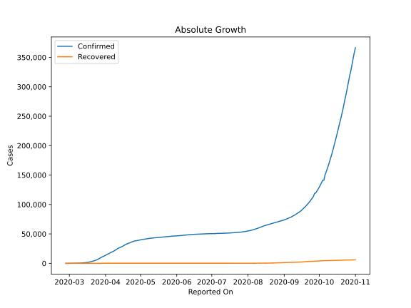
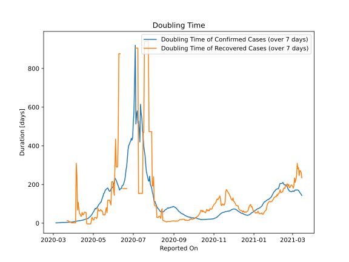

# Country Figures: Doubling Time of Infections for Netherlands 

The doubling time below are calculated based on
* an exponential growth assumption
* for time difference of past seven (7) days.
The doubling time's unit is "days".

The first doubling time indicates the increase of confirmed (infected)
cases. There, the *higher* the number is, the better is to take control
of the disease.

The second doubling time indicates the increase of recovered (healed)
cases. There, the *lower* the number is, the better it is to take
control of the disease.

| Reported On | Confirmed | Doubling Time (Confirmed) | Recovered | Doubling Time (Recovered) |
|-------------|-----------|---------------------------|-----------|---------------------------|
| 2020-05-06 | 41518 |  77.8 days  | 146 |  24.1 days  | 
| 2020-05-05 | 41286 |  72.8 days  | 139 |  28.5 days  | 
| 2020-05-04 | 40968 |  76.5 days  | 138 |  29.7 days  | 
| 2020-05-03 | 40769 |  70.4 days  | 138 |  29.7 days  | 
| 2020-05-02 | 40434 |  62.2 days  | 138 |  16.4 days  | 
| 2020-05-01 | 39989 |  57.4 days  | 138 |  16.4 days  | 
| 2020-04-30 | 39512 |  51.3 days  | 125 |  23.1 days  | 
| 2020-04-29 | 38998 |  45.6 days  | 119 |  29.9 days  | 
| 2020-04-28 | 38612 |  41.5 days  | 117 |  10.9 days  | 
| 2020-04-27 | 38440 |  36.3 days  | 117 |  -4.4 days  | 
| 2020-04-26 | 38040 |  33.3 days  | 117 |  -4.4 days  | 
| 2020-04-25 | 37384 |  30.1 days  | 102 |  -3.9 days  | 
| 2020-04-24 | 36729 |  27.0 days  | 102 |  -3.9 days  | 
| 2020-04-23 | 35921 |  24.5 days  | 101 |  -4.0 days  | 
| 2020-04-22 | 35032 |  23.1 days  | 101 |  -4.0 days  | 
| 2020-04-21 | 34317 |  22.5 days  | 74 |  -3.1 days  | 
| 2020-04-20 | 33588 |  21.5 days  | 322 |  55.7 days  | 
| 2020-04-19 | 32838 |  20.3 days  | 322 |  55.7 days  | 
| 2020-04-18 | 31766 |  19.2 days  | 317 |  57.0 days  | 
| 2020-04-17 | 30619 |  18.0 days  | 315 |  52.5 days  | 
| 2020-04-16 | 29383 |  16.9 days  | 311 |  43.6 days  | 
| 2020-04-15 | 28316 |  15.8 days  | 304 |  44.0 days  | 
| 2020-04-14 | 27580 |  14.8 days  | 297 |  55.5 days  | 
| 2020-04-13 | 26710 |  14.4 days  | 295 |  36.6 days  | 
| 2020-04-12 | 25746 |  13.8 days  | 295 |  35.5 days  | 
| 2020-04-11 | 24571 |  13.0 days  | 291 |  46.6 days  | 
| 2020-04-10 | 23249 |  12.9 days  | 287 |  49.5 days  | 
| 2020-04-09 | 21903 |  12.7 days  | 278 |  72.8 days  | 
| 2020-04-08 | 20682 |  12.1 days  | 272 |  107.9 days  | 
| 2020-04-07 | 19709 |  11.3 days  | 272 |  67.4 days  | 
| 2020-04-06 | 18926 |  10.6 days  | 258 |  248.3 days  | 
| 2020-04-05 | 17953 |  10.1 days  | 257 |  309.7 days  | 
| 2020-04-04 | 16727 |  9.5 days  | 262 |  1.6 days  | 
| 2020-04-03 | 15821 |  8.4 days  | 260 |  1.6 days  | 
| 2020-04-02 | 14788 |  7.4 days  | 260 |  1.6 days  | 
| 2020-04-01 | 13696 |  6.8 days  | 260 |  1.5 days  | 
| 2020-03-31 | 12667 |  6.3 days  | 253 |  1.4 days  | 
| 2020-03-30 | 11817 |  5.7 days  | 253 |  1.4 days  | 
| 2020-03-29 | 10930 |  5.4 days  | 253 |  1.4 days  | 
| 2020-03-28 | 9819 |  5.2 days  | 6 |  4.8 days  | 
| 2020-03-27 | 8647 |  4.9 days  | 6 |  4.8 days  | 
| 2020-03-26 | 7468 |  4.7 days  | 6 |  4.8 days  | 
| 2020-03-25 | 6438 |  4.6 days  | 4 |  7.3 days  | 
| 2020-03-24 | 5580 |  4.4 days  | 3 |  12.3 days  | 
| 2020-03-23 | 4764 |  4.3 days  | 3 |  12.3 days  | 
| 2020-03-22 | 4217 |  4.0 days  | 3 |  12.3 days  | 
| 2020-03-21 | 3640 |  4.0 days  | 2 |  None  | 
| 2020-03-20 | 3003 |  4.0 days  | 2 |  None  | 
| 2020-03-19 | 2465 |  3.4 days  | 2 |  None  | 
| 2020-03-18 | 2056 |  3.8 days  | 2 |  None  | 
| 2020-03-17 | 1708 |  3.6 days  | 2 |  None  | 
| 2020-03-16 | 1414 |  3.6 days  | 2 |  None  | 
| 2020-03-15 | 1135 |  3.7 days  | 2 |  None  | 
| 2020-03-14 | 959 |  3.3 days  | 2 |  None  | 
| 2020-03-13 | 804 |  3.0 days  | 0 |  None  | 
| 2020-03-12 | 503 |  3.0 days  | 0 |  None  | 
| 2020-03-11 | 503 |  2.2 days  | 0 |  None  | 
| 2020-03-10 | 382 |  2.1 days  | 0 |  None  | 
| 2020-03-09 | 321 |  2.0 days  | 0 |  None  | 
| 2020-03-08 | 265 |  1.8 days  | 0 |  None  | 
| 2020-03-07 | 188 |  1.7 days  | 0 |  None  | 
| 2020-03-06 | 128 |  1.3 days  | 0 |  None  | 
| 2020-03-05 | 82 |  1.4 days  | 0 |  None  | 
| 2020-03-04 | 38 |  None  | 0 |  None  | 
| 2020-03-03 | 24 |  None  | 0 |  None  | 
| 2020-03-02 | 18 |  None  | 0 |  None  | 
| 2020-03-01 | 10 |  None  | 0 |  None  | 
| 2020-02-29 | 6 |  None  | 0 |  None  | 
| 2020-02-28 | 1 |  None  | 0 |  None  | 
| 2020-02-27 | 1 |  None  | 0 |  None  | 

