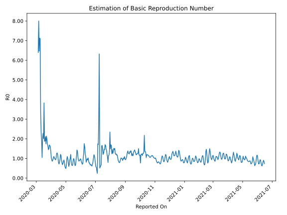

# Country Figures: Time Series for Basic Reproduction Number of Netherlands 

| Reported On | &Delta; Confirmed | Total &Delta; Confirmed First Interval | Total &Delta; Confirmed Second Interval | Estimated Basic Reproduction Number R0 | 
|-------------|-------------------|----------------------------------------|-----------------------------------------|---------------------------------------------------|
| 2020-04-29 | 386 |  1883  |  3141  |  0.60  | 
| 2020-04-28 | 172 |  2519  |  3083  |  0.82  | 
| 2020-04-27 | 400 |  3008  |  3266  |  0.92  | 
| 2020-04-26 | 656 |  3067  |  3698  |  0.83  | 
| 2020-04-25 | 655 |  3141  |  4205  |  0.75  | 
| 2020-04-24 | 808 |  3083  |  4522  |  0.68  | 
| 2020-04-23 | 889 |  3266  |  4186  |  0.78  | 
| 2020-04-22 | 715 |  3698  |  3909  |  0.95  | 
| 2020-04-21 | 729 |  4205  |  3637  |  1.16  | 
| 2020-04-20 | 750 |  4522  |  3745  |  1.21  | 
| 2020-04-19 | 1072 |  4186  |  4331  |  0.97  | 
| 2020-04-18 | 1147 |  3909  |  4807  |  0.81  | 
| 2020-04-17 | 1236 |  3637  |  5064  |  0.72  | 
| 2020-04-16 | 1067 |  3745  |  4862  |  0.77  | 
| 2020-04-15 | 736 |  4331  |  4323  |  1.00  | 
| 2020-04-14 | 870 |  4807  |  3950  |  1.22  | 
| 2020-04-13 | 964 |  5064  |  3955  |  1.28  | 
| 2020-04-12 | 1175 |  4862  |  3888  |  1.25  | 
| 2020-04-11 | 1322 |  4323  |  4138  |  1.04  | 
| 2020-04-10 | 1346 |  3950  |  4257  |  0.93  | 
| 2020-04-09 | 1221 |  3955  |  4060  |  0.97  | 
| 2020-04-08 | 973 |  3888  |  4004  |  0.97  | 
| 2020-04-07 | 783 |  4138  |  3858  |  1.07  | 
| 2020-04-06 | 973 |  4257  |  3877  |  1.10  | 
| 2020-04-05 | 1226 |  4060  |  4020  |  1.01  | 
| 2020-04-04 | 906 |  4004  |  4349  |  0.92  | 
| 2020-04-03 | 1033 |  3858  |  4492  |  0.86  | 
| 2020-04-02 | 1092 |  3877  |  4239  |  0.91  | 
| 2020-04-01 | 1029 |  4020  |  3883  |  1.04  | 
| 2020-03-31 | 850 |  4349  |  3251  |  1.34  | 
| 2020-03-30 | 887 |  4492  |  2798  |  1.61  | 
| 2020-03-29 | 1111 |  4239  |  2577  |  1.64  | 
| 2020-03-28 | 1172 |  3883  |  2299  |  1.69  | 
| 2020-03-27 | 1179 |  3251  |  2161  |  1.50  | 
| 2020-03-26 | 1030 |  2798  |  1932  |  1.45  | 
| 2020-03-25 | 858 |  2577  |  1589  |  1.62  | 
| 2020-03-24 | 816 |  2299  |  1330  |  1.73  | 
| 2020-03-23 | 547 |  2161  |  1097  |  1.97  | 
| 2020-03-22 | 577 |  1932  |  904  |  2.14  | 
| 2020-03-21 | 637 |  1589  |  911  |  1.74  | 
| 2020-03-20 | 538 |  1330  |  632  |  2.10  | 
| 2020-03-19 | 409 |  1097  |  577  |  1.90  | 
| 2020-03-18 | 348 |  904  |  483  |  1.87  | 
| 2020-03-17 | 294 |  911  |  238  |  3.83  | 
| 2020-03-16 | 279 |  632  |  315  |  2.01  | 
| 2020-03-15 | 176 |  577  |  254  |  2.27  | 
| 2020-03-14 | 155 |  483  |  239  |  2.02  | 
| 2020-03-13 | 301 |  238  |  227  |  1.05  | 
| 2020-03-12 | 0 |  315  |  164  |  1.92  | 
| 2020-03-11 | 121 |  254  |  110  |  2.31  | 
| 2020-03-10 | 61 |  239  |  72  |  3.32  | 
| 2020-03-09 | 56 |  227  |  32  |  7.09  | 
| 2020-03-08 | 77 |  164  |  23  |  7.13  | 
| 2020-03-07 | 60 |  110  |  17  |  6.47  | 
| 2020-03-06 | 46 |  72  |  9  |  8.00  | 
| 2020-03-05 | 44 |  32  |  5  |  6.40  | 
| 2020-03-04 | 14 |  23  |  None  |  None  | 
| 2020-03-03 | 6 |  17  |  None  |  None  | 
| 2020-03-02 | 8 |  9  |  None  |  None  | 
| 2020-03-01 | 4 |  5  |  None  |  None  | 
| 2020-02-29 | 5 |  None  |  None  |  None  | 
| 2020-02-28 | 0 |  None  |  None  |  None  | 
| 2020-02-27 | None |  None  |  None  |  None  | 

