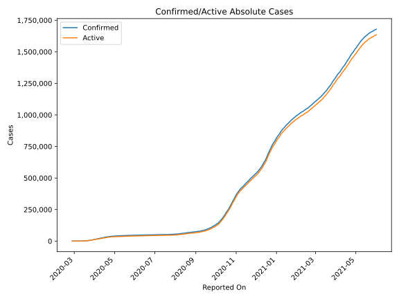
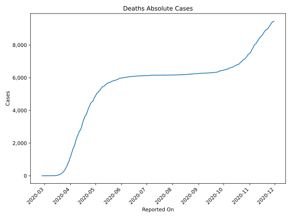
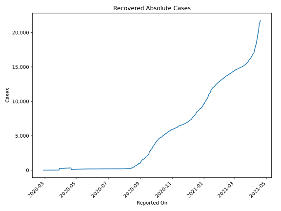
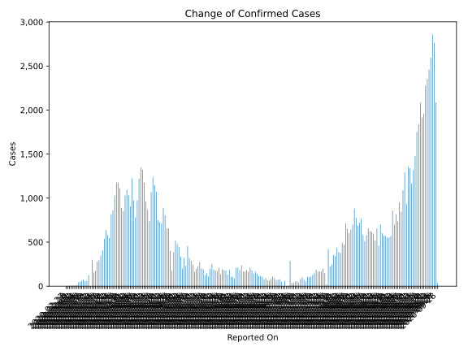
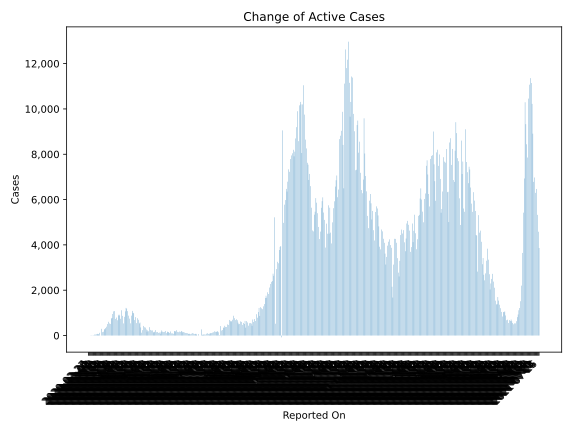
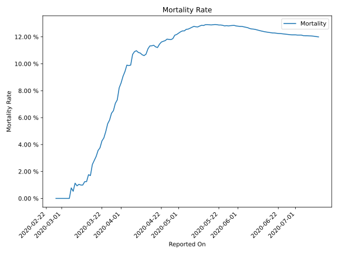

# Country Figures: Time Series for Netherlands 

| Reported On | Confirmed | Deaths | Recovered | Active | Mortality | &Delta; Confirmed | &Delta; Deaths | &Delta; Active | % Active of Population |
|-------------|-----------|--------|-----------|--------|-----------|-------------------|----------------|----------------|------------------------|
| 2020-04-06 | 18926 | 1874 | 258 | 16794 |  9.90 %  | 973 | 103 | 869 |  0.097 %  | 
| 2020-04-05 | 17953 | 1771 | 257 | 15925 |  9.86 %  | 1226 | 115 | 1116 |  0.092 %  | 
| 2020-04-04 | 16727 | 1656 | 262 | 14809 |  9.90 %  | 906 | 166 | 738 |  0.086 %  | 
| 2020-04-03 | 15821 | 1490 | 260 | 14071 |  9.42 %  | 1033 | 149 | 884 |  0.082 %  | 
| 2020-04-02 | 14788 | 1341 | 260 | 13187 |  9.07 %  | 1092 | 166 | 926 |  0.077 %  | 
| 2020-04-01 | 13696 | 1175 | 260 | 12261 |  8.58 %  | 1029 | 135 | 887 |  0.071 %  | 
| 2020-03-31 | 12667 | 1040 | 253 | 11374 |  8.21 %  | 850 | 175 | 675 |  0.066 %  | 
| 2020-03-30 | 11817 | 865 | 253 | 10699 |  7.32 %  | 887 | 93 | 794 |  0.062 %  | 
| 2020-03-29 | 10930 | 772 | 253 | 9905 |  7.06 %  | 1111 | 132 | 732 |  0.057 %  | 
| 2020-03-28 | 9819 | 640 | 6 | 9173 |  6.52 %  | 1172 | 93 | 1079 |  0.053 %  | 
| 2020-03-27 | 8647 | 547 | 6 | 8094 |  6.33 %  | 1179 | 112 | 1067 |  0.047 %  | 
| 2020-03-26 | 7468 | 435 | 6 | 7027 |  5.82 %  | 1030 | 78 | 950 |  0.041 %  | 
| 2020-03-25 | 6438 | 357 | 4 | 6077 |  5.55 %  | 858 | 80 | 777 |  0.035 %  | 
| 2020-03-24 | 5580 | 277 | 3 | 5300 |  4.96 %  | 816 | 63 | 753 |  0.031 %  | 
| 2020-03-23 | 4764 | 214 | 3 | 4547 |  4.49 %  | 547 | 34 | 513 |  0.026 %  | 
| 2020-03-22 | 4217 | 180 | 3 | 4034 |  4.27 %  | 577 | 43 | 533 |  0.023 %  | 
| 2020-03-21 | 3640 | 137 | 2 | 3501 |  3.76 %  | 637 | 30 | 607 |  0.020 %  | 
| 2020-03-20 | 3003 | 107 | 2 | 2894 |  3.56 %  | 538 | 30 | 508 |  0.017 %  | 
| 2020-03-19 | 2465 | 77 | 2 | 2386 |  3.12 %  | 409 | 19 | 390 |  0.014 %  | 
| 2020-03-18 | 2056 | 58 | 2 | 1996 |  2.82 %  | 348 | 15 | 333 |  0.012 %  | 
| 2020-03-17 | 1708 | 43 | 2 | 1663 |  2.52 %  | 294 | 19 | 275 |  0.010 %  | 
| 2020-03-16 | 1414 | 24 | 2 | 1388 |  1.70 %  | 279 | 4 | 275 |  0.008 %  | 
| 2020-03-15 | 1135 | 20 | 2 | 1113 |  1.76 %  | 176 | 8 | 168 |  0.006 %  | 
| 2020-03-14 | 959 | 12 | 2 | 945 |  1.25 %  | 155 | 2 | 151 |  0.005 %  | 
| 2020-03-13 | 804 | 10 | 0 | 794 |  1.24 %  | 301 | 5 | 296 |  0.005 %  | 
| 2020-03-12 | 503 | 5 | 0 | 498 |  0.99 %  | 0 | 0 | 0 |  0.003 %  | 
| 2020-03-11 | 503 | 5 | 0 | 498 |  0.99 %  | 121 | 1 | 120 |  0.003 %  | 
| 2020-03-10 | 382 | 4 | 0 | 378 |  1.05 %  | 61 | 1 | 60 |  0.002 %  | 
| 2020-03-09 | 321 | 3 | 0 | 318 |  0.93 %  | 56 | 0 | 56 |  0.002 %  | 
| 2020-03-08 | 265 | 3 | 0 | 262 |  1.13 %  | 77 | 2 | 75 |  0.002 %  | 
| 2020-03-07 | 188 | 1 | 0 | 187 |  0.53 %  | 60 | 0 | 60 |  0.001 %  | 
| 2020-03-06 | 128 | 1 | 0 | 127 |  0.78 %  | 46 | 1 | 45 |  0.001 %  | 
| 2020-03-05 | 82 | 0 | 0 | 82 |  None  | 44 | 0 | 44 |  0.000 %  | 
| 2020-03-04 | 38 | 0 | 0 | 38 |  None  | 14 | 0 | 14 |  0.000 %  | 
| 2020-03-03 | 24 | 0 | 0 | 24 |  None  | 6 | 0 | 6 |  0.000 %  | 
| 2020-03-02 | 18 | 0 | 0 | 18 |  None  | 8 | 0 | 8 |  0.000 %  | 
| 2020-03-01 | 10 | 0 | 0 | 10 |  None  | 4 | 0 | 4 |  0.000 %  | 
| 2020-02-29 | 6 | 0 | 0 | 6 |  None  | 5 | 0 | 5 |  0.000 %  | 
| 2020-02-28 | 1 | 0 | 0 | 1 |  None  | 0 | 0 | 0 |  0.000 %  | 
| 2020-02-27 | 1 | 0 | 0 | 1 |  None  | None | None | None |  0.000 %  | 

