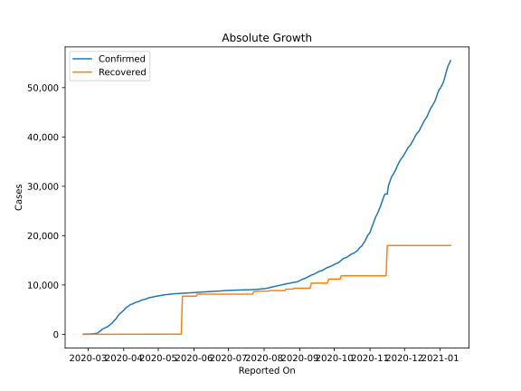
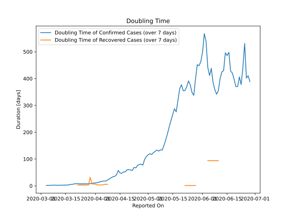

# Country Figures: Doubling Time of Infections for Norway 

The doubling time below are calculated based on
* an exponential growth assumption
* for time difference of past seven (7) days.
The doubling time's unit is "days".

The first doubling time indicates the increase of confirmed (infected)
cases. There, the *higher* the number is, the better is to take control
of the disease.

The second doubling time indicates the increase of recovered (healed)
cases. There, the *lower* the number is, the better it is to take
control of the disease.

| Reported On | Confirmed | Doubling Time (Confirmed) | Recovered | Doubling Time (Recovered) |
|-------------|-----------|---------------------------|-----------|---------------------------|
| 2020-04-07 | 6086 |  18.2 days  | 32 |  5.7 days  | 
| 2020-04-06 | 5865 |  17.8 days  | 32 |  5.3 days  | 
| 2020-04-05 | 5687 |  17.5 days  | 32 |  3.5 days  | 
| 2020-04-04 | 5550 |  15.3 days  | 32 |  3.5 days  | 
| 2020-04-03 | 5370 |  13.9 days  | 32 |  3.2 days  | 
| 2020-04-02 | 5147 |  11.8 days  | 32 |  3.2 days  | 
| 2020-04-01 | 4863 |  11.0 days  | 13 |  6.6 days  | 
| 2020-03-31 | 4641 |  10.4 days  | 13 |  6.6 days  | 
| 2020-03-30 | 4445 |  9.5 days  | 12 |  7.3 days  | 
| 2020-03-29 | 4284 |  7.9 days  | 7 |  31.8 days  | 
| 2020-03-28 | 4015 |  7.9 days  | 7 |  2.8 days  | 
| 2020-03-27 | 3755 |  7.5 days  | 6 |  3.0 days  | 
| 2020-03-26 | 3369 |  7.7 days  | 6 |  3.0 days  | 
| 2020-03-25 | 3084 |  7.4 days  | 6 |  3.0 days  | 
| 2020-03-24 | 2863 |  7.6 days  | 6 |  3.0 days  | 
| 2020-03-23 | 2621 |  7.5 days  | 6 |  3.0 days  | 
| 2020-03-22 | 2263 |  8.2 days  | 6 |  3.0 days  | 
| 2020-03-21 | 2118 |  7.6 days  | 1 |  None  | 
| 2020-03-20 | 1914 |  7.8 days  | 1 |  None  | 
| 2020-03-19 | 1746 |  5.7 days  | 1 |  None  | 
| 2020-03-18 | 1550 |  5.4 days  | 1 |  None  | 
| 2020-03-17 | 1463 |  4.1 days  | 1 |  None  | 
| 2020-03-16 | 1333 |  2.9 days  | 1 |  None  | 
| 2020-03-15 | 1221 |  2.8 days  | 1 |  None  | 
| 2020-03-14 | 1090 |  2.8 days  | 1 |  None  | 
| 2020-03-13 | 996 |  2.5 days  | 1 |  None  | 
| 2020-03-12 | 702 |  2.7 days  | 1 |  None  | 
| 2020-03-11 | 598 |  2.4 days  | 1 |  None  | 
| 2020-03-10 | 400 |  2.2 days  | 1 |  None  | 
| 2020-03-09 | 205 |  2.6 days  | 1 |  None  | 
| 2020-03-08 | 176 |  2.5 days  | 0 |  None  | 
| 2020-03-07 | 147 |  2.5 days  | 0 |  None  | 
| 2020-03-06 | 108 |  2.0 days  | 0 |  None  | 
| 2020-03-05 | 87 |  1.4 days  | 0 |  None  | 
| 2020-03-04 | 56 |  1.5 days  | 0 |  None  | 
| 2020-03-03 | 32 |  None  | 0 |  None  | 
| 2020-03-02 | 25 |  None  | 0 |  None  | 
| 2020-03-01 | 19 |  None  | 0 |  None  | 
| 2020-02-29 | 15 |  None  | 0 |  None  | 
| 2020-02-28 | 6 |  None  | 0 |  None  | 
| 2020-02-27 | 1 |  None  | 0 |  None  | 
| 2020-02-26 | 1 |  None  | 0 |  None  | 

