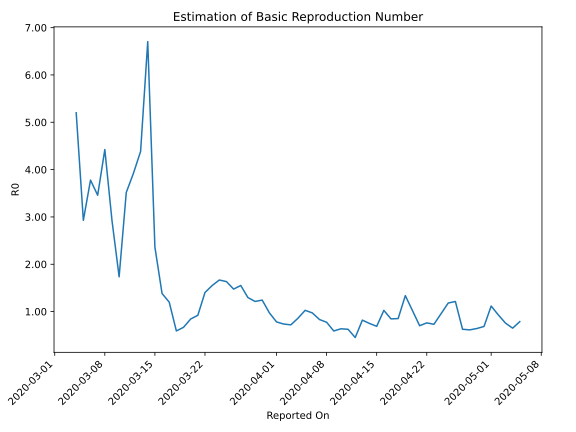

# Country Figures: Time Series for Basic Reproduction Number of Norway 

| Reported On | &Delta; Confirmed | Total &Delta; Confirmed First Interval | Total &Delta; Confirmed Second Interval | Estimated Basic Reproduction Number R0 | 
|-------------|-------------------|----------------------------------------|-----------------------------------------|---------------------------------------------------|
| 2020-05-09 | 29 |  166  |  166  |  1.00  | 
| 2020-05-08 | 36 |  187  |  137  |  1.36  | 
| 2020-05-07 | 38 |  187  |  149  |  1.26  | 
| 2020-05-06 | 41 |  172  |  184  |  0.93  | 
| 2020-05-05 | 51 |  166  |  211  |  0.79  | 
| 2020-05-04 | 57 |  137  |  211  |  0.65  | 
| 2020-05-03 | 38 |  149  |  197  |  0.76  | 
| 2020-05-02 | 26 |  184  |  198  |  0.93  | 
| 2020-05-01 | 45 |  211  |  189  |  1.12  | 
| 2020-04-30 | 28 |  211  |  308  |  0.69  | 
| 2020-04-29 | 50 |  197  |  307  |  0.64  | 
| 2020-04-28 | 61 |  198  |  323  |  0.61  | 
| 2020-04-27 | 72 |  189  |  302  |  0.63  | 
| 2020-04-26 | 28 |  308  |  254  |  1.21  | 
| 2020-04-25 | 36 |  307  |  260  |  1.18  | 
| 2020-04-24 | 62 |  323  |  338  |  0.96  | 
| 2020-04-23 | 63 |  302  |  413  |  0.73  | 
| 2020-04-22 | 147 |  254  |  334  |  0.76  | 
| 2020-04-21 | 35 |  260  |  371  |  0.70  | 
| 2020-04-20 | 78 |  338  |  331  |  1.02  | 
| 2020-04-19 | 42 |  413  |  309  |  1.34  | 
| 2020-04-18 | 99 |  334  |  392  |  0.85  | 
| 2020-04-17 | 41 |  371  |  439  |  0.85  | 
| 2020-04-16 | 156 |  331  |  323  |  1.02  | 
| 2020-04-15 | 117 |  309  |  449  |  0.69  | 
| 2020-04-14 | 20 |  392  |  524  |  0.75  | 
| 2020-04-13 | 78 |  439  |  536  |  0.82  | 
| 2020-04-12 | 116 |  323  |  716  |  0.45  | 
| 2020-04-11 | 95 |  449  |  718  |  0.63  | 
| 2020-04-10 | 103 |  524  |  824  |  0.64  | 
| 2020-04-09 | 125 |  536  |  909  |  0.59  | 
| 2020-04-08 | 0 |  716  |  925  |  0.77  | 
| 2020-04-07 | 221 |  718  |  863  |  0.83  | 
| 2020-04-06 | 178 |  824  |  848  |  0.97  | 
| 2020-04-05 | 137 |  909  |  886  |  1.03  | 
| 2020-04-04 | 180 |  925  |  1076  |  0.86  | 
| 2020-04-03 | 223 |  863  |  1200  |  0.72  | 
| 2020-04-02 | 284 |  848  |  1152  |  0.74  | 
| 2020-04-01 | 222 |  886  |  1134  |  0.78  | 
| 2020-03-31 | 196 |  1076  |  1106  |  0.97  | 
| 2020-03-30 | 161 |  1200  |  966  |  1.24  | 
| 2020-03-29 | 269 |  1152  |  949  |  1.21  | 
| 2020-03-28 | 260 |  1134  |  875  |  1.30  | 
| 2020-03-27 | 386 |  1106  |  713  |  1.55  | 
| 2020-03-26 | 285 |  966  |  655  |  1.47  | 
| 2020-03-25 | 221 |  949  |  581  |  1.63  | 
| 2020-03-24 | 242 |  875  |  525  |  1.67  | 
| 2020-03-23 | 358 |  713  |  460  |  1.55  | 
| 2020-03-22 | 145 |  655  |  467  |  1.40  | 
| 2020-03-21 | 204 |  581  |  631  |  0.92  | 
| 2020-03-20 | 168 |  525  |  623  |  0.84  | 
| 2020-03-19 | 196 |  460  |  690  |  0.67  | 
| 2020-03-18 | 87 |  467  |  791  |  0.59  | 
| 2020-03-17 | 130 |  631  |  526  |  1.20  | 
| 2020-03-16 | 112 |  623  |  451  |  1.38  | 
| 2020-03-15 | 131 |  690  |  292  |  2.36  | 
| 2020-03-14 | 94 |  791  |  118  |  6.70  | 
| 2020-03-13 | 294 |  526  |  120  |  4.38  | 
| 2020-03-12 | 104 |  451  |  115  |  3.92  | 
| 2020-03-11 | 198 |  292  |  83  |  3.52  | 
| 2020-03-10 | 195 |  118  |  68  |  1.74  | 
| 2020-03-09 | 29 |  120  |  41  |  2.93  | 
| 2020-03-08 | 29 |  115  |  26  |  4.42  | 
| 2020-03-07 | 39 |  83  |  24  |  3.46  | 
| 2020-03-06 | 21 |  68  |  18  |  3.78  | 
| 2020-03-05 | 31 |  41  |  14  |  2.93  | 
| 2020-03-04 | 24 |  26  |  5  |  5.20  | 
| 2020-03-03 | 7 |  24  |  None  |  None  | 
| 2020-03-02 | 6 |  18  |  None  |  None  | 
| 2020-03-01 | 4 |  14  |  None  |  None  | 
| 2020-02-29 | 9 |  5  |  None  |  None  | 
| 2020-02-28 | 5 |  None  |  None  |  None  | 
| 2020-02-27 | 0 |  None  |  None  |  None  | 
| 2020-02-26 | None |  None  |  None  |  None  | 

