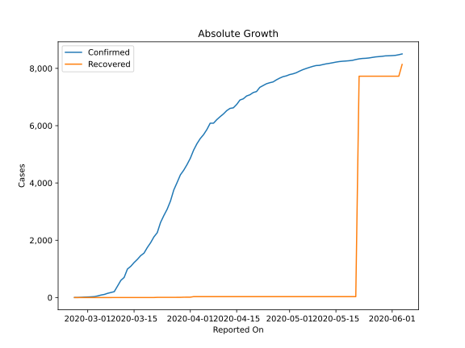
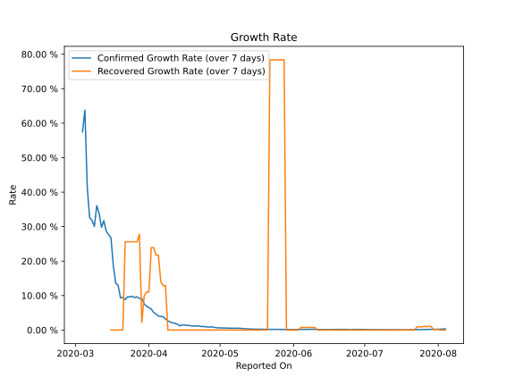

# Country Figures: Growth Rate for Norway 

The growth rates below are calculated based on
* an exponential growth assumption
* for time difference of past seven (7) days.
The growth rate is to be understood as on "growth per day".

The first growth rate indicates the increase of confirmed (infected) cases.

The second growth rate indicates the increase of recovered (healed) cases.

| Reported On | Confirmed | Growth Rate (Confirmed) | Recovered | Growth Rate (Recovered) |
|-------------|-----------|-------------------------|-----------|-------------------------|
| 2020-04-30 | 7738 |  0.64 %  | 32 |  None  | 
| 2020-04-29 | 7710 |  0.71 %  | 32 |  None  | 
| 2020-04-28 | 7660 |  0.90 %  | 32 |  None  | 
| 2020-04-27 | 7599 |  0.86 %  | 32 |  None  | 
| 2020-04-26 | 7527 |  0.88 %  | 32 |  None  | 
| 2020-04-25 | 7499 |  0.91 %  | 32 |  None  | 
| 2020-04-24 | 7463 |  1.04 %  | 32 |  None  | 
| 2020-04-23 | 7401 |  1.01 %  | 32 |  None  | 
| 2020-04-22 | 7338 |  1.21 %  | 32 |  None  | 
| 2020-04-21 | 7191 |  1.18 %  | 32 |  None  | 
| 2020-04-20 | 7156 |  1.15 %  | 32 |  None  | 
| 2020-04-19 | 7078 |  1.16 %  | 32 |  None  | 
| 2020-04-18 | 7036 |  1.33 %  | 32 |  None  | 
| 2020-04-17 | 6937 |  1.34 %  | 32 |  None  | 
| 2020-04-16 | 6896 |  1.49 %  | 32 |  None  | 
| 2020-04-15 | 6740 |  1.46 %  | 32 |  None  | 
| 2020-04-14 | 6623 |  1.21 %  | 32 |  None  | 
| 2020-04-13 | 6603 |  1.69 %  | 32 |  None  | 
| 2020-04-12 | 6525 |  1.96 %  | 32 |  None  | 
| 2020-04-11 | 6409 |  2.06 %  | 32 |  None  | 
| 2020-04-10 | 6314 |  2.31 %  | 32 |  None  | 
| 2020-04-09 | 6211 |  2.68 %  | 32 |  None  | 
| 2020-04-08 | 6086 |  3.20 %  | 32 |  12.868 %  | 
| 2020-04-07 | 6086 |  3.87 %  | 32 |  12.868 %  | 
| 2020-04-06 | 5865 |  3.96 %  | 32 |  14.012 %  | 
| 2020-04-05 | 5687 |  4.05 %  | 32 |  21.712 %  | 
| 2020-04-04 | 5550 |  4.63 %  | 32 |  21.712 %  | 
| 2020-04-03 | 5370 |  5.11 %  | 32 |  23.914 %  | 
| 2020-04-02 | 5147 |  6.05 %  | 32 |  23.914 %  | 
| 2020-04-01 | 4863 |  6.51 %  | 13 |  11.046 %  | 
| 2020-03-31 | 4641 |  6.90 %  | 13 |  11.046 %  | 
| 2020-03-30 | 4445 |  7.55 %  | 12 |  9.902 %  | 
| 2020-03-29 | 4284 |  9.12 %  | 7 |  2.202 %  | 
| 2020-03-28 | 4015 |  9.14 %  | 7 |  27.799 %  | 
| 2020-03-27 | 3755 |  9.63 %  | 6 |  25.597 %  | 
| 2020-03-26 | 3369 |  9.39 %  | 6 |  25.597 %  | 
| 2020-03-25 | 3084 |  9.83 %  | 6 |  25.597 %  | 
| 2020-03-24 | 2863 |  9.59 %  | 6 |  25.597 %  | 
| 2020-03-23 | 2621 |  9.66 %  | 6 |  25.597 %  | 
| 2020-03-22 | 2263 |  8.81 %  | 6 |  25.597 %  | 
| 2020-03-21 | 2118 |  9.49 %  | 1 |  None  | 
| 2020-03-20 | 1914 |  9.33 %  | 1 |  None  | 
| 2020-03-19 | 1746 |  13.02 %  | 1 |  None  | 
| 2020-03-18 | 1550 |  13.61 %  | 1 |  None  | 
| 2020-03-17 | 1463 |  18.53 %  | 1 |  None  | 
| 2020-03-16 | 1333 |  26.75 %  | 1 |  None  | 
| 2020-03-15 | 1221 |  27.67 %  | 1 |  None  | 
| 2020-03-14 | 1090 |  28.62 %  | 1 |  None  | 
| 2020-03-13 | 996 |  31.74 %  | 1 |  None  | 
| 2020-03-12 | 702 |  29.83 %  | 1 |  None  | 
| 2020-03-11 | 598 |  33.83 %  | 1 |  None  | 
| 2020-03-10 | 400 |  36.08 %  | 1 |  None  | 
| 2020-03-09 | 205 |  30.06 %  | 1 |  None  | 
| 2020-03-08 | 176 |  31.80 %  | 0 |  None  | 
| 2020-03-07 | 147 |  32.61 %  | 0 |  None  | 
| 2020-03-06 | 108 |  41.29 %  | 0 |  None  | 
| 2020-03-05 | 87 |  63.80 %  | 0 |  None  | 
| 2020-03-04 | 56 |  57.51 %  | 0 |  None  | 
| 2020-03-03 | 32 |  None  | 0 |  None  | 
| 2020-03-02 | 25 |  None  | 0 |  None  | 
| 2020-03-01 | 19 |  None  | 0 |  None  | 
| 2020-02-29 | 15 |  None  | 0 |  None  | 
| 2020-02-28 | 6 |  None  | 0 |  None  | 
| 2020-02-27 | 1 |  None  | 0 |  None  | 
| 2020-02-26 | 1 |  None  | 0 |  None  | 

