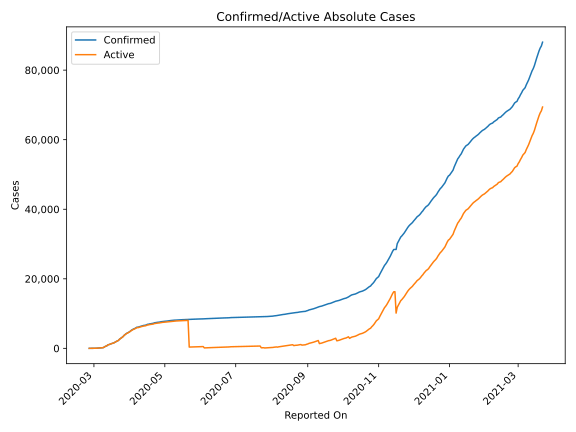
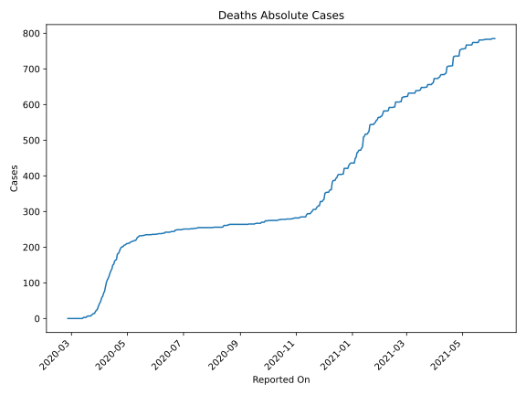
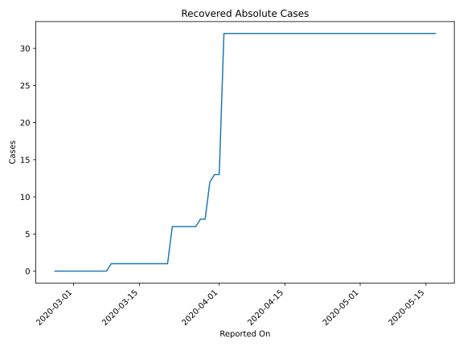
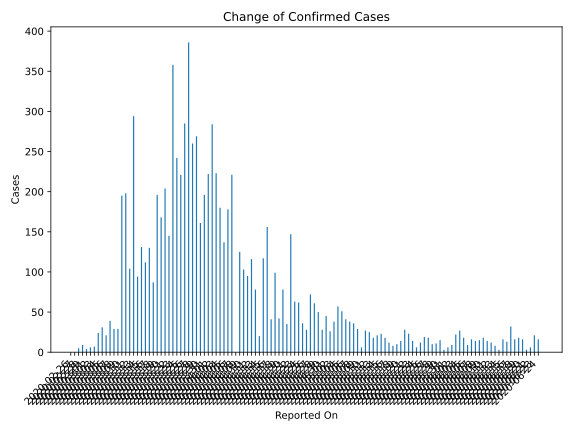
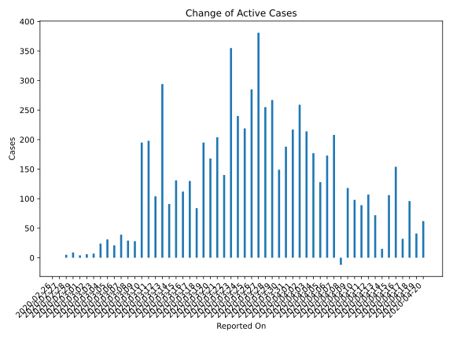
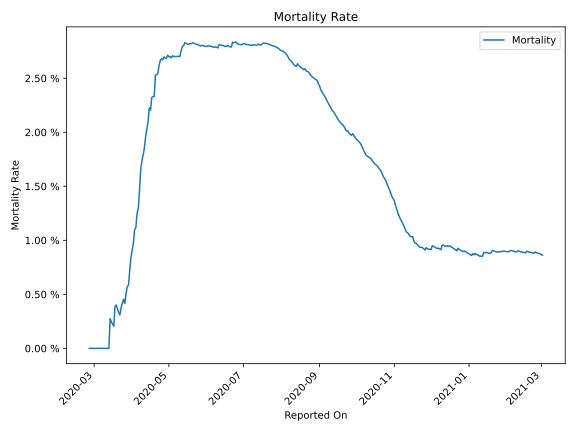

# Country Figures: Time Series for Norway 

| Reported On | Confirmed | Deaths | Recovered | Active | Mortality | &Delta; Confirmed | &Delta; Deaths | &Delta; Recovered | &Delta; Active | % Active of Population |
|-------------|-----------|--------|-----------|--------|-----------|-------------------|----------------|-------------------|----------------|------------------------|
| 2020-04-28 | 7660 | 206 | 32 | 7422 |  2.69 %  | 61 | 1 | 0 | 60 |  0.140 %  | 
| 2020-04-27 | 7599 | 205 | 32 | 7362 |  2.70 %  | 72 | 4 | 0 | 68 |  0.139 %  | 
| 2020-04-26 | 7527 | 201 | 32 | 7294 |  2.67 %  | 28 | 0 | 0 | 28 |  0.137 %  | 
| 2020-04-25 | 7499 | 201 | 32 | 7266 |  2.68 %  | 36 | 2 | 0 | 34 |  0.137 %  | 
| 2020-04-24 | 7463 | 199 | 32 | 7232 |  2.67 %  | 62 | 5 | 0 | 57 |  0.136 %  | 
| 2020-04-23 | 7401 | 194 | 32 | 7175 |  2.62 %  | 63 | 7 | 0 | 56 |  0.135 %  | 
| 2020-04-22 | 7338 | 187 | 32 | 7119 |  2.55 %  | 147 | 5 | 0 | 142 |  0.134 %  | 
| 2020-04-21 | 7191 | 182 | 32 | 6977 |  2.53 %  | 35 | 1 | 0 | 34 |  0.131 %  | 
| 2020-04-20 | 7156 | 181 | 32 | 6943 |  2.53 %  | 78 | 16 | 0 | 62 |  0.131 %  | 
| 2020-04-19 | 7078 | 165 | 32 | 6881 |  2.33 %  | 42 | 1 | 0 | 41 |  0.129 %  | 
| 2020-04-18 | 7036 | 164 | 32 | 6840 |  2.33 %  | 99 | 3 | 0 | 96 |  0.129 %  | 
| 2020-04-17 | 6937 | 161 | 32 | 6744 |  2.32 %  | 41 | 9 | 0 | 32 |  0.127 %  | 
| 2020-04-16 | 6896 | 152 | 32 | 6712 |  2.20 %  | 156 | 2 | 0 | 154 |  0.126 %  | 
| 2020-04-15 | 6740 | 150 | 32 | 6558 |  2.23 %  | 117 | 11 | 0 | 106 |  0.123 %  | 
| 2020-04-14 | 6623 | 139 | 32 | 6452 |  2.10 %  | 20 | 5 | 0 | 15 |  0.121 %  | 
| 2020-04-13 | 6603 | 134 | 32 | 6437 |  2.03 %  | 78 | 6 | 0 | 72 |  0.121 %  | 
| 2020-04-12 | 6525 | 128 | 32 | 6365 |  1.96 %  | 116 | 9 | 0 | 107 |  0.120 %  | 
| 2020-04-11 | 6409 | 119 | 32 | 6258 |  1.86 %  | 95 | 6 | 0 | 89 |  0.118 %  | 
| 2020-04-10 | 6314 | 113 | 32 | 6169 |  1.79 %  | 103 | 5 | 0 | 98 |  0.116 %  | 
| 2020-04-09 | 6211 | 108 | 32 | 6071 |  1.74 %  | 125 | 7 | 0 | 118 |  0.114 %  | 
| 2020-04-08 | 6086 | 101 | 32 | 5953 |  1.66 %  | 0 | 12 | 0 | -12 |  0.112 %  | 
| 2020-04-07 | 6086 | 89 | 32 | 5965 |  1.46 %  | 221 | 13 | 0 | 208 |  0.112 %  | 
| 2020-04-06 | 5865 | 76 | 32 | 5757 |  1.30 %  | 178 | 5 | 0 | 173 |  0.108 %  | 
| 2020-04-05 | 5687 | 71 | 32 | 5584 |  1.25 %  | 137 | 9 | 0 | 128 |  0.105 %  | 
| 2020-04-04 | 5550 | 62 | 32 | 5456 |  1.12 %  | 180 | 3 | 0 | 177 |  0.103 %  | 
| 2020-04-03 | 5370 | 59 | 32 | 5279 |  1.10 %  | 223 | 9 | 0 | 214 |  0.099 %  | 
| 2020-04-02 | 5147 | 50 | 32 | 5065 |  0.97 %  | 284 | 6 | 19 | 259 |  0.095 %  | 
| 2020-04-01 | 4863 | 44 | 13 | 4806 |  0.90 %  | 222 | 5 | 0 | 217 |  0.090 %  | 
| 2020-03-31 | 4641 | 39 | 13 | 4589 |  0.84 %  | 196 | 7 | 1 | 188 |  0.086 %  | 
| 2020-03-30 | 4445 | 32 | 12 | 4401 |  0.72 %  | 161 | 7 | 5 | 149 |  0.083 %  | 
| 2020-03-29 | 4284 | 25 | 7 | 4252 |  0.58 %  | 269 | 2 | 0 | 267 |  0.080 %  | 
| 2020-03-28 | 4015 | 23 | 7 | 3985 |  0.57 %  | 260 | 4 | 1 | 255 |  0.075 %  | 
| 2020-03-27 | 3755 | 19 | 6 | 3730 |  0.51 %  | 386 | 5 | 0 | 381 |  0.070 %  | 
| 2020-03-26 | 3369 | 14 | 6 | 3349 |  0.42 %  | 285 | 0 | 0 | 285 |  0.063 %  | 
| 2020-03-25 | 3084 | 14 | 6 | 3064 |  0.45 %  | 221 | 2 | 0 | 219 |  0.058 %  | 
| 2020-03-24 | 2863 | 12 | 6 | 2845 |  0.42 %  | 242 | 2 | 0 | 240 |  0.054 %  | 
| 2020-03-23 | 2621 | 10 | 6 | 2605 |  0.38 %  | 358 | 3 | 0 | 355 |  0.049 %  | 
| 2020-03-22 | 2263 | 7 | 6 | 2250 |  0.31 %  | 145 | 0 | 5 | 140 |  0.042 %  | 
| 2020-03-21 | 2118 | 7 | 1 | 2110 |  0.33 %  | 204 | 0 | 0 | 204 |  0.040 %  | 
| 2020-03-20 | 1914 | 7 | 1 | 1906 |  0.37 %  | 168 | 0 | 0 | 168 |  0.036 %  | 
| 2020-03-19 | 1746 | 7 | 1 | 1738 |  0.40 %  | 196 | 1 | 0 | 195 |  0.033 %  | 
| 2020-03-18 | 1550 | 6 | 1 | 1543 |  0.39 %  | 87 | 3 | 0 | 84 |  0.029 %  | 
| 2020-03-17 | 1463 | 3 | 1 | 1459 |  0.21 %  | 130 | 0 | 0 | 130 |  0.027 %  | 
| 2020-03-16 | 1333 | 3 | 1 | 1329 |  0.23 %  | 112 | 0 | 0 | 112 |  0.025 %  | 
| 2020-03-15 | 1221 | 3 | 1 | 1217 |  0.25 %  | 131 | 0 | 0 | 131 |  0.023 %  | 
| 2020-03-14 | 1090 | 3 | 1 | 1086 |  0.28 %  | 94 | 3 | 0 | 91 |  0.020 %  | 
| 2020-03-13 | 996 | 0 | 1 | 995 |  None  | 294 | 0 | 0 | 294 |  0.019 %  | 
| 2020-03-12 | 702 | 0 | 1 | 701 |  None  | 104 | 0 | 0 | 104 |  0.013 %  | 
| 2020-03-11 | 598 | 0 | 1 | 597 |  None  | 198 | 0 | 0 | 198 |  0.011 %  | 
| 2020-03-10 | 400 | 0 | 1 | 399 |  None  | 195 | 0 | 0 | 195 |  0.008 %  | 
| 2020-03-09 | 205 | 0 | 1 | 204 |  None  | 29 | 0 | 1 | 28 |  0.004 %  | 
| 2020-03-08 | 176 | 0 | 0 | 176 |  None  | 29 | 0 | 0 | 29 |  0.003 %  | 
| 2020-03-07 | 147 | 0 | 0 | 147 |  None  | 39 | 0 | 0 | 39 |  0.003 %  | 
| 2020-03-06 | 108 | 0 | 0 | 108 |  None  | 21 | 0 | 0 | 21 |  0.002 %  | 
| 2020-03-05 | 87 | 0 | 0 | 87 |  None  | 31 | 0 | 0 | 31 |  0.002 %  | 
| 2020-03-04 | 56 | 0 | 0 | 56 |  None  | 24 | 0 | 0 | 24 |  0.001 %  | 
| 2020-03-03 | 32 | 0 | 0 | 32 |  None  | 7 | 0 | 0 | 7 |  0.001 %  | 
| 2020-03-02 | 25 | 0 | 0 | 25 |  None  | 6 | 0 | 0 | 6 |  0.000 %  | 
| 2020-03-01 | 19 | 0 | 0 | 19 |  None  | 4 | 0 | 0 | 4 |  0.000 %  | 
| 2020-02-29 | 15 | 0 | 0 | 15 |  None  | 9 | 0 | 0 | 9 |  0.000 %  | 
| 2020-02-28 | 6 | 0 | 0 | 6 |  None  | 5 | 0 | 0 | 5 |  0.000 %  | 
| 2020-02-27 | 1 | 0 | 0 | 1 |  None  | 0 | 0 | 0 | 0 |  0.000 %  | 
| 2020-02-26 | 1 | 0 | 0 | 1 |  None  | None | None | None | None |  0.000 %  | 

