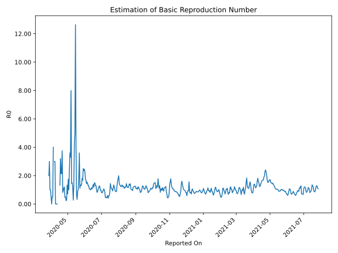

# Country Figures: Time Series for Basic Reproduction Number of Nepal 

| Reported On | &Delta; Confirmed | Total &Delta; Confirmed First Interval | Total &Delta; Confirmed Second Interval | Estimated Basic Reproduction Number R0 | 
|-------------|-------------------|----------------------------------------|-----------------------------------------|---------------------------------------------------|
| 2020-04-29 | 3 |  5  |  18  |  0.28  | 
| 2020-04-28 | 2 |  4  |  17  |  0.24  | 
| 2020-04-27 | 0 |  7  |  14  |  0.50  | 
| 2020-04-26 | 3 |  6  |  13  |  0.46  | 
| 2020-04-25 | 0 |  18  |  15  |  1.20  | 
| 2020-04-24 | 1 |  17  |  15  |  1.13  | 
| 2020-04-23 | 3 |  14  |  15  |  0.93  | 
| 2020-04-22 | 2 |  13  |  16  |  0.81  | 
| 2020-04-21 | 12 |  15  |  4  |  3.75  | 
| 2020-04-20 | 0 |  15  |  7  |  2.14  | 
| 2020-04-19 | 0 |  15  |  7  |  2.14  | 
| 2020-04-18 | 1 |  16  |  5  |  3.20  | 
| 2020-04-17 | 14 |  4  |  3  |  1.33  | 
| 2020-04-16 | 0 |  7  |  None  |  None  | 
| 2020-04-15 | 0 |  7  |  None  |  None  | 
| 2020-04-14 | 2 |  5  |  None  |  None  | 
| 2020-04-13 | 2 |  3  |  None  |  None  | 
| 2020-04-12 | 3 |  None  |  3  |  None  | 
| 2020-04-11 | 0 |  None  |  3  |  None  | 
| 2020-04-10 | 0 |  None  |  4  |  None  | 
| 2020-04-09 | 0 |  None  |  4  |  None  | 
| 2020-04-08 | 0 |  3  |  1  |  3.00  | 
| 2020-04-07 | 0 |  3  |  1  |  3.00  | 
| 2020-04-06 | 0 |  4  |  None  |  None  | 
| 2020-04-05 | 0 |  4  |  1  |  4.00  | 
| 2020-04-04 | 3 |  1  |  2  |  0.50  | 
| 2020-04-03 | 0 |  1  |  2  |  0.50  | 
| 2020-04-02 | 1 |  None  |  3  |  None  | 
| 2020-04-01 | 0 |  1  |  2  |  0.50  | 
| 2020-03-31 | 0 |  2  |  2  |  1.00  | 
| 2020-03-30 | 0 |  2  |  2  |  1.00  | 
| 2020-03-29 | 0 |  3  |  1  |  3.00  | 
| 2020-03-28 | 1 |  2  |  1  |  2.00  | 
| 2020-03-27 | 1 |  2  |  None  |  None  | 
| 2020-03-26 | 0 |  2  |  None  |  None  | 
| 2020-03-25 | 1 |  1  |  None  |  None  | 
| 2020-03-24 | 0 |  1  |  None  |  None  | 
| 2020-03-23 | 1 |  None  |  None  |  None  | 
| 2020-03-22 | 0 |  None  |  None  |  None  | 
| 2020-03-21 | 0 |  None  |  None  |  None  | 
| 2020-03-20 | 0 |  None  |  None  |  None  | 
| 2020-03-19 | 0 |  None  |  None  |  None  | 
| 2020-03-18 | 0 |  None  |  None  |  None  | 
| 2020-03-17 | 0 |  None  |  None  |  None  | 
| 2020-03-16 | 0 |  None  |  None  |  None  | 
| 2020-03-15 | 0 |  None  |  None  |  None  | 
| 2020-03-14 | 0 |  None  |  None  |  None  | 
| 2020-03-13 | 0 |  None  |  None  |  None  | 
| 2020-03-12 | 0 |  None  |  None  |  None  | 
| 2020-03-11 | 0 |  None  |  None  |  None  | 
| 2020-03-10 | 0 |  None  |  None  |  None  | 
| 2020-03-09 | 0 |  None  |  None  |  None  | 
| 2020-03-08 | 0 |  None  |  None  |  None  | 
| 2020-03-07 | 0 |  None  |  None  |  None  | 
| 2020-03-06 | 0 |  None  |  None  |  None  | 
| 2020-03-05 | 0 |  None  |  None  |  None  | 
| 2020-03-04 | 0 |  None  |  None  |  None  | 
| 2020-03-03 | 0 |  None  |  None  |  None  | 
| 2020-03-02 | 0 |  None  |  None  |  None  | 
| 2020-03-01 | 0 |  None  |  None  |  None  | 
| 2020-02-29 | 0 |  None  |  None  |  None  | 
| 2020-02-28 | 0 |  None  |  None  |  None  | 
| 2020-02-27 | 0 |  None  |  None  |  None  | 
| 2020-02-26 | 0 |  None  |  None  |  None  | 
| 2020-02-25 | 0 |  None  |  None  |  None  | 
| 2020-02-24 | 0 |  None  |  None  |  None  | 
| 2020-02-23 | 0 |  None  |  None  |  None  | 
| 2020-02-22 | 0 |  None  |  None  |  None  | 
| 2020-02-21 | 0 |  None  |  None  |  None  | 
| 2020-02-20 | 0 |  None  |  None  |  None  | 
| 2020-02-19 | 0 |  None  |  None  |  None  | 
| 2020-02-18 | 0 |  None  |  None  |  None  | 
| 2020-02-17 | 0 |  None  |  None  |  None  | 
| 2020-02-16 | 0 |  None  |  None  |  None  | 
| 2020-02-15 | 0 |  None  |  None  |  None  | 
| 2020-02-14 | 0 |  None  |  None  |  None  | 
| 2020-02-13 | 0 |  None  |  None  |  None  | 
| 2020-02-12 | 0 |  None  |  None  |  None  | 
| 2020-02-11 | 0 |  None  |  None  |  None  | 
| 2020-02-10 | 0 |  None  |  None  |  None  | 
| 2020-02-09 | 0 |  None  |  None  |  None  | 
| 2020-02-08 | 0 |  None  |  None  |  None  | 
| 2020-02-07 | 0 |  None  |  None  |  None  | 
| 2020-02-06 | 0 |  None  |  None  |  None  | 
| 2020-02-05 | 0 |  None  |  None  |  None  | 
| 2020-02-04 | 0 |  None  |  None  |  None  | 
| 2020-02-03 | 0 |  None  |  None  |  None  | 
| 2020-02-02 | 0 |  None  |  None  |  None  | 
| 2020-02-01 | 0 |  None  |  None  |  None  | 
| 2020-01-31 | 0 |  None  |  None  |  None  | 
| 2020-01-30 | 0 |  None  |  None  |  None  | 
| 2020-01-29 | 0 |  None  |  None  |  None  | 
| 2020-01-28 | 0 |  None  |  None  |  None  | 
| 2020-01-27 | 0 |  None  |  None  |  None  | 
| 2020-01-26 | 0 |  None  |  None  |  None  | 
| 2020-01-25 | None |  None  |  None  |  None  | 

