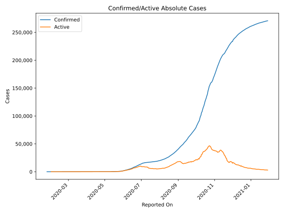
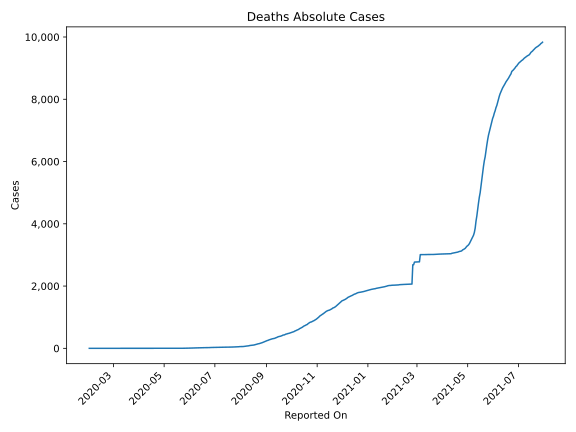
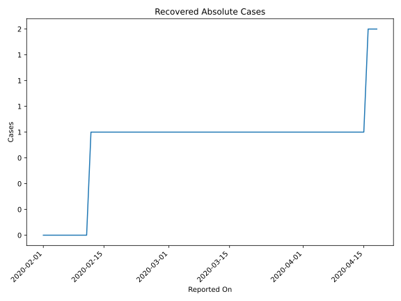
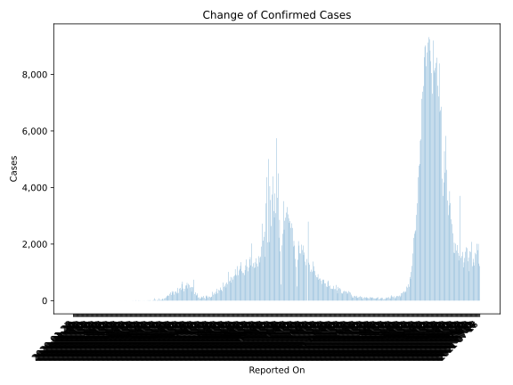
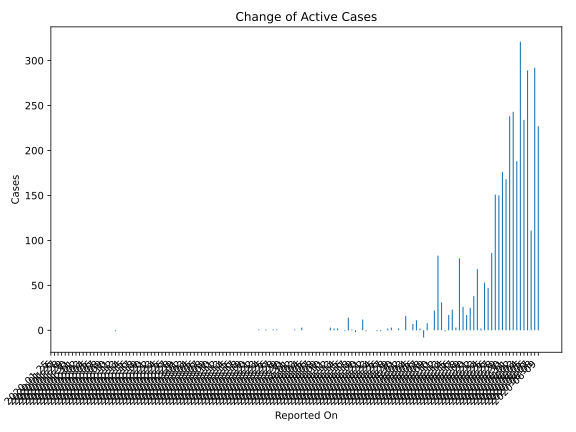
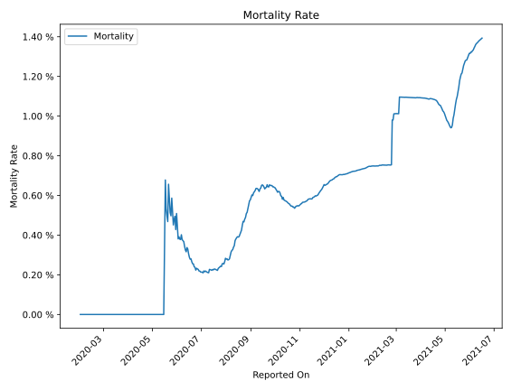

# Country Figures: Time Series for Nepal 

| Reported On | Confirmed | Deaths | Recovered | Active | Mortality | &Delta; Confirmed | &Delta; Deaths | &Delta; Recovered | &Delta; Active | % Active of Population |
|-------------|-----------|--------|-----------|--------|-----------|-------------------|----------------|-------------------|----------------|------------------------|
| 2020-04-27 | 52 | 0 | 16 | 36 |  None  | 0 | 0 | 0 | 0 |  0.000 %  | 
| 2020-04-26 | 52 | 0 | 16 | 36 |  None  | 3 | 0 | 4 | -1 |  0.000 %  | 
| 2020-04-25 | 49 | 0 | 12 | 37 |  None  | 0 | 0 | 1 | -1 |  0.000 %  | 
| 2020-04-24 | 49 | 0 | 11 | 38 |  None  | 1 | 0 | 1 | 0 |  0.000 %  | 
| 2020-04-23 | 48 | 0 | 10 | 38 |  None  | 3 | 0 | 3 | 0 |  0.000 %  | 
| 2020-04-22 | 45 | 0 | 7 | 38 |  None  | 2 | 0 | 3 | -1 |  0.000 %  | 
| 2020-04-21 | 43 | 0 | 4 | 39 |  None  | 12 | 0 | 0 | 12 |  0.000 %  | 
| 2020-04-20 | 31 | 0 | 4 | 27 |  None  | 0 | 0 | 0 | 0 |  0.000 %  | 
| 2020-04-19 | 31 | 0 | 4 | 27 |  None  | 0 | 0 | 2 | -2 |  0.000 %  | 
| 2020-04-18 | 31 | 0 | 2 | 29 |  None  | 1 | 0 | 0 | 1 |  0.000 %  | 
| 2020-04-17 | 30 | 0 | 2 | 28 |  None  | 14 | 0 | 0 | 14 |  0.000 %  | 
| 2020-04-16 | 16 | 0 | 2 | 14 |  None  | 0 | 0 | 1 | -1 |  0.000 %  | 
| 2020-04-15 | 16 | 0 | 1 | 15 |  None  | 0 | 0 | 0 | 0 |  0.000 %  | 
| 2020-04-14 | 16 | 0 | 1 | 15 |  None  | 2 | 0 | 0 | 2 |  0.000 %  | 
| 2020-04-13 | 14 | 0 | 1 | 13 |  None  | 2 | 0 | 0 | 2 |  0.000 %  | 
| 2020-04-12 | 12 | 0 | 1 | 11 |  None  | 3 | 0 | 0 | 3 |  0.000 %  | 
| 2020-04-11 | 9 | 0 | 1 | 8 |  None  | 0 | 0 | 0 | 0 |  0.000 %  | 
| 2020-04-10 | 9 | 0 | 1 | 8 |  None  | 0 | 0 | 0 | 0 |  0.000 %  | 
| 2020-04-09 | 9 | 0 | 1 | 8 |  None  | 0 | 0 | 0 | 0 |  0.000 %  | 
| 2020-04-08 | 9 | 0 | 1 | 8 |  None  | 0 | 0 | 0 | 0 |  0.000 %  | 
| 2020-04-07 | 9 | 0 | 1 | 8 |  None  | 0 | 0 | 0 | 0 |  0.000 %  | 
| 2020-04-06 | 9 | 0 | 1 | 8 |  None  | 0 | 0 | 0 | 0 |  0.000 %  | 
| 2020-04-05 | 9 | 0 | 1 | 8 |  None  | 0 | 0 | 0 | 0 |  0.000 %  | 
| 2020-04-04 | 9 | 0 | 1 | 8 |  None  | 3 | 0 | 0 | 3 |  0.000 %  | 
| 2020-04-03 | 6 | 0 | 1 | 5 |  None  | 0 | 0 | 0 | 0 |  0.000 %  | 
| 2020-04-02 | 6 | 0 | 1 | 5 |  None  | 1 | 0 | 0 | 1 |  0.000 %  | 
| 2020-04-01 | 5 | 0 | 1 | 4 |  None  | 0 | 0 | 0 | 0 |  0.000 %  | 
| 2020-03-31 | 5 | 0 | 1 | 4 |  None  | 0 | 0 | 0 | 0 |  0.000 %  | 
| 2020-03-30 | 5 | 0 | 1 | 4 |  None  | 0 | 0 | 0 | 0 |  0.000 %  | 
| 2020-03-29 | 5 | 0 | 1 | 4 |  None  | 0 | 0 | 0 | 0 |  0.000 %  | 
| 2020-03-28 | 5 | 0 | 1 | 4 |  None  | 1 | 0 | 0 | 1 |  0.000 %  | 
| 2020-03-27 | 4 | 0 | 1 | 3 |  None  | 1 | 0 | 0 | 1 |  0.000 %  | 
| 2020-03-26 | 3 | 0 | 1 | 2 |  None  | 0 | 0 | 0 | 0 |  0.000 %  | 
| 2020-03-25 | 3 | 0 | 1 | 2 |  None  | 1 | 0 | 0 | 1 |  0.000 %  | 
| 2020-03-24 | 2 | 0 | 1 | 1 |  None  | 0 | 0 | 0 | 0 |  0.000 %  | 
| 2020-03-23 | 2 | 0 | 1 | 1 |  None  | 1 | 0 | 0 | 1 |  0.000 %  | 
| 2020-03-22 | 1 | 0 | 1 | 0 |  None  | 0 | 0 | 0 | 0 |  n/a  | 
| 2020-03-21 | 1 | 0 | 1 | 0 |  None  | 0 | 0 | 0 | 0 |  n/a  | 
| 2020-03-20 | 1 | 0 | 1 | 0 |  None  | 0 | 0 | 0 | 0 |  n/a  | 
| 2020-03-19 | 1 | 0 | 1 | 0 |  None  | 0 | 0 | 0 | 0 |  n/a  | 
| 2020-03-18 | 1 | 0 | 1 | 0 |  None  | 0 | 0 | 0 | 0 |  n/a  | 
| 2020-03-17 | 1 | 0 | 1 | 0 |  None  | 0 | 0 | 0 | 0 |  n/a  | 
| 2020-03-16 | 1 | 0 | 1 | 0 |  None  | 0 | 0 | 0 | 0 |  n/a  | 
| 2020-03-15 | 1 | 0 | 1 | 0 |  None  | 0 | 0 | 0 | 0 |  n/a  | 
| 2020-03-14 | 1 | 0 | 1 | 0 |  None  | 0 | 0 | 0 | 0 |  n/a  | 
| 2020-03-13 | 1 | 0 | 1 | 0 |  None  | 0 | 0 | 0 | 0 |  n/a  | 
| 2020-03-12 | 1 | 0 | 1 | 0 |  None  | 0 | 0 | 0 | 0 |  n/a  | 
| 2020-03-11 | 1 | 0 | 1 | 0 |  None  | 0 | 0 | 0 | 0 |  n/a  | 
| 2020-03-10 | 1 | 0 | 1 | 0 |  None  | 0 | 0 | 0 | 0 |  n/a  | 
| 2020-03-09 | 1 | 0 | 1 | 0 |  None  | 0 | 0 | 0 | 0 |  n/a  | 
| 2020-03-08 | 1 | 0 | 1 | 0 |  None  | 0 | 0 | 0 | 0 |  n/a  | 
| 2020-03-07 | 1 | 0 | 1 | 0 |  None  | 0 | 0 | 0 | 0 |  n/a  | 
| 2020-03-06 | 1 | 0 | 1 | 0 |  None  | 0 | 0 | 0 | 0 |  n/a  | 
| 2020-03-05 | 1 | 0 | 1 | 0 |  None  | 0 | 0 | 0 | 0 |  n/a  | 
| 2020-03-04 | 1 | 0 | 1 | 0 |  None  | 0 | 0 | 0 | 0 |  n/a  | 
| 2020-03-03 | 1 | 0 | 1 | 0 |  None  | 0 | 0 | 0 | 0 |  n/a  | 
| 2020-03-02 | 1 | 0 | 1 | 0 |  None  | 0 | 0 | 0 | 0 |  n/a  | 
| 2020-03-01 | 1 | 0 | 1 | 0 |  None  | 0 | 0 | 0 | 0 |  n/a  | 
| 2020-02-29 | 1 | 0 | 1 | 0 |  None  | 0 | 0 | 0 | 0 |  n/a  | 
| 2020-02-28 | 1 | 0 | 1 | 0 |  None  | 0 | 0 | 0 | 0 |  n/a  | 
| 2020-02-27 | 1 | 0 | 1 | 0 |  None  | 0 | 0 | 0 | 0 |  n/a  | 
| 2020-02-26 | 1 | 0 | 1 | 0 |  None  | 0 | 0 | 0 | 0 |  n/a  | 
| 2020-02-25 | 1 | 0 | 1 | 0 |  None  | 0 | 0 | 0 | 0 |  n/a  | 
| 2020-02-24 | 1 | 0 | 1 | 0 |  None  | 0 | 0 | 0 | 0 |  n/a  | 
| 2020-02-23 | 1 | 0 | 1 | 0 |  None  | 0 | 0 | 0 | 0 |  n/a  | 
| 2020-02-22 | 1 | 0 | 1 | 0 |  None  | 0 | 0 | 0 | 0 |  n/a  | 
| 2020-02-21 | 1 | 0 | 1 | 0 |  None  | 0 | 0 | 0 | 0 |  n/a  | 
| 2020-02-20 | 1 | 0 | 1 | 0 |  None  | 0 | 0 | 0 | 0 |  n/a  | 
| 2020-02-19 | 1 | 0 | 1 | 0 |  None  | 0 | 0 | 0 | 0 |  n/a  | 
| 2020-02-18 | 1 | 0 | 1 | 0 |  None  | 0 | 0 | 0 | 0 |  n/a  | 
| 2020-02-17 | 1 | 0 | 1 | 0 |  None  | 0 | 0 | 0 | 0 |  n/a  | 
| 2020-02-16 | 1 | 0 | 1 | 0 |  None  | 0 | 0 | 0 | 0 |  n/a  | 
| 2020-02-15 | 1 | 0 | 1 | 0 |  None  | 0 | 0 | 0 | 0 |  n/a  | 
| 2020-02-14 | 1 | 0 | 1 | 0 |  None  | 0 | 0 | 0 | 0 |  n/a  | 
| 2020-02-13 | 1 | 0 | 1 | 0 |  None  | 0 | 0 | 0 | 0 |  n/a  | 
| 2020-02-12 | 1 | 0 | 1 | 0 |  None  | 0 | 0 | 1 | -1 |  n/a  | 
| 2020-02-11 | 1 | 0 | 0 | 1 |  None  | 0 | 0 | 0 | 0 |  0.000 %  | 
| 2020-02-10 | 1 | 0 | 0 | 1 |  None  | 0 | 0 | 0 | 0 |  0.000 %  | 
| 2020-02-09 | 1 | 0 | 0 | 1 |  None  | 0 | 0 | 0 | 0 |  0.000 %  | 
| 2020-02-08 | 1 | 0 | 0 | 1 |  None  | 0 | 0 | 0 | 0 |  0.000 %  | 
| 2020-02-07 | 1 | 0 | 0 | 1 |  None  | 0 | 0 | 0 | 0 |  0.000 %  | 
| 2020-02-06 | 1 | 0 | 0 | 1 |  None  | 0 | 0 | 0 | 0 |  0.000 %  | 
| 2020-02-05 | 1 | 0 | 0 | 1 |  None  | 0 | 0 | 0 | 0 |  0.000 %  | 
| 2020-02-04 | 1 | 0 | 0 | 1 |  None  | 0 | 0 | 0 | 0 |  0.000 %  | 
| 2020-02-03 | 1 | 0 | 0 | 1 |  None  | 0 | 0 | 0 | 0 |  0.000 %  | 
| 2020-02-02 | 1 | 0 | 0 | 1 |  None  | 0 | 0 | 0 | 0 |  0.000 %  | 
| 2020-02-01 | 1 | 0 | 0 | 1 |  None  | 0 | None | None | None |  0.000 %  | 
| 2020-01-31 | 1 | None | None | None |  None  | 0 | None | None | None |  n/a  | 
| 2020-01-30 | 1 | None | None | None |  None  | 0 | None | None | None |  n/a  | 
| 2020-01-29 | 1 | None | None | None |  None  | 0 | None | None | None |  n/a  | 
| 2020-01-28 | 1 | None | None | None |  None  | 0 | None | None | None |  n/a  | 
| 2020-01-27 | 1 | None | None | None |  None  | 0 | None | None | None |  n/a  | 
| 2020-01-26 | 1 | None | None | None |  None  | 0 | None | None | None |  n/a  | 
| 2020-01-25 | 1 | None | None | None |  None  | None | None | None | None |  n/a  | 

