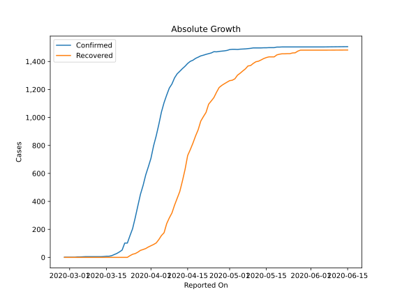
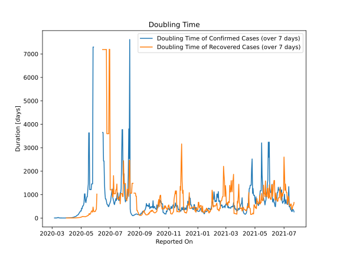

# Country Figures: Doubling Time of Infections for NewZealand 

The doubling time below are calculated based on
* an exponential growth assumption
* for time difference of past seven (7) days.
The doubling time's unit is "days".

The first doubling time indicates the increase of confirmed (infected)
cases. There, the *higher* the number is, the better is to take control
of the disease.

The second doubling time indicates the increase of recovered (healed)
cases. There, the *lower* the number is, the better it is to take
control of the disease.

| Reported On | Confirmed | Doubling Time (Confirmed) | Recovered | Doubling Time (Recovered) |
|-------------|-----------|---------------------------|-----------|---------------------------|
| 2020-04-20 | 1440 |  74.7 days  | 974 |  8.7 days  | 
| 2020-04-19 | 1431 |  66.6 days  | 912 |  7.7 days  | 
| 2020-04-18 | 1422 |  60.6 days  | 867 |  7.1 days  | 
| 2020-04-17 | 1409 |  52.1 days  | 816 |  6.5 days  | 
| 2020-04-16 | 1401 |  39.8 days  | 770 |  5.8 days  | 
| 2020-04-15 | 1386 |  36.1 days  | 728 |  5.5 days  | 
| 2020-04-14 | 1366 |  30.0 days  | 628 |  5.4 days  | 
| 2020-04-13 | 1349 |  24.8 days  | 546 |  4.6 days  | 
| 2020-04-12 | 1330 |  20.0 days  | 471 |  4.7 days  | 
| 2020-04-11 | 1312 |  15.4 days  | 422 |  4.4 days  | 
| 2020-04-10 | 1283 |  12.8 days  | 373 |  4.1 days  | 
| 2020-04-09 | 1239 |  11.3 days  | 317 |  4.3 days  | 
| 2020-04-08 | 1210 |  9.4 days  | 282 |  4.3 days  | 
| 2020-04-07 | 1160 |  8.7 days  | 241 |  4.4 days  | 
| 2020-04-06 | 1106 |  8.0 days  | 176 |  5.1 days  | 
| 2020-04-05 | 1039 |  7.2 days  | 156 |  5.1 days  | 
| 2020-04-04 | 950 |  6.9 days  | 127 |  5.5 days  | 
| 2020-04-03 | 868 |  6.0 days  | 103 |  5.1 days  | 
| 2020-04-02 | 797 |  5.0 days  | 92 |  4.3 days  | 
| 2020-04-01 | 708 |  4.3 days  | 83 |  4.0 days  | 
| 2020-03-31 | 647 |  3.7 days  | 74 |  3.0 days  | 
| 2020-03-30 | 589 |  3.1 days  | 63 |  None  | 
| 2020-03-29 | 514 |  3.3 days  | 56 |  None  | 
| 2020-03-28 | 451 |  2.6 days  | 50 |  None  | 
| 2020-03-27 | 368 |  2.5 days  | 37 |  None  | 
| 2020-03-26 | 283 |  2.4 days  | 27 |  None  | 
| 2020-03-25 | 205 |  2.4 days  | 22 |  None  | 
| 2020-03-24 | 155 |  2.2 days  | 12 |  None  | 
| 2020-03-23 | 102 |  2.2 days  | 0 |  None  | 
| 2020-03-22 | 102 |  2.2 days  | 0 |  None  | 
| 2020-03-21 | 52 |  2.6 days  | 0 |  None  | 
| 2020-03-20 | 39 |  2.7 days  | 0 |  None  | 
| 2020-03-19 | 28 |  3.2 days  | 0 |  None  | 
| 2020-03-18 | 20 |  3.8 days  | 0 |  None  | 
| 2020-03-17 | 12 |  5.9 days  | 0 |  None  | 
| 2020-03-16 | 8 |  10.7 days  | 0 |  None  | 
| 2020-03-15 | 8 |  10.7 days  | 0 |  None  | 
| 2020-03-14 | 6 |  27.0 days  | 0 |  None  | 
| 2020-03-13 | 5 |  22.1 days  | 0 |  None  | 
| 2020-03-12 | 5 |  9.8 days  | 0 |  None  | 
| 2020-03-11 | 5 |  9.8 days  | 0 |  None  | 
| 2020-03-10 | 5 |  3.3 days  | 0 |  None  | 
| 2020-03-09 | 5 |  3.3 days  | 0 |  None  | 
| 2020-03-08 | 5 |  3.3 days  | 0 |  None  | 
| 2020-03-07 | 5 |  3.3 days  | 0 |  None  | 
| 2020-03-06 | 4 |  3.8 days  | 0 |  None  | 
| 2020-03-05 | 3 |  None  | 0 |  None  | 
| 2020-03-04 | 3 |  None  | 0 |  None  | 
| 2020-03-03 | 1 |  None  | 0 |  None  | 
| 2020-03-02 | 1 |  None  | 0 |  None  | 
| 2020-03-01 | 1 |  None  | 0 |  None  | 
| 2020-02-29 | 1 |  None  | 0 |  None  | 
| 2020-02-28 | 1 |  None  | 0 |  None  | 

