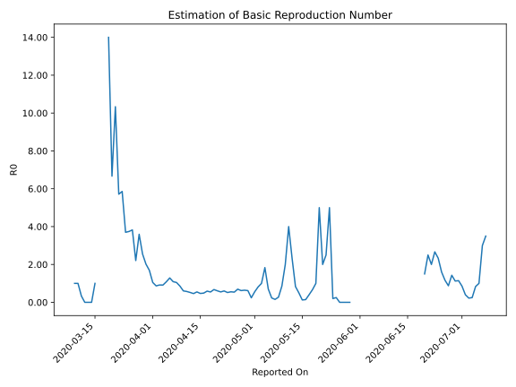

# Country Figures: Time Series for Basic Reproduction Number of NewZealand 

| Reported On | &Delta; Confirmed | Total &Delta; Confirmed First Interval | Total &Delta; Confirmed Second Interval | Estimated Basic Reproduction Number R0 | 
|-------------|-------------------|----------------------------------------|-----------------------------------------|---------------------------------------------------|
| 2020-05-05 | 2 |  7  |  10  |  0.70  | 
| 2020-05-04 | -1 |  11  |  6  |  1.83  | 
| 2020-05-03 | 0 |  13  |  13  |  1.00  | 
| 2020-05-02 | 2 |  13  |  16  |  0.81  | 
| 2020-05-01 | 6 |  10  |  18  |  0.56  | 
| 2020-04-30 | 3 |  6  |  25  |  0.24  | 
| 2020-04-29 | 2 |  13  |  21  |  0.62  | 
| 2020-04-28 | 2 |  16  |  25  |  0.64  | 
| 2020-04-27 | 3 |  18  |  29  |  0.62  | 
| 2020-04-26 | -1 |  25  |  36  |  0.69  | 
| 2020-04-25 | 9 |  21  |  39  |  0.54  | 
| 2020-04-24 | 5 |  25  |  45  |  0.56  | 
| 2020-04-23 | 5 |  29  |  56  |  0.52  | 
| 2020-04-22 | 6 |  36  |  60  |  0.60  | 
| 2020-04-21 | 5 |  39  |  71  |  0.55  | 
| 2020-04-20 | 9 |  45  |  74  |  0.61  | 
| 2020-04-19 | 9 |  56  |  83  |  0.67  | 
| 2020-04-18 | 13 |  60  |  110  |  0.55  | 
| 2020-04-17 | 8 |  71  |  120  |  0.59  | 
| 2020-04-16 | 15 |  74  |  152  |  0.49  | 
| 2020-04-15 | 20 |  83  |  177  |  0.47  | 
| 2020-04-14 | 17 |  110  |  200  |  0.55  | 
| 2020-04-13 | 19 |  120  |  260  |  0.46  | 
| 2020-04-12 | 18 |  152  |  292  |  0.52  | 
| 2020-04-11 | 29 |  177  |  309  |  0.57  | 
| 2020-04-10 | 44 |  200  |  331  |  0.60  | 
| 2020-04-09 | 29 |  260  |  303  |  0.86  | 
| 2020-04-08 | 50 |  292  |  279  |  1.05  | 
| 2020-04-07 | 54 |  309  |  283  |  1.09  | 
| 2020-04-06 | 67 |  331  |  257  |  1.29  | 
| 2020-04-05 | 89 |  303  |  279  |  1.09  | 
| 2020-04-04 | 82 |  279  |  306  |  0.91  | 
| 2020-04-03 | 71 |  283  |  309  |  0.92  | 
| 2020-04-02 | 89 |  257  |  296  |  0.87  | 
| 2020-04-01 | 61 |  279  |  266  |  1.05  | 
| 2020-03-31 | 58 |  306  |  181  |  1.69  | 
| 2020-03-30 | 75 |  309  |  153  |  2.02  | 
| 2020-03-29 | 63 |  296  |  116  |  2.55  | 
| 2020-03-28 | 83 |  266  |  74  |  3.59  | 
| 2020-03-27 | 85 |  181  |  82  |  2.21  | 
| 2020-03-26 | 78 |  153  |  40  |  3.83  | 
| 2020-03-25 | 50 |  116  |  31  |  3.74  | 
| 2020-03-24 | 53 |  74  |  20  |  3.70  | 
| 2020-03-23 | 0 |  82  |  14  |  5.86  | 
| 2020-03-22 | 50 |  40  |  7  |  5.71  | 
| 2020-03-21 | 13 |  31  |  3  |  10.33  | 
| 2020-03-20 | 11 |  20  |  3  |  6.67  | 
| 2020-03-19 | 8 |  14  |  1  |  14.00  | 
| 2020-03-18 | 8 |  7  |  None  |  None  | 
| 2020-03-17 | 4 |  3  |  None  |  None  | 
| 2020-03-16 | 0 |  3  |  None  |  None  | 
| 2020-03-15 | 2 |  1  |  1  |  1.00  | 
| 2020-03-14 | 1 |  None  |  2  |  None  | 
| 2020-03-13 | 0 |  None  |  2  |  None  | 
| 2020-03-12 | 0 |  None  |  4  |  None  | 
| 2020-03-11 | 0 |  1  |  3  |  0.33  | 
| 2020-03-10 | 0 |  2  |  2  |  1.00  | 
| 2020-03-09 | 0 |  2  |  2  |  1.00  | 
| 2020-03-08 | 0 |  4  |  None  |  None  | 
| 2020-03-07 | 1 |  3  |  None  |  None  | 
| 2020-03-06 | 1 |  2  |  None  |  None  | 
| 2020-03-05 | 0 |  2  |  None  |  None  | 
| 2020-03-04 | 2 |  None  |  None  |  None  | 
| 2020-03-03 | 0 |  None  |  None  |  None  | 
| 2020-03-02 | 0 |  None  |  None  |  None  | 
| 2020-03-01 | 0 |  None  |  None  |  None  | 
| 2020-02-29 | 0 |  None  |  None  |  None  | 
| 2020-02-28 | None |  None  |  None  |  None  | 

