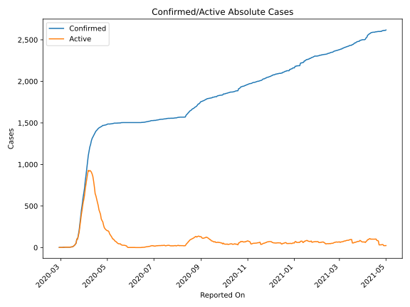
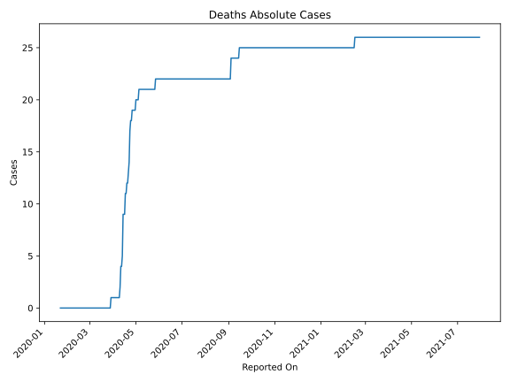
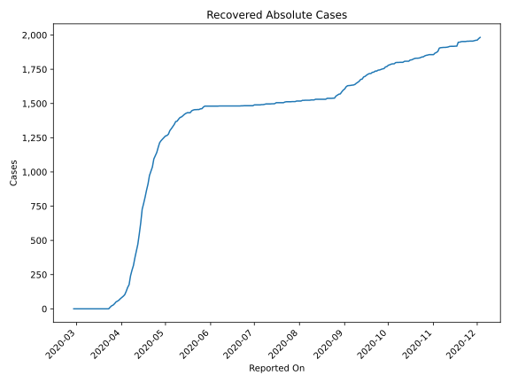
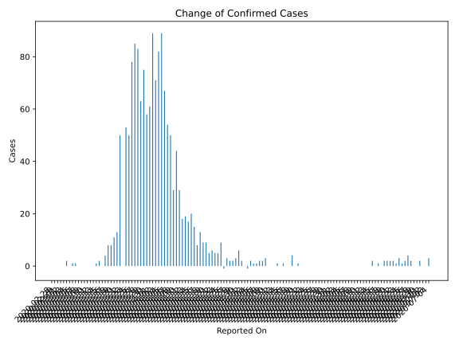
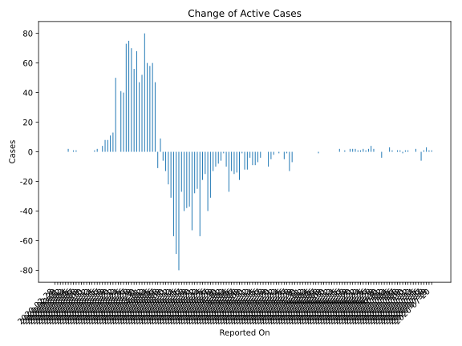
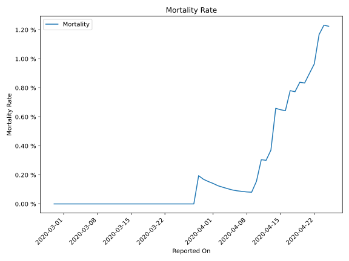

# Country Figures: Time Series for NewZealand 

| Reported On | Confirmed | Deaths | Recovered | Active | Mortality | &Delta; Confirmed | &Delta; Deaths | &Delta; Active | % Active of Population |
|-------------|-----------|--------|-----------|--------|-----------|-------------------|----------------|----------------|------------------------|
| 2020-03-26 | 283 | 0 | 27 | 256 |  None  | 78 | 0 | 73 |  0.005 %  | 
| 2020-03-25 | 205 | 0 | 22 | 183 |  None  | 50 | 0 | 40 |  0.004 %  | 
| 2020-03-24 | 155 | 0 | 12 | 143 |  None  | 53 | 0 | 41 |  0.003 %  | 
| 2020-03-23 | 102 | 0 | 0 | 102 |  None  | 0 | 0 | 0 |  0.002 %  | 
| 2020-03-22 | 102 | 0 | 0 | 102 |  None  | 50 | 0 | 50 |  0.002 %  | 
| 2020-03-21 | 52 | 0 | 0 | 52 |  None  | 13 | 0 | 13 |  0.001 %  | 
| 2020-03-20 | 39 | 0 | 0 | 39 |  None  | 11 | 0 | 11 |  0.001 %  | 
| 2020-03-19 | 28 | 0 | 0 | 28 |  None  | 8 | 0 | 8 |  0.001 %  | 
| 2020-03-18 | 20 | 0 | 0 | 20 |  None  | 8 | 0 | 8 |  0.000 %  | 
| 2020-03-17 | 12 | 0 | 0 | 12 |  None  | 4 | 0 | 4 |  0.000 %  | 
| 2020-03-16 | 8 | 0 | 0 | 8 |  None  | 0 | 0 | 0 |  0.000 %  | 
| 2020-03-15 | 8 | 0 | 0 | 8 |  None  | 2 | 0 | 2 |  0.000 %  | 
| 2020-03-14 | 6 | 0 | 0 | 6 |  None  | 1 | 0 | 1 |  0.000 %  | 
| 2020-03-13 | 5 | 0 | 0 | 5 |  None  | 0 | 0 | 0 |  0.000 %  | 
| 2020-03-12 | 5 | 0 | 0 | 5 |  None  | 0 | 0 | 0 |  0.000 %  | 
| 2020-03-11 | 5 | 0 | 0 | 5 |  None  | 0 | 0 | 0 |  0.000 %  | 
| 2020-03-10 | 5 | 0 | 0 | 5 |  None  | 0 | 0 | 0 |  0.000 %  | 
| 2020-03-09 | 5 | 0 | 0 | 5 |  None  | 0 | 0 | 0 |  0.000 %  | 
| 2020-03-08 | 5 | 0 | 0 | 5 |  None  | 0 | 0 | 0 |  0.000 %  | 
| 2020-03-07 | 5 | 0 | 0 | 5 |  None  | 1 | 0 | 1 |  0.000 %  | 
| 2020-03-06 | 4 | 0 | 0 | 4 |  None  | 1 | 0 | 1 |  0.000 %  | 
| 2020-03-05 | 3 | 0 | 0 | 3 |  None  | 0 | 0 | 0 |  0.000 %  | 
| 2020-03-04 | 3 | 0 | 0 | 3 |  None  | 2 | 0 | 2 |  0.000 %  | 
| 2020-03-03 | 1 | 0 | 0 | 1 |  None  | 0 | 0 | 0 |  0.000 %  | 
| 2020-03-02 | 1 | 0 | 0 | 1 |  None  | 0 | 0 | 0 |  0.000 %  | 
| 2020-03-01 | 1 | 0 | 0 | 1 |  None  | 0 | 0 | 0 |  0.000 %  | 
| 2020-02-29 | 1 | 0 | 0 | 1 |  None  | 0 | 0 | 0 |  0.000 %  | 
| 2020-02-28 | 1 | 0 | 0 | 1 |  None  | None | None | None |  0.000 %  | 

