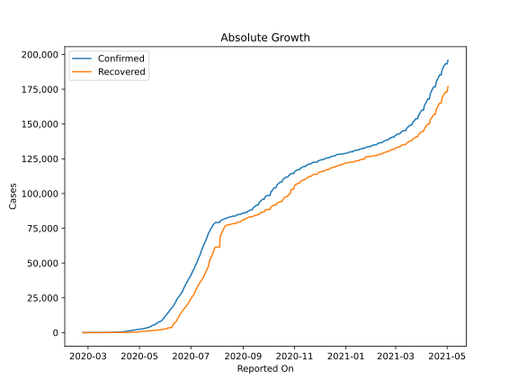
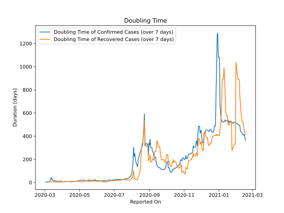

# Country Figures: Doubling Time of Infections for Oman 

The doubling time below are calculated based on
* an exponential growth assumption
* for time difference of past seven (7) days.
The doubling time's unit is "days".

The first doubling time indicates the increase of confirmed (infected)
cases. There, the *higher* the number is, the better is to take control
of the disease.

The second doubling time indicates the increase of recovered (healed)
cases. There, the *lower* the number is, the better it is to take
control of the disease.

| Reported On | Confirmed | Doubling Time (Confirmed) | Recovered | Doubling Time (Recovered) |
|-------------|-----------|---------------------------|-----------|---------------------------|
| 2020-04-06 | 331 |  8.2 days  | 61 |  6.9 days  | 
| 2020-04-05 | 298 |  8.7 days  | 61 |  5.3 days  | 
| 2020-04-04 | 277 |  8.4 days  | 61 |  5.3 days  | 
| 2020-04-03 | 252 |  7.8 days  | 57 |  5.7 days  | 
| 2020-04-02 | 231 |  6.8 days  | 57 |  5.7 days  | 
| 2020-04-01 | 210 |  6.8 days  | 34 |  7.3 days  | 
| 2020-03-31 | 192 |  6.2 days  | 34 |  7.3 days  | 
| 2020-03-30 | 179 |  5.2 days  | 29 |  9.4 days  | 
| 2020-03-29 | 167 |  4.7 days  | 23 |  16.4 days  | 
| 2020-03-28 | 152 |  4.9 days  | 23 |  7.8 days  | 
| 2020-03-27 | 131 |  5.2 days  | 23 |  7.8 days  | 
| 2020-03-26 | 109 |  6.3 days  | 23 |  7.8 days  | 
| 2020-03-25 | 99 |  5.5 days  | 17 |  14.3 days  | 
| 2020-03-24 | 84 |  4.2 days  | 17 |  8.0 days  | 
| 2020-03-23 | 66 |  4.8 days  | 17 |  8.0 days  | 
| 2020-03-22 | 55 |  5.6 days  | 17 |  8.0 days  | 
| 2020-03-21 | 52 |  5.2 days  | 12 |  17.2 days  | 
| 2020-03-20 | 48 |  5.6 days  | 12 |  17.2 days  | 
| 2020-03-19 | 48 |  5.3 days  | 12 |  17.2 days  | 
| 2020-03-18 | 39 |  6.6 days  | 12 |  17.2 days  | 
| 2020-03-17 | 24 |  17.2 days  | 9 |  None  | 
| 2020-03-16 | 22 |  15.6 days  | 9 |  3.6 days  | 
| 2020-03-15 | 22 |  15.6 days  | 9 |  3.6 days  | 
| 2020-03-14 | 19 |  28.6 days  | 9 |  3.6 days  | 
| 2020-03-13 | 19 |  28.6 days  | 9 |  3.6 days  | 
| 2020-03-12 | 18 |  41.5 days  | 9 |  3.6 days  | 
| 2020-03-11 | 18 |  27.0 days  | 9 |  3.6 days  | 
| 2020-03-10 | 18 |  12.3 days  | 9 |  3.6 days  | 
| 2020-03-09 | 16 |  5.3 days  | 2 |  7.3 days  | 
| 2020-03-08 | 16 |  5.3 days  | 2 |  7.3 days  | 
| 2020-03-07 | 16 |  5.3 days  | 2 |  7.3 days  | 
| 2020-03-06 | 16 |  3.8 days  | 2 |  None  | 
| 2020-03-05 | 16 |  3.8 days  | 2 |  None  | 
| 2020-03-04 | 15 |  4.0 days  | 2 |  None  | 
| 2020-03-03 | 12 |  3.0 days  | 2 |  None  | 
| 2020-03-02 | 6 |  4.8 days  | 1 |  None  | 
| 2020-03-01 | 6 |  None  | 1 |  None  | 
| 2020-02-29 | 6 |  None  | 1 |  None  | 
| 2020-02-28 | 4 |  None  | 0 |  None  | 
| 2020-02-27 | 4 |  None  | 0 |  None  | 
| 2020-02-26 | 4 |  None  | 0 |  None  | 
| 2020-02-25 | 2 |  None  | 0 |  None  | 
| 2020-02-24 | 2 |  None  | 0 |  None  | 

