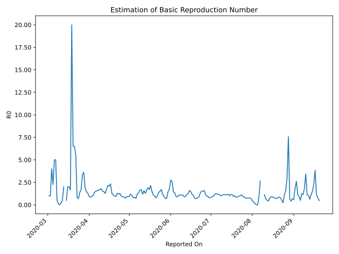

# Country Figures: Time Series for Basic Reproduction Number of Oman 

| Reported On | &Delta; Confirmed | Total &Delta; Confirmed First Interval | Total &Delta; Confirmed Second Interval | Estimated Basic Reproduction Number R0 | 
|-------------|-------------------|----------------------------------------|-----------------------------------------|---------------------------------------------------|
| 2020-05-06 | 168 |  288  |  398  |  0.72  | 
| 2020-05-05 | 98 |  289  |  350  |  0.83  | 
| 2020-05-04 | 69 |  294  |  369  |  0.80  | 
| 2020-05-03 | 85 |  352  |  341  |  1.03  | 
| 2020-05-02 | 36 |  398  |  333  |  1.20  | 
| 2020-05-01 | 99 |  350  |  384  |  0.91  | 
| 2020-04-30 | 74 |  369  |  397  |  0.93  | 
| 2020-04-29 | 143 |  341  |  380  |  0.90  | 
| 2020-04-28 | 82 |  333  |  450  |  0.74  | 
| 2020-04-27 | 51 |  384  |  434  |  0.88  | 
| 2020-04-26 | 93 |  397  |  439  |  0.90  | 
| 2020-04-25 | 115 |  380  |  391  |  0.97  | 
| 2020-04-24 | 74 |  450  |  356  |  1.26  | 
| 2020-04-23 | 102 |  434  |  367  |  1.18  | 
| 2020-04-22 | 106 |  439  |  342  |  1.28  | 
| 2020-04-21 | 98 |  391  |  420  |  0.93  | 
| 2020-04-20 | 144 |  356  |  364  |  0.98  | 
| 2020-04-19 | 86 |  367  |  329  |  1.12  | 
| 2020-04-18 | 111 |  342  |  270  |  1.27  | 
| 2020-04-17 | 50 |  420  |  180  |  2.33  | 
| 2020-04-16 | 109 |  364  |  175  |  2.08  | 
| 2020-04-15 | 97 |  329  |  153  |  2.15  | 
| 2020-04-14 | 86 |  270  |  159  |  1.70  | 
| 2020-04-13 | 128 |  180  |  142  |  1.27  | 
| 2020-04-12 | 53 |  175  |  119  |  1.47  | 
| 2020-04-11 | 62 |  153  |  100  |  1.53  | 
| 2020-04-10 | 27 |  159  |  88  |  1.81  | 
| 2020-04-09 | 38 |  142  |  85  |  1.67  | 
| 2020-04-08 | 48 |  119  |  73  |  1.63  | 
| 2020-04-07 | 40 |  100  |  64  |  1.56  | 
| 2020-04-06 | 33 |  88  |  58  |  1.52  | 
| 2020-04-05 | 21 |  85  |  61  |  1.39  | 
| 2020-04-04 | 25 |  73  |  70  |  1.04  | 
| 2020-04-03 | 21 |  64  |  68  |  0.94  | 
| 2020-04-02 | 21 |  58  |  68  |  0.85  | 
| 2020-04-01 | 18 |  61  |  65  |  0.94  | 
| 2020-03-31 | 13 |  70  |  54  |  1.30  | 
| 2020-03-30 | 12 |  68  |  47  |  1.45  | 
| 2020-03-29 | 15 |  68  |  36  |  1.89  | 
| 2020-03-28 | 21 |  65  |  18  |  3.61  | 
| 2020-03-27 | 22 |  54  |  16  |  3.38  | 
| 2020-03-26 | 10 |  47  |  28  |  1.68  | 
| 2020-03-25 | 15 |  36  |  26  |  1.38  | 
| 2020-03-24 | 18 |  18  |  26  |  0.69  | 
| 2020-03-23 | 11 |  16  |  20  |  0.80  | 
| 2020-03-22 | 3 |  28  |  5  |  5.60  | 
| 2020-03-21 | 4 |  26  |  4  |  6.50  | 
| 2020-03-20 | 0 |  26  |  4  |  6.50  | 
| 2020-03-19 | 9 |  20  |  1  |  20.00  | 
| 2020-03-18 | 15 |  5  |  3  |  1.67  | 
| 2020-03-17 | 2 |  4  |  2  |  2.00  | 
| 2020-03-16 | 0 |  4  |  2  |  2.00  | 
| 2020-03-15 | 3 |  1  |  2  |  0.50  | 
| 2020-03-14 | 0 |  3  |  None  |  None  | 
| 2020-03-13 | 1 |  2  |  1  |  2.00  | 
| 2020-03-12 | 0 |  2  |  4  |  0.50  | 
| 2020-03-11 | 0 |  2  |  10  |  0.20  | 
| 2020-03-10 | 2 |  None  |  10  |  None  | 
| 2020-03-09 | 0 |  1  |  9  |  0.11  | 
| 2020-03-08 | 0 |  4  |  8  |  0.50  | 
| 2020-03-07 | 0 |  10  |  2  |  5.00  | 
| 2020-03-06 | 0 |  10  |  2  |  5.00  | 
| 2020-03-05 | 1 |  9  |  4  |  2.25  | 
| 2020-03-04 | 3 |  8  |  2  |  4.00  | 
| 2020-03-03 | 6 |  2  |  2  |  1.00  | 
| 2020-03-02 | 0 |  2  |  2  |  1.00  | 
| 2020-03-01 | 0 |  4  |  None  |  None  | 
| 2020-02-29 | 2 |  2  |  None  |  None  | 
| 2020-02-28 | 0 |  2  |  None  |  None  | 
| 2020-02-27 | 0 |  2  |  None  |  None  | 
| 2020-02-26 | 2 |  None  |  None  |  None  | 
| 2020-02-25 | 0 |  None  |  None  |  None  | 
| 2020-02-24 | None |  None  |  None  |  None  | 

