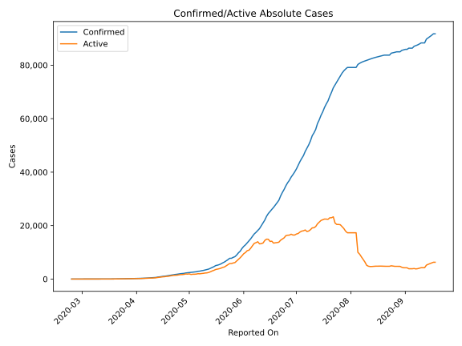
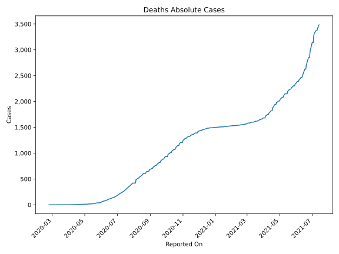
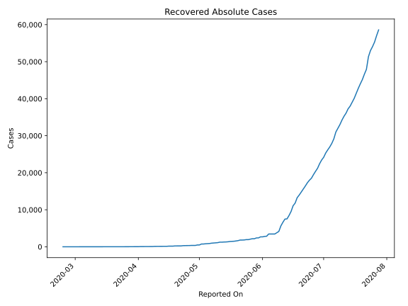
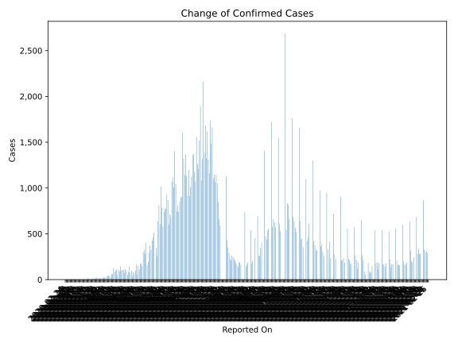
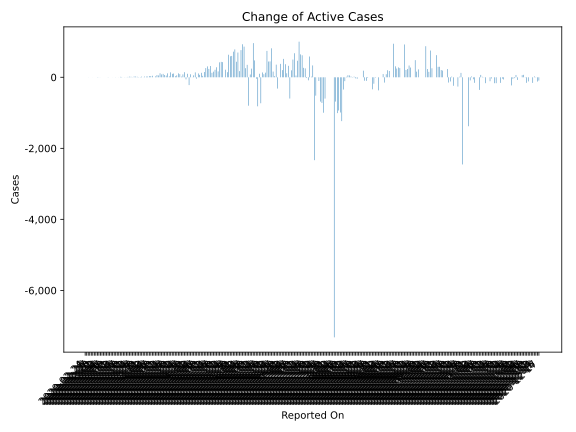
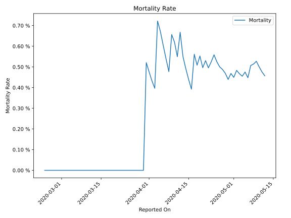

# Country Figures: Time Series for Oman 

| Reported On | Confirmed | Deaths | Recovered | Active | Mortality | &Delta; Confirmed | &Delta; Deaths | &Delta; Active | % Active of Population |
|-------------|-----------|--------|-----------|--------|-----------|-------------------|----------------|----------------|------------------------|
| 2020-03-26 | 109 | 0 | 23 | 86 |  None  | 10 | 0 | 4 |  0.002 %  | 
| 2020-03-25 | 99 | 0 | 17 | 82 |  None  | 15 | 0 | 15 |  0.002 %  | 
| 2020-03-24 | 84 | 0 | 17 | 67 |  None  | 18 | 0 | 18 |  0.001 %  | 
| 2020-03-23 | 66 | 0 | 17 | 49 |  None  | 11 | 0 | 11 |  0.001 %  | 
| 2020-03-22 | 55 | 0 | 17 | 38 |  None  | 3 | 0 | -2 |  0.001 %  | 
| 2020-03-21 | 52 | 0 | 12 | 40 |  None  | 4 | 0 | 4 |  0.001 %  | 
| 2020-03-20 | 48 | 0 | 12 | 36 |  None  | 0 | 0 | 0 |  0.001 %  | 
| 2020-03-19 | 48 | 0 | 12 | 36 |  None  | 9 | 0 | 9 |  0.001 %  | 
| 2020-03-18 | 39 | 0 | 12 | 27 |  None  | 15 | 0 | 12 |  0.001 %  | 
| 2020-03-17 | 24 | 0 | 9 | 15 |  None  | 2 | 0 | 2 |  0.000 %  | 
| 2020-03-16 | 22 | 0 | 9 | 13 |  None  | 0 | 0 | 0 |  0.000 %  | 
| 2020-03-15 | 22 | 0 | 9 | 13 |  None  | 3 | 0 | 3 |  0.000 %  | 
| 2020-03-14 | 19 | 0 | 9 | 10 |  None  | 0 | 0 | 0 |  0.000 %  | 
| 2020-03-13 | 19 | 0 | 9 | 10 |  None  | 1 | 0 | 1 |  0.000 %  | 
| 2020-03-12 | 18 | 0 | 9 | 9 |  None  | 0 | 0 | 0 |  0.000 %  | 
| 2020-03-11 | 18 | 0 | 9 | 9 |  None  | 0 | 0 | 0 |  0.000 %  | 
| 2020-03-10 | 18 | 0 | 9 | 9 |  None  | 2 | 0 | -5 |  0.000 %  | 
| 2020-03-09 | 16 | 0 | 2 | 14 |  None  | 0 | 0 | 0 |  0.000 %  | 
| 2020-03-08 | 16 | 0 | 2 | 14 |  None  | 0 | 0 | 0 |  0.000 %  | 
| 2020-03-07 | 16 | 0 | 2 | 14 |  None  | 0 | 0 | 0 |  0.000 %  | 
| 2020-03-06 | 16 | 0 | 2 | 14 |  None  | 0 | 0 | 0 |  0.000 %  | 
| 2020-03-05 | 16 | 0 | 2 | 14 |  None  | 1 | 0 | 1 |  0.000 %  | 
| 2020-03-04 | 15 | 0 | 2 | 13 |  None  | 3 | 0 | 3 |  0.000 %  | 
| 2020-03-03 | 12 | 0 | 2 | 10 |  None  | 6 | 0 | 5 |  0.000 %  | 
| 2020-03-02 | 6 | 0 | 1 | 5 |  None  | 0 | 0 | 0 |  0.000 %  | 
| 2020-03-01 | 6 | 0 | 1 | 5 |  None  | 0 | 0 | 0 |  0.000 %  | 
| 2020-02-29 | 6 | 0 | 1 | 5 |  None  | 2 | 0 | 1 |  0.000 %  | 
| 2020-02-28 | 4 | 0 | 0 | 4 |  None  | 0 | 0 | 0 |  0.000 %  | 
| 2020-02-27 | 4 | 0 | 0 | 4 |  None  | 0 | 0 | 0 |  0.000 %  | 
| 2020-02-26 | 4 | 0 | 0 | 4 |  None  | 2 | 0 | 2 |  0.000 %  | 
| 2020-02-25 | 2 | 0 | 0 | 2 |  None  | 0 | 0 | 0 |  0.000 %  | 
| 2020-02-24 | 2 | 0 | 0 | 2 |  None  | None | None | None |  0.000 %  | 

