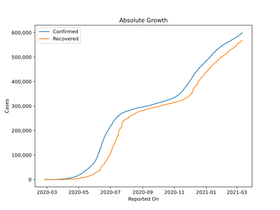
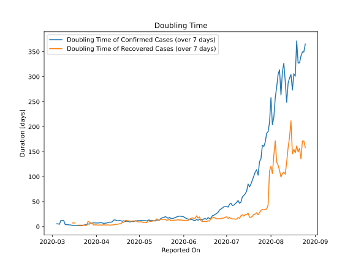

# Country Figures: Doubling Time of Infections for Pakistan 

The doubling time below are calculated based on
* an exponential growth assumption
* for time difference of past seven (7) days.
The doubling time's unit is "days".

The first doubling time indicates the increase of confirmed (infected)
cases. There, the *higher* the number is, the better is to take control
of the disease.

The second doubling time indicates the increase of recovered (healed)
cases. There, the *lower* the number is, the better it is to take
control of the disease.

| Reported On | Confirmed | Doubling Time (Confirmed) | Recovered | Doubling Time (Recovered) |
|-------------|-----------|---------------------------|-----------|---------------------------|
| 2020-04-26 | 13328 |  10.7 days  | 2936 |  11.1 days  | 
| 2020-04-25 | 12723 |  9.9 days  | 2866 |  11.2 days  | 
| 2020-04-24 | 11940 |  9.5 days  | 2755 |  11.2 days  | 
| 2020-04-23 | 11155 |  10.5 days  | 2527 |  11.6 days  | 
| 2020-04-22 | 10076 |  11.0 days  | 2156 |  12.5 days  | 
| 2020-04-21 | 9565 |  10.2 days  | 2073 |  12.2 days  | 
| 2020-04-20 | 8418 |  11.7 days  | 1970 |  8.6 days  | 
| 2020-04-19 | 8348 |  10.7 days  | 1868 |  8.5 days  | 
| 2020-04-18 | 7638 |  11.9 days  | 1832 |  5.9 days  | 
| 2020-04-17 | 7025 |  12.4 days  | 1765 |  5.8 days  | 
| 2020-04-16 | 6919 |  11.6 days  | 1645 |  4.9 days  | 
| 2020-04-15 | 6383 |  12.4 days  | 1446 |  4.6 days  | 
| 2020-04-14 | 5837 |  13.5 days  | 1378 |  4.5 days  | 
| 2020-04-13 | 5496 |  13.2 days  | 1095 |  3.7 days  | 
| 2020-04-12 | 5230 |  10.0 days  | 1028 |  3.4 days  | 
| 2020-04-11 | 5011 |  8.8 days  | 762 |  3.1 days  | 
| 2020-04-10 | 4695 |  9.0 days  | 727 |  3.1 days  | 
| 2020-04-09 | 4489 |  8.2 days  | 572 |  3.5 days  | 
| 2020-04-08 | 4263 |  7.3 days  | 467 |  3.4 days  | 
| 2020-04-07 | 4035 |  7.0 days  | 429 |  3.1 days  | 
| 2020-04-06 | 3766 |  6.5 days  | 259 |  4.3 days  | 
| 2020-04-05 | 3157 |  7.5 days  | 211 |  2.8 days  | 
| 2020-04-04 | 2818 |  8.0 days  | 131 |  3.6 days  | 
| 2020-04-03 | 2686 |  7.6 days  | 126 |  3.2 days  | 
| 2020-04-02 | 2421 |  7.3 days  | 125 |  3.1 days  | 
| 2020-04-01 | 2118 |  7.4 days  | 94 |  3.6 days  | 
| 2020-03-31 | 1938 |  7.4 days  | 76 |  3.7 days  | 
| 2020-03-30 | 1717 |  7.5 days  | 76 |  3.1 days  | 
| 2020-03-29 | 1597 |  7.1 days  | 29 |  6.4 days  | 
| 2020-03-28 | 1495 |  7.1 days  | 29 |  6.4 days  | 
| 2020-03-27 | 1373 |  5.2 days  | 23 |  8.8 days  | 
| 2020-03-26 | 1201 |  5.3 days  | 21 |  10.5 days  | 
| 2020-03-25 | 1063 |  4.2 days  | 21 |  2.4 days  | 
| 2020-03-24 | 972 |  3.8 days  | 18 |  2.5 days  | 
| 2020-03-23 | 875 |  2.9 days  | 13 |  2.9 days  | 
| 2020-03-22 | 776 |  2.1 days  | 13 |  2.9 days  | 
| 2020-03-21 | 730 |  1.9 days  | 13 |  2.9 days  | 
| 2020-03-20 | 501 |  2.0 days  | 13 |  2.9 days  | 
| 2020-03-19 | 454 |  1.9 days  | 13 |  2.9 days  | 
| 2020-03-18 | 299 |  2.1 days  | 2 |  None  | 
| 2020-03-17 | 236 |  2.1 days  | 2 |  7.3 days  | 
| 2020-03-16 | 136 |  1.9 days  | 2 |  7.3 days  | 
| 2020-03-15 | 53 |  2.6 days  | 2 |  7.3 days  | 
| 2020-03-14 | 31 |  3.3 days  | 2 |  None  | 
| 2020-03-13 | 28 |  3.5 days  | 2 |  None  | 
| 2020-03-12 | 20 |  3.8 days  | 2 |  None  | 
| 2020-03-11 | 19 |  4.0 days  | 2 |  None  | 
| 2020-03-10 | 16 |  4.5 days  | 1 |  None  | 
| 2020-03-09 | 6 |  12.3 days  | 1 |  None  | 
| 2020-03-08 | 6 |  12.3 days  | 1 |  None  | 
| 2020-03-07 | 6 |  12.3 days  | 0 |  None  | 
| 2020-03-06 | 6 |  4.8 days  | 0 |  None  | 
| 2020-03-05 | 5 |  5.6 days  | 0 |  None  | 
| 2020-03-04 | 5 |  5.6 days  | 0 |  None  | 
| 2020-03-03 | 5 |  None  | 0 |  None  | 
| 2020-03-02 | 4 |  None  | 0 |  None  | 
| 2020-03-01 | 4 |  None  | 0 |  None  | 
| 2020-02-29 | 4 |  None  | 0 |  None  | 
| 2020-02-28 | 2 |  None  | 0 |  None  | 
| 2020-02-27 | 2 |  None  | 0 |  None  | 
| 2020-02-26 | 2 |  None  | 0 |  None  | 

