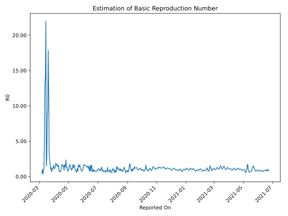

# Country Figures: Time Series for Basic Reproduction Number of Pakistan 

| Reported On | &Delta; Confirmed | Total &Delta; Confirmed First Interval | Total &Delta; Confirmed Second Interval | Estimated Basic Reproduction Number R0 | 
|-------------|-------------------|----------------------------------------|-----------------------------------------|---------------------------------------------------|
| 2020-04-27 | 587 |  3252  |  2438  |  1.33  | 
| 2020-04-26 | 605 |  3158  |  2540  |  1.24  | 
| 2020-04-25 | 783 |  3522  |  1499  |  2.35  | 
| 2020-04-24 | 785 |  2807  |  1965  |  1.43  | 
| 2020-04-23 | 1079 |  2438  |  1801  |  1.35  | 
| 2020-04-22 | 511 |  2540  |  1529  |  1.66  | 
| 2020-04-21 | 1147 |  1499  |  1689  |  0.89  | 
| 2020-04-20 | 70 |  1965  |  1372  |  1.43  | 
| 2020-04-19 | 710 |  1801  |  1142  |  1.58  | 
| 2020-04-18 | 613 |  1529  |  1007  |  1.52  | 
| 2020-04-17 | 106 |  1689  |  967  |  1.75  | 
| 2020-04-16 | 536 |  1372  |  976  |  1.41  | 
| 2020-04-15 | 546 |  1142  |  929  |  1.23  | 
| 2020-04-14 | 341 |  1007  |  1332  |  0.76  | 
| 2020-04-13 | 266 |  967  |  1445  |  0.67  | 
| 2020-04-12 | 219 |  976  |  1349  |  0.72  | 
| 2020-04-11 | 316 |  929  |  1345  |  0.69  | 
| 2020-04-10 | 206 |  1332  |  1039  |  1.28  | 
| 2020-04-09 | 226 |  1445  |  880  |  1.64  | 
| 2020-04-08 | 228 |  1349  |  969  |  1.39  | 
| 2020-04-07 | 269 |  1345  |  824  |  1.63  | 
| 2020-04-06 | 609 |  1039  |  623  |  1.67  | 
| 2020-04-05 | 339 |  880  |  565  |  1.56  | 
| 2020-04-04 | 132 |  969  |  516  |  1.88  | 
| 2020-04-03 | 265 |  824  |  534  |  1.54  | 
| 2020-04-02 | 303 |  623  |  523  |  1.19  | 
| 2020-04-01 | 180 |  565  |  498  |  1.13  | 
| 2020-03-31 | 221 |  516  |  425  |  1.21  | 
| 2020-03-30 | 120 |  534  |  333  |  1.60  | 
| 2020-03-29 | 102 |  523  |  471  |  1.11  | 
| 2020-03-28 | 122 |  498  |  421  |  1.18  | 
| 2020-03-27 | 172 |  425  |  477  |  0.89  | 
| 2020-03-26 | 138 |  333  |  494  |  0.67  | 
| 2020-03-25 | 91 |  471  |  365  |  1.29  | 
| 2020-03-24 | 97 |  421  |  401  |  1.05  | 
| 2020-03-23 | 99 |  477  |  268  |  1.78  | 
| 2020-03-22 | 46 |  494  |  208  |  2.38  | 
| 2020-03-21 | 229 |  365  |  116  |  3.15  | 
| 2020-03-20 | 47 |  401  |  34  |  11.79  | 
| 2020-03-19 | 155 |  268  |  15  |  17.87  | 
| 2020-03-18 | 63 |  208  |  22  |  9.45  | 
| 2020-03-17 | 100 |  116  |  14  |  8.29  | 
| 2020-03-16 | 83 |  34  |  13  |  2.62  | 
| 2020-03-15 | 22 |  15  |  10  |  1.50  | 
| 2020-03-14 | 3 |  22  |  1  |  22.00  | 
| 2020-03-13 | 8 |  14  |  1  |  14.00  | 
| 2020-03-12 | 1 |  13  |  1  |  13.00  | 
| 2020-03-11 | 3 |  10  |  2  |  5.00  | 
| 2020-03-10 | 10 |  1  |  1  |  1.00  | 
| 2020-03-09 | 0 |  1  |  1  |  1.00  | 
| 2020-03-08 | 0 |  1  |  3  |  0.33  | 
| 2020-03-07 | 0 |  2  |  2  |  1.00  | 
| 2020-03-06 | 1 |  1  |  2  |  0.50  | 
| 2020-03-05 | 0 |  1  |  2  |  0.50  | 
| 2020-03-04 | 0 |  3  |  None  |  None  | 
| 2020-03-03 | 1 |  2  |  None  |  None  | 
| 2020-03-02 | 0 |  2  |  None  |  None  | 
| 2020-03-01 | 0 |  2  |  None  |  None  | 
| 2020-02-29 | 2 |  None  |  None  |  None  | 
| 2020-02-28 | 0 |  None  |  None  |  None  | 
| 2020-02-27 | 0 |  None  |  None  |  None  | 
| 2020-02-26 | None |  None  |  None  |  None  | 

