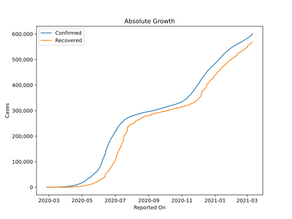
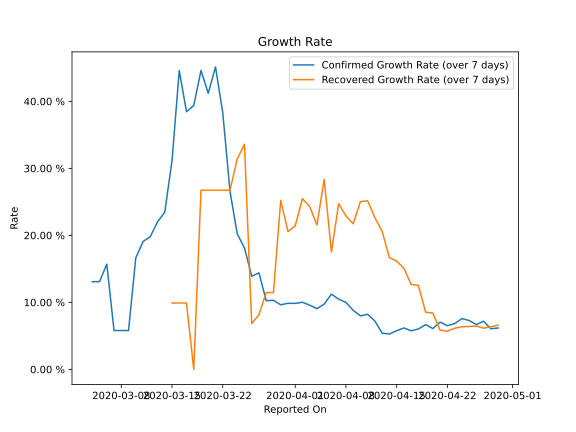

# Country Figures: Growth Rate for Pakistan 

The growth rates below are calculated based on
* an exponential growth assumption
* for time difference of past seven (7) days.
The growth rate is to be understood as on "growth per day".

The first growth rate indicates the increase of confirmed (infected) cases.

The second growth rate indicates the increase of recovered (healed) cases.

| Reported On | Confirmed | Growth Rate (Confirmed) | Recovered | Growth Rate (Recovered) |
|-------------|-----------|-------------------------|-----------|-------------------------|
| 2020-05-07 | 24644 |  5.46 %  | 6464 |  5.774 %  | 
| 2020-05-06 | 24073 |  6.27 %  | 6464 |  9.074 %  | 
| 2020-05-05 | 22049 |  5.88 %  | 5801 |  8.352 %  | 
| 2020-05-04 | 20941 |  5.84 %  | 5635 |  8.868 %  | 
| 2020-05-03 | 20084 |  5.86 %  | 5114 |  7.928 %  | 
| 2020-05-02 | 19103 |  5.81 %  | 4817 |  7.418 %  | 
| 2020-05-01 | 18114 |  5.95 %  | 4715 |  7.676 %  | 
| 2020-04-30 | 16817 |  5.86 %  | 4315 |  7.644 %  | 
| 2020-04-29 | 15525 |  6.18 %  | 3425 |  6.612 %  | 
| 2020-04-28 | 14612 |  6.05 %  | 3233 |  6.349 %  | 
| 2020-04-27 | 13915 |  7.18 %  | 3029 |  6.146 %  | 
| 2020-04-26 | 13328 |  6.68 %  | 2936 |  6.460 %  | 
| 2020-04-25 | 12723 |  7.29 %  | 2866 |  6.393 %  | 
| 2020-04-24 | 11940 |  7.58 %  | 2755 |  6.361 %  | 
| 2020-04-23 | 11155 |  6.82 %  | 2527 |  6.133 %  | 
| 2020-04-22 | 10076 |  6.52 %  | 2156 |  5.706 %  | 
| 2020-04-21 | 9565 |  7.06 %  | 2073 |  5.834 %  | 
| 2020-04-20 | 8418 |  6.09 %  | 1970 |  8.390 %  | 
| 2020-04-19 | 8348 |  6.68 %  | 1868 |  8.532 %  | 
| 2020-04-18 | 7638 |  6.02 %  | 1832 |  12.532 %  | 
| 2020-04-17 | 7025 |  5.76 %  | 1765 |  12.671 %  | 
| 2020-04-16 | 6919 |  6.18 %  | 1645 |  15.091 %  | 
| 2020-04-15 | 6383 |  5.77 %  | 1446 |  16.146 %  | 
| 2020-04-14 | 5837 |  5.27 %  | 1378 |  16.670 %  | 
| 2020-04-13 | 5496 |  5.40 %  | 1095 |  20.595 %  | 
| 2020-04-12 | 5230 |  7.21 %  | 1028 |  22.622 %  | 
| 2020-04-11 | 5011 |  8.22 %  | 762 |  25.154 %  | 
| 2020-04-10 | 4695 |  7.98 %  | 727 |  25.038 %  | 
| 2020-04-09 | 4489 |  8.82 %  | 572 |  21.726 %  | 
| 2020-04-08 | 4263 |  9.99 %  | 467 |  22.900 %  | 
| 2020-04-07 | 4035 |  10.48 %  | 429 |  24.725 %  | 
| 2020-04-06 | 3766 |  11.22 %  | 259 |  17.516 %  | 
| 2020-04-05 | 3157 |  9.74 %  | 211 |  28.351 %  | 
| 2020-04-04 | 2818 |  9.06 %  | 131 |  21.541 %  | 
| 2020-04-03 | 2686 |  9.59 %  | 126 |  24.297 %  | 
| 2020-04-02 | 2421 |  10.01 %  | 125 |  25.483 %  | 
| 2020-04-01 | 2118 |  9.85 %  | 94 |  21.411 %  | 
| 2020-03-31 | 1938 |  9.86 %  | 76 |  20.577 %  | 
| 2020-03-30 | 1717 |  9.63 %  | 76 |  25.225 %  | 
| 2020-03-29 | 1597 |  10.31 %  | 29 |  11.462 %  | 
| 2020-03-28 | 1495 |  10.24 %  | 29 |  11.462 %  | 
| 2020-03-27 | 1373 |  14.40 %  | 23 |  8.151 %  | 
| 2020-03-26 | 1201 |  13.90 %  | 21 |  6.851 %  | 
| 2020-03-25 | 1063 |  18.12 %  | 21 |  33.591 %  | 
| 2020-03-24 | 972 |  20.22 %  | 18 |  31.389 %  | 
| 2020-03-23 | 875 |  26.59 %  | 13 |  26.740 %  | 
| 2020-03-22 | 776 |  38.34 %  | 13 |  26.740 %  | 
| 2020-03-21 | 730 |  45.13 %  | 13 |  26.740 %  | 
| 2020-03-20 | 501 |  41.21 %  | 13 |  26.740 %  | 
| 2020-03-19 | 454 |  44.61 %  | 13 |  26.740 %  | 
| 2020-03-18 | 299 |  39.37 %  | 2 |  None  | 
| 2020-03-17 | 236 |  38.45 %  | 2 |  9.902 %  | 
| 2020-03-16 | 136 |  44.58 %  | 2 |  9.902 %  | 
| 2020-03-15 | 53 |  31.12 %  | 2 |  9.902 %  | 
| 2020-03-14 | 31 |  23.46 %  | 2 |  None  | 
| 2020-03-13 | 28 |  22.01 %  | 2 |  None  | 
| 2020-03-12 | 20 |  19.80 %  | 2 |  None  | 
| 2020-03-11 | 19 |  19.07 %  | 2 |  None  | 
| 2020-03-10 | 16 |  16.62 %  | 1 |  None  | 
| 2020-03-09 | 6 |  5.79 %  | 1 |  None  | 
| 2020-03-08 | 6 |  5.79 %  | 1 |  None  | 
| 2020-03-07 | 6 |  5.79 %  | 0 |  None  | 
| 2020-03-06 | 6 |  15.69 %  | 0 |  None  | 
| 2020-03-05 | 5 |  13.09 %  | 0 |  None  | 
| 2020-03-04 | 5 |  13.09 %  | 0 |  None  | 
| 2020-03-03 | 5 |  None  | 0 |  None  | 
| 2020-03-02 | 4 |  None  | 0 |  None  | 
| 2020-03-01 | 4 |  None  | 0 |  None  | 
| 2020-02-29 | 4 |  None  | 0 |  None  | 
| 2020-02-28 | 2 |  None  | 0 |  None  | 
| 2020-02-27 | 2 |  None  | 0 |  None  | 
| 2020-02-26 | 2 |  None  | 0 |  None  | 

