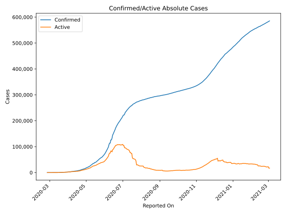
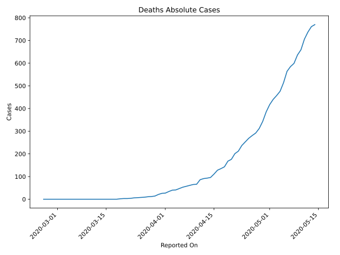
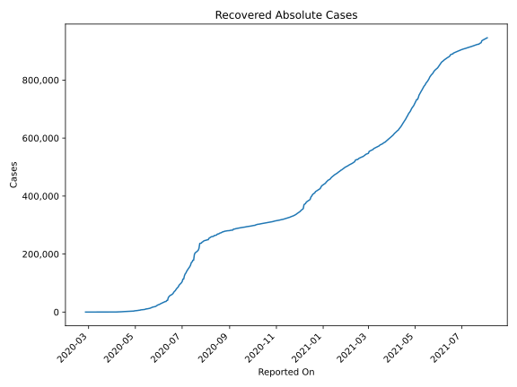
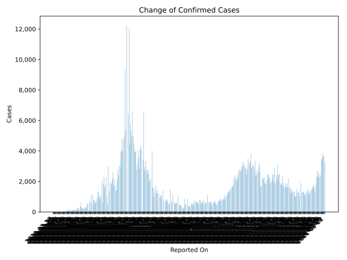
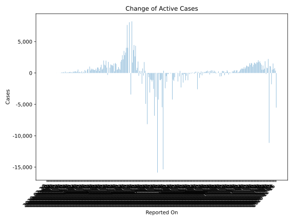
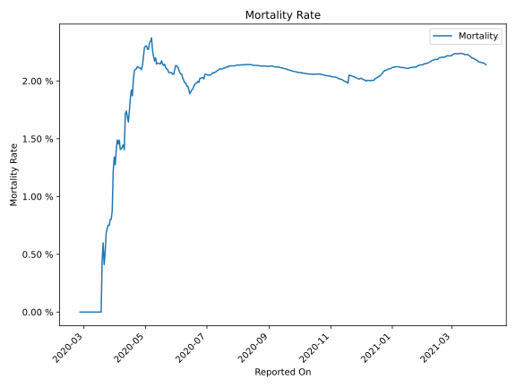

# Country Figures: Time Series for Pakistan 

| Reported On | Confirmed | Deaths | Recovered | Active | Mortality | &Delta; Confirmed | &Delta; Deaths | &Delta; Active | % Active of Population |
|-------------|-----------|--------|-----------|--------|-----------|-------------------|----------------|----------------|------------------------|
| 2020-03-23 | 875 | 6 | 13 | 856 |  0.69 %  | 99 | 1 | 90 |  0.000 %  | 
| 2020-03-22 | 776 | 5 | 5 | 766 |  0.64 %  | 46 | 2 | 52 |  0.000 %  | 
| 2020-03-21 | 730 | 3 | 13 | 714 |  0.41 %  | 229 | 0 | 229 |  0.000 %  | 
| 2020-03-20 | 501 | 3 | 13 | 485 |  0.60 %  | 47 | 1 | 46 |  0.000 %  | 
| 2020-03-19 | 454 | 2 | 13 | 439 |  0.44 %  | 155 | 2 | 142 |  0.000 %  | 
| 2020-03-18 | 299 | 0 | 2 | 297 |  None  | 63 | 0 | 63 |  0.000 %  | 
| 2020-03-17 | 236 | 0 | 2 | 234 |  None  | 100 | 0 | 100 |  0.000 %  | 
| 2020-03-16 | 136 | 0 | 2 | 134 |  None  | 83 | 0 | 83 |  0.000 %  | 
| 2020-03-15 | 53 | 0 | 2 | 51 |  None  | 22 | 0 | 22 |  0.000 %  | 
| 2020-03-14 | 31 | 0 | 2 | 29 |  None  | 3 | 0 | 3 |  0.000 %  | 
| 2020-03-13 | 28 | 0 | 2 | 26 |  None  | 8 | 0 | 8 |  0.000 %  | 
| 2020-03-12 | 20 | 0 | 2 | 18 |  None  | 1 | 0 | 1 |  0.000 %  | 
| 2020-03-11 | 19 | 0 | 2 | 17 |  None  | 3 | 0 | 2 |  0.000 %  | 
| 2020-03-10 | 16 | 0 | 1 | 15 |  None  | 10 | 0 | 10 |  0.000 %  | 
| 2020-03-09 | 6 | 0 | 1 | 5 |  None  | 0 | 0 | 0 |  0.000 %  | 
| 2020-03-08 | 6 | 0 | 1 | 5 |  None  | 0 | 0 | -1 |  0.000 %  | 
| 2020-03-07 | 6 | 0 | 0 | 6 |  None  | 0 | 0 | 0 |  0.000 %  | 
| 2020-03-06 | 6 | 0 | 0 | 6 |  None  | 1 | 0 | 1 |  0.000 %  | 
| 2020-03-05 | 5 | 0 | 0 | 5 |  None  | 0 | 0 | 0 |  0.000 %  | 
| 2020-03-04 | 5 | 0 | 0 | 5 |  None  | 0 | 0 | 0 |  0.000 %  | 
| 2020-03-03 | 5 | 0 | 0 | 5 |  None  | 1 | 0 | 1 |  0.000 %  | 
| 2020-03-02 | 4 | 0 | 0 | 4 |  None  | 0 | 0 | 0 |  0.000 %  | 
| 2020-03-01 | 4 | 0 | 0 | 4 |  None  | 0 | 0 | 0 |  0.000 %  | 
| 2020-02-29 | 4 | 0 | 0 | 4 |  None  | 2 | 0 | 2 |  0.000 %  | 
| 2020-02-28 | 2 | 0 | 0 | 2 |  None  | 0 | 0 | 0 |  0.000 %  | 
| 2020-02-27 | 2 | 0 | 0 | 2 |  None  | 0 | 0 | 0 |  0.000 %  | 
| 2020-02-26 | 2 | 0 | 0 | 2 |  None  | None | None | None |  0.000 %  | 

