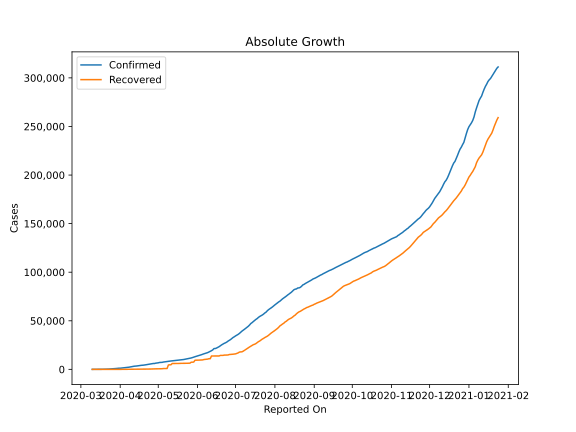
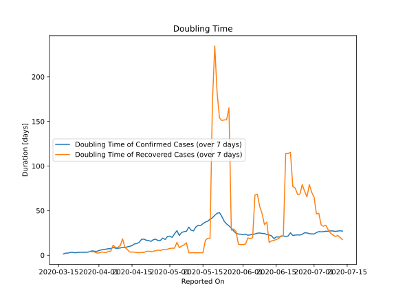

# Country Figures: Doubling Time of Infections for Panama 

The doubling time below are calculated based on
* an exponential growth assumption
* for time difference of past seven (7) days.
The doubling time's unit is "days".

The first doubling time indicates the increase of confirmed (infected)
cases. There, the *higher* the number is, the better is to take control
of the disease.

The second doubling time indicates the increase of recovered (healed)
cases. There, the *lower* the number is, the better it is to take
control of the disease.

| Reported On | Confirmed | Doubling Time (Confirmed) | Recovered | Doubling Time (Recovered) |
|-------------|-----------|---------------------------|-----------|---------------------------|
| 2020-04-10 | 2752 |  8.1 days  | 16 |  10.7 days  | 
| 2020-04-09 | 2528 |  7.8 days  | 16 |  8.8 days  | 
| 2020-04-08 | 2249 |  7.9 days  | 16 |  8.8 days  | 
| 2020-04-07 | 2100 |  8.8 days  | 14 |  11.3 days  | 
| 2020-04-06 | 1988 |  7.3 days  | 13 |  4.5 days  | 
| 2020-04-05 | 1801 |  7.3 days  | 13 |  4.5 days  | 
| 2020-04-04 | 1673 |  6.8 days  | 13 |  2.9 days  | 
| 2020-04-03 | 1475 |  6.5 days  | 10 |  3.3 days  | 
| 2020-04-02 | 1317 |  6.0 days  | 9 |  3.6 days  | 
| 2020-04-01 | 1181 |  5.3 days  | 9 |  2.5 days  | 
| 2020-03-31 | 1181 |  4.3 days  | 9 |  2.5 days  | 
| 2020-03-30 | 989 |  4.6 days  | 4 |  3.8 days  | 
| 2020-03-29 | 901 |  4.9 days  | 4 |  3.8 days  | 
| 2020-03-28 | 786 |  3.9 days  | 2 |  None  | 
| 2020-03-27 | 674 |  3.4 days  | 2 |  None  | 
| 2020-03-26 | 558 |  3.3 days  | 2 |  None  | 
| 2020-03-25 | 443 |  3.3 days  | 1 |  None  | 
| 2020-03-24 | 345 |  3.3 days  | 1 |  None  | 
| 2020-03-23 | 313 |  3.1 days  | 1 |  None  | 
| 2020-03-22 | 313 |  2.8 days  | 1 |  None  | 
| 2020-03-21 | 200 |  3.2 days  | 0 |  None  | 
| 2020-03-20 | 137 |  3.3 days  | 0 |  None  | 
| 2020-03-19 | 109 |  2.4 days  | 0 |  None  | 
| 2020-03-18 | 86 |  2.4 days  | 0 |  None  | 
| 2020-03-17 | 69 |  1.5 days  | 0 |  None  | 
| 2020-03-16 | 55 |  None  | 0 |  None  | 
| 2020-03-15 | 43 |  None  | 0 |  None  | 
| 2020-03-14 | 36 |  None  | 0 |  None  | 
| 2020-03-13 | 27 |  None  | 0 |  None  | 
| 2020-03-12 | 11 |  None  | 0 |  None  | 
| 2020-03-11 | 8 |  None  | 0 |  None  | 
| 2020-03-10 | 1 |  None  | 0 |  None  | 

