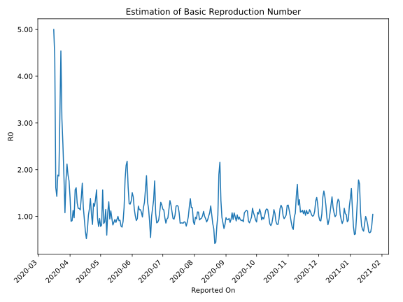

# Country Figures: Time Series for Basic Reproduction Number of Panama 

| Reported On | &Delta; Confirmed | Total &Delta; Confirmed First Interval | Total &Delta; Confirmed Second Interval | Estimated Basic Reproduction Number R0 | 
|-------------|-------------------|----------------------------------------|-----------------------------------------|---------------------------------------------------|
| 2020-04-27 | 242 |  958  |  611  |  1.57  | 
| 2020-04-26 | 241 |  880  |  642  |  1.37  | 
| 2020-04-25 | 200 |  871  |  716  |  1.22  | 
| 2020-04-24 | 172 |  893  |  699  |  1.28  | 
| 2020-04-23 | 345 |  611  |  738  |  0.83  | 
| 2020-04-22 | 163 |  642  |  616  |  1.04  | 
| 2020-04-21 | 191 |  716  |  517  |  1.38  | 
| 2020-04-20 | 194 |  699  |  600  |  1.17  | 
| 2020-04-19 | 63 |  738  |  720  |  1.02  | 
| 2020-04-18 | 194 |  616  |  872  |  0.71  | 
| 2020-04-17 | 265 |  517  |  985  |  0.52  | 
| 2020-04-16 | 177 |  600  |  874  |  0.69  | 
| 2020-04-15 | 102 |  720  |  764  |  0.94  | 
| 2020-04-14 | 72 |  872  |  727  |  1.20  | 
| 2020-04-13 | 166 |  985  |  576  |  1.71  | 
| 2020-04-12 | 260 |  874  |  625  |  1.40  | 
| 2020-04-11 | 222 |  764  |  671  |  1.14  | 
| 2020-04-10 | 224 |  727  |  620  |  1.17  | 
| 2020-04-09 | 279 |  576  |  492  |  1.17  | 
| 2020-04-08 | 149 |  625  |  486  |  1.29  | 
| 2020-04-07 | 112 |  671  |  416  |  1.61  | 
| 2020-04-06 | 187 |  620  |  395  |  1.57  | 
| 2020-04-05 | 128 |  492  |  507  |  0.97  | 
| 2020-04-04 | 198 |  486  |  431  |  1.13  | 
| 2020-04-03 | 158 |  416  |  458  |  0.91  | 
| 2020-04-02 | 136 |  395  |  441  |  0.90  | 
| 2020-04-01 | 0 |  507  |  361  |  1.40  | 
| 2020-03-31 | 192 |  431  |  245  |  1.76  | 
| 2020-03-30 | 88 |  458  |  243  |  1.88  | 
| 2020-03-29 | 115 |  441  |  208  |  2.12  | 
| 2020-03-28 | 112 |  361  |  204  |  1.77  | 
| 2020-03-27 | 116 |  245  |  227  |  1.08  | 
| 2020-03-26 | 115 |  243  |  131  |  1.85  | 
| 2020-03-25 | 98 |  208  |  82  |  2.54  | 
| 2020-03-24 | 32 |  204  |  66  |  3.09  | 
| 2020-03-23 | 0 |  227  |  50  |  4.54  | 
| 2020-03-22 | 113 |  131  |  42  |  3.12  | 
| 2020-03-21 | 63 |  82  |  44  |  1.86  | 
| 2020-03-20 | 28 |  66  |  35  |  1.89  | 
| 2020-03-19 | 23 |  50  |  35  |  1.43  | 
| 2020-03-18 | 17 |  42  |  26  |  1.62  | 
| 2020-03-17 | 14 |  44  |  10  |  4.40  | 
| 2020-03-16 | 12 |  35  |  7  |  5.00  | 
| 2020-03-15 | 7 |  35  |  None  |  None  | 
| 2020-03-14 | 9 |  26  |  None  |  None  | 
| 2020-03-13 | 16 |  10  |  None  |  None  | 
| 2020-03-12 | 3 |  7  |  None  |  None  | 
| 2020-03-11 | 7 |  None  |  None  |  None  | 
| 2020-03-10 | None |  None  |  None  |  None  | 

