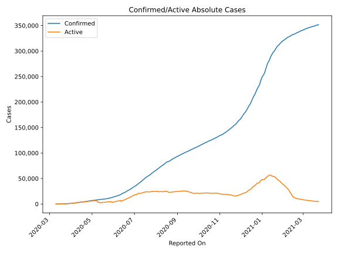
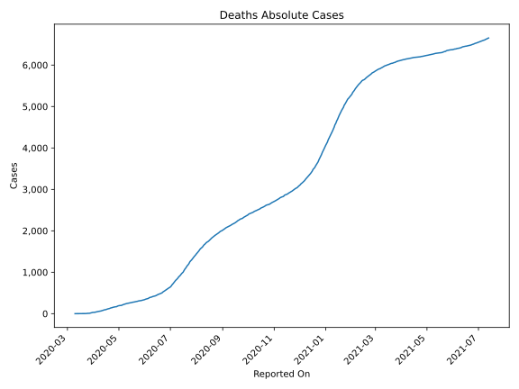
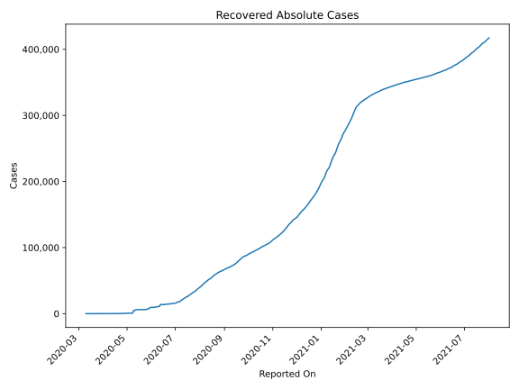
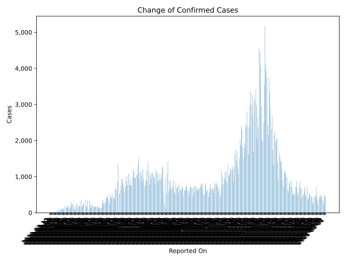
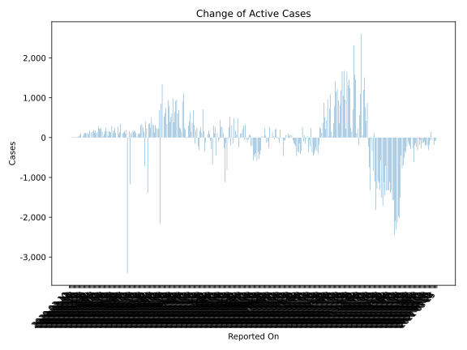
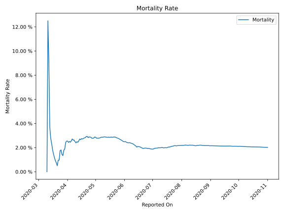

# Country Figures: Time Series for Panama 

| Reported On | Confirmed | Deaths | Recovered | Active | Mortality | &Delta; Confirmed | &Delta; Deaths | &Delta; Recovered | &Delta; Active | % Active of Population |
|-------------|-----------|--------|-----------|--------|-----------|-------------------|----------------|-------------------|----------------|------------------------|
| 2020-04-14 | 3472 | 94 | 61 | 3317 |  2.71 %  | 72 | 7 | 32 | 33 |  0.079 %  | 
| 2020-04-13 | 3400 | 87 | 29 | 3284 |  2.56 %  | 166 | 8 | 6 | 152 |  0.079 %  | 
| 2020-04-12 | 3234 | 79 | 23 | 3132 |  2.44 %  | 260 | 5 | 6 | 249 |  0.075 %  | 
| 2020-04-11 | 2974 | 74 | 17 | 2883 |  2.49 %  | 222 | 8 | 1 | 213 |  0.069 %  | 
| 2020-04-10 | 2752 | 66 | 16 | 2670 |  2.40 %  | 224 | 3 | 0 | 221 |  0.064 %  | 
| 2020-04-09 | 2528 | 63 | 16 | 2449 |  2.49 %  | 279 | 4 | 0 | 275 |  0.059 %  | 
| 2020-04-08 | 2249 | 59 | 16 | 2174 |  2.62 %  | 149 | 4 | 2 | 143 |  0.052 %  | 
| 2020-04-07 | 2100 | 55 | 14 | 2031 |  2.62 %  | 112 | 1 | 1 | 110 |  0.049 %  | 
| 2020-04-06 | 1988 | 54 | 13 | 1921 |  2.72 %  | 187 | 8 | 0 | 179 |  0.046 %  | 
| 2020-04-05 | 1801 | 46 | 13 | 1742 |  2.55 %  | 128 | 5 | 0 | 123 |  0.042 %  | 
| 2020-04-04 | 1673 | 41 | 13 | 1619 |  2.45 %  | 198 | 4 | 3 | 191 |  0.039 %  | 
| 2020-04-03 | 1475 | 37 | 10 | 1428 |  2.51 %  | 158 | 5 | 1 | 152 |  0.034 %  | 
| 2020-04-02 | 1317 | 32 | 9 | 1276 |  2.43 %  | 136 | 2 | 0 | 134 |  0.031 %  | 
| 2020-04-01 | 1181 | 30 | 9 | 1142 |  2.54 %  | 0 | 0 | 0 | 0 |  0.027 %  | 
| 2020-03-31 | 1181 | 30 | 9 | 1142 |  2.54 %  | 192 | 6 | 5 | 181 |  0.027 %  | 
| 2020-03-30 | 989 | 24 | 4 | 961 |  2.43 %  | 88 | 7 | 0 | 81 |  0.023 %  | 
| 2020-03-29 | 901 | 17 | 4 | 880 |  1.89 %  | 115 | 3 | 2 | 110 |  0.021 %  | 
| 2020-03-28 | 786 | 14 | 2 | 770 |  1.78 %  | 112 | 5 | 0 | 107 |  0.018 %  | 
| 2020-03-27 | 674 | 9 | 2 | 663 |  1.34 %  | 116 | 1 | 0 | 115 |  0.016 %  | 
| 2020-03-26 | 558 | 8 | 2 | 548 |  1.43 %  | 115 | 0 | 1 | 114 |  0.013 %  | 
| 2020-03-25 | 443 | 8 | 1 | 434 |  1.81 %  | 98 | 2 | 0 | 96 |  0.010 %  | 
| 2020-03-24 | 345 | 6 | 1 | 338 |  1.74 %  | 32 | 3 | 0 | 29 |  0.008 %  | 
| 2020-03-23 | 313 | 3 | 1 | 309 |  0.96 %  | 0 | 0 | 0 | 0 |  0.007 %  | 
| 2020-03-22 | 313 | 3 | 1 | 309 |  0.96 %  | 113 | 2 | 1 | 110 |  0.007 %  | 
| 2020-03-21 | 200 | 1 | 0 | 199 |  0.50 %  | 63 | 0 | 0 | 63 |  0.005 %  | 
| 2020-03-20 | 137 | 1 | 0 | 136 |  0.73 %  | 28 | 0 | 0 | 28 |  0.003 %  | 
| 2020-03-19 | 109 | 1 | 0 | 108 |  0.92 %  | 23 | 0 | 0 | 23 |  0.003 %  | 
| 2020-03-18 | 86 | 1 | 0 | 85 |  1.16 %  | 17 | 0 | 0 | 17 |  0.002 %  | 
| 2020-03-17 | 69 | 1 | 0 | 68 |  1.45 %  | 14 | 0 | 0 | 14 |  0.002 %  | 
| 2020-03-16 | 55 | 1 | 0 | 54 |  1.82 %  | 12 | 0 | 0 | 12 |  0.001 %  | 
| 2020-03-15 | 43 | 1 | 0 | 42 |  2.33 %  | 7 | 0 | 0 | 7 |  0.001 %  | 
| 2020-03-14 | 36 | 1 | 0 | 35 |  2.78 %  | 9 | 0 | 0 | 9 |  0.001 %  | 
| 2020-03-13 | 27 | 1 | 0 | 26 |  3.70 %  | 16 | 0 | 0 | 16 |  0.001 %  | 
| 2020-03-12 | 11 | 1 | 0 | 10 |  9.09 %  | 3 | 0 | 0 | 3 |  0.000 %  | 
| 2020-03-11 | 8 | 1 | 0 | 7 |  12.50 %  | 7 | 1 | 0 | 6 |  0.000 %  | 
| 2020-03-10 | 1 | 0 | 0 | 1 |  None  | None | None | None | None |  0.000 %  | 

