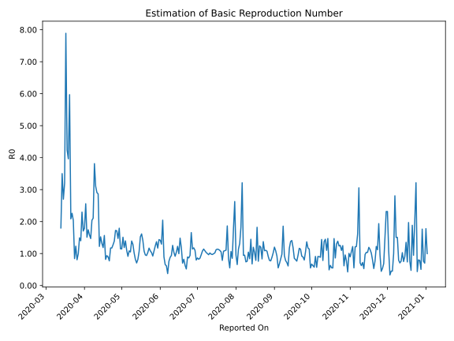

# Country Figures: Time Series for Basic Reproduction Number of Peru 

| Reported On | &Delta; Confirmed | Total &Delta; Confirmed First Interval | Total &Delta; Confirmed Second Interval | Estimated Basic Reproduction Number R0 | 
|-------------|-------------------|----------------------------------------|-----------------------------------------|---------------------------------------------------|
| 2020-04-30 | 3045 |  8600  |  7494  |  1.15  | 
| 2020-04-29 | 2741 |  9542  |  5323  |  1.79  | 
| 2020-04-28 | 2491 |  7785  |  5286  |  1.47  | 
| 2020-04-27 | 1182 |  8267  |  4830  |  1.71  | 
| 2020-04-26 | 2186 |  7494  |  4348  |  1.72  | 
| 2020-04-25 | 3683 |  5323  |  3834  |  1.39  | 
| 2020-04-24 | 734 |  5286  |  4153  |  1.27  | 
| 2020-04-23 | 1664 |  4830  |  4117  |  1.17  | 
| 2020-04-22 | 1413 |  4348  |  3705  |  1.17  | 
| 2020-04-21 | 1512 |  3834  |  4972  |  0.77  | 
| 2020-04-20 | 697 |  4153  |  4627  |  0.90  | 
| 2020-04-19 | 1208 |  4117  |  4406  |  0.93  | 
| 2020-04-18 | 931 |  3705  |  4528  |  0.82  | 
| 2020-04-17 | 998 |  4972  |  3177  |  1.56  | 
| 2020-04-16 | 1016 |  4627  |  3894  |  1.19  | 
| 2020-04-15 | 1172 |  4406  |  3336  |  1.32  | 
| 2020-04-14 | 519 |  4528  |  2975  |  1.52  | 
| 2020-04-13 | 2265 |  3177  |  2596  |  1.22  | 
| 2020-04-12 | 671 |  3894  |  1359  |  2.87  | 
| 2020-04-11 | 951 |  3336  |  1147  |  2.91  | 
| 2020-04-10 | 641 |  2975  |  958  |  3.11  | 
| 2020-04-09 | 914 |  2596  |  681  |  3.81  | 
| 2020-04-08 | 1388 |  1359  |  645  |  2.11  | 
| 2020-04-07 | 393 |  1147  |  562  |  2.04  | 
| 2020-04-06 | 280 |  958  |  652  |  1.47  | 
| 2020-04-05 | 535 |  681  |  430  |  1.58  | 
| 2020-04-04 | 151 |  645  |  370  |  1.74  | 
| 2020-04-03 | 181 |  562  |  372  |  1.51  | 
| 2020-04-02 | 91 |  652  |  255  |  2.56  | 
| 2020-04-01 | 258 |  430  |  240  |  1.79  | 
| 2020-03-31 | 115 |  370  |  217  |  1.71  | 
| 2020-03-30 | 98 |  372  |  162  |  2.30  | 
| 2020-03-29 | 181 |  255  |  182  |  1.40  | 
| 2020-03-28 | 36 |  240  |  161  |  1.49  | 
| 2020-03-27 | 55 |  217  |  218  |  1.00  | 
| 2020-03-26 | 100 |  162  |  201  |  0.81  | 
| 2020-03-25 | 64 |  182  |  148  |  1.23  | 
| 2020-03-24 | 21 |  161  |  191  |  0.84  | 
| 2020-03-23 | 32 |  218  |  107  |  2.04  | 
| 2020-03-22 | 45 |  201  |  89  |  2.26  | 
| 2020-03-21 | 84 |  148  |  71  |  2.08  | 
| 2020-03-20 | 0 |  191  |  32  |  5.97  | 
| 2020-03-19 | 89 |  107  |  27  |  3.96  | 
| 2020-03-18 | 28 |  89  |  21  |  4.24  | 
| 2020-03-17 | 31 |  71  |  9  |  7.89  | 
| 2020-03-16 | 43 |  32  |  10  |  3.20  | 
| 2020-03-15 | 5 |  27  |  10  |  2.70  | 
| 2020-03-14 | 10 |  21  |  6  |  3.50  | 
| 2020-03-13 | 13 |  9  |  5  |  1.80  | 
| 2020-03-12 | 4 |  10  |  None  |  None  | 
| 2020-03-11 | 0 |  10  |  None  |  None  | 
| 2020-03-10 | 4 |  6  |  None  |  None  | 
| 2020-03-09 | 1 |  5  |  None  |  None  | 
| 2020-03-08 | 5 |  None  |  None  |  None  | 
| 2020-03-07 | 0 |  None  |  None  |  None  | 
| 2020-03-06 | None |  None  |  None  |  None  | 

