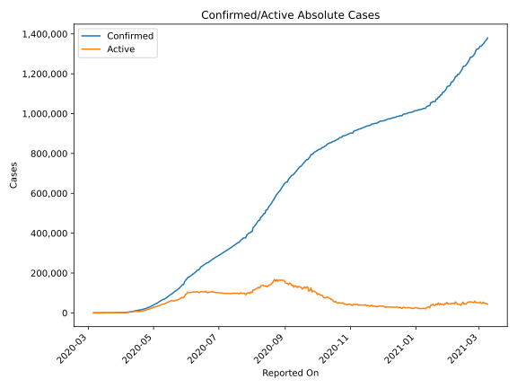
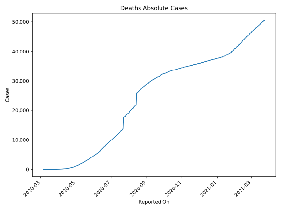
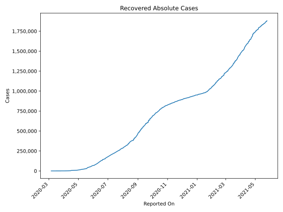
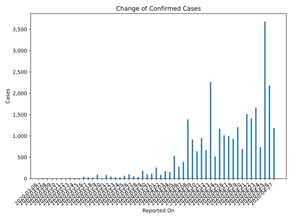
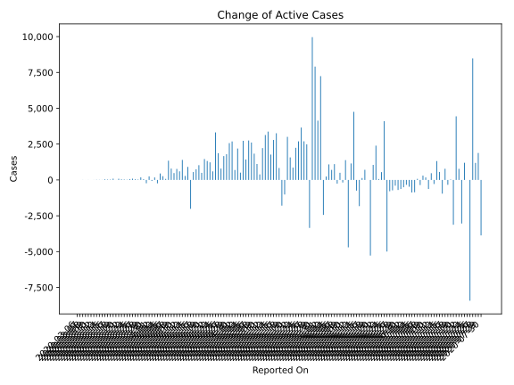
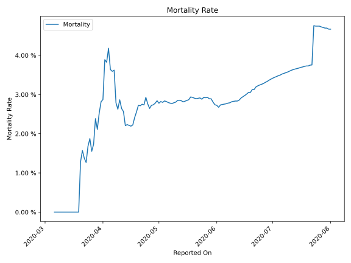

# Country Figures: Time Series for Peru 

| Reported On | Confirmed | Deaths | Recovered | Active | Mortality | &Delta; Confirmed | &Delta; Deaths | &Delta; Recovered | &Delta; Active | % Active of Population |
|-------------|-----------|--------|-----------|--------|-----------|-------------------|----------------|-------------------|----------------|------------------------|
| 2020-04-20 | 16325 | 445 | 6968 | 8912 |  2.73 %  | 697 | 45 | 157 | 495 |  0.028 %  | 
| 2020-04-19 | 15628 | 400 | 6811 | 8417 |  2.56 %  | 1208 | 52 | 127 | 1029 |  0.026 %  | 
| 2020-04-18 | 14420 | 348 | 6684 | 7388 |  2.41 %  | 931 | 48 | 143 | 740 |  0.023 %  | 
| 2020-04-17 | 13489 | 300 | 6541 | 6648 |  2.22 %  | 998 | 26 | 421 | 551 |  0.021 %  | 
| 2020-04-16 | 12491 | 274 | 6120 | 6097 |  2.19 %  | 1016 | 20 | 3012 | -2016 |  0.019 %  | 
| 2020-04-15 | 11475 | 254 | 3108 | 8113 |  2.21 %  | 1172 | 24 | 239 | 909 |  0.025 %  | 
| 2020-04-14 | 10303 | 230 | 2869 | 7204 |  2.23 %  | 519 | 14 | 227 | 278 |  0.023 %  | 
| 2020-04-13 | 9784 | 216 | 2642 | 6926 |  2.21 %  | 2265 | 23 | 844 | 1398 |  0.022 %  | 
| 2020-04-12 | 7519 | 193 | 1798 | 5528 |  2.57 %  | 671 | 12 | 59 | 600 |  0.017 %  | 
| 2020-04-11 | 6848 | 181 | 1739 | 4928 |  2.64 %  | 951 | 12 | 170 | 769 |  0.015 %  | 
| 2020-04-10 | 5897 | 169 | 1569 | 4159 |  2.87 %  | 641 | 31 | 131 | 479 |  0.013 %  | 
| 2020-04-09 | 5256 | 138 | 1438 | 3680 |  2.63 %  | 914 | 17 | 105 | 792 |  0.012 %  | 
| 2020-04-08 | 4342 | 121 | 1333 | 2888 |  2.79 %  | 1388 | 14 | 32 | 1342 |  0.009 %  | 
| 2020-04-07 | 2954 | 107 | 1301 | 1546 |  3.62 %  | 393 | 15 | 304 | 74 |  0.005 %  | 
| 2020-04-06 | 2561 | 92 | 997 | 1472 |  3.59 %  | 280 | 9 | 8 | 263 |  0.005 %  | 
| 2020-04-05 | 2281 | 83 | 989 | 1209 |  3.64 %  | 535 | 10 | 75 | 450 |  0.004 %  | 
| 2020-04-04 | 1746 | 73 | 914 | 759 |  4.18 %  | 151 | 12 | 377 | -238 |  0.002 %  | 
| 2020-04-03 | 1595 | 61 | 537 | 997 |  3.82 %  | 181 | 6 | 0 | 175 |  0.003 %  | 
| 2020-04-02 | 1414 | 55 | 537 | 822 |  3.89 %  | 91 | 17 | 143 | -69 |  0.003 %  | 
| 2020-04-01 | 1323 | 38 | 394 | 891 |  2.87 %  | 258 | 8 | 0 | 250 |  0.003 %  | 
| 2020-03-31 | 1065 | 30 | 394 | 641 |  2.82 %  | 115 | 6 | 341 | -232 |  0.002 %  | 
| 2020-03-30 | 950 | 24 | 53 | 873 |  2.53 %  | 98 | 6 | 37 | 55 |  0.003 %  | 
| 2020-03-29 | 852 | 18 | 16 | 818 |  2.11 %  | 181 | 2 | 0 | 179 |  0.003 %  | 
| 2020-03-28 | 671 | 16 | 16 | 639 |  2.38 %  | 36 | 5 | 0 | 31 |  0.002 %  | 
| 2020-03-27 | 635 | 11 | 16 | 608 |  1.73 %  | 55 | 2 | 2 | 51 |  0.002 %  | 
| 2020-03-26 | 580 | 9 | 14 | 557 |  1.55 %  | 100 | 0 | 13 | 87 |  0.002 %  | 
| 2020-03-25 | 480 | 9 | 1 | 470 |  1.88 %  | 64 | 2 | 0 | 62 |  0.001 %  | 
| 2020-03-24 | 416 | 7 | 1 | 408 |  1.68 %  | 21 | 2 | 0 | 19 |  0.001 %  | 
| 2020-03-23 | 395 | 5 | 1 | 389 |  1.27 %  | 32 | 0 | 0 | 32 |  0.001 %  | 
| 2020-03-22 | 363 | 5 | 1 | 357 |  1.38 %  | 45 | 0 | 0 | 45 |  0.001 %  | 
| 2020-03-21 | 318 | 5 | 1 | 312 |  1.57 %  | 84 | 2 | 0 | 82 |  0.001 %  | 
| 2020-03-20 | 234 | 3 | 1 | 230 |  1.28 %  | 0 | 3 | 0 | -3 |  0.001 %  | 
| 2020-03-19 | 234 | 0 | 1 | 233 |  None  | 89 | 0 | 0 | 89 |  0.001 %  | 
| 2020-03-18 | 145 | 0 | 1 | 144 |  None  | 28 | 0 | 0 | 28 |  0.000 %  | 
| 2020-03-17 | 117 | 0 | 1 | 116 |  None  | 31 | 0 | 1 | 30 |  0.000 %  | 
| 2020-03-16 | 86 | 0 | 0 | 86 |  None  | 43 | 0 | 0 | 43 |  0.000 %  | 
| 2020-03-15 | 43 | 0 | 0 | 43 |  None  | 5 | 0 | 0 | 5 |  0.000 %  | 
| 2020-03-14 | 38 | 0 | 0 | 38 |  None  | 10 | 0 | 0 | 10 |  0.000 %  | 
| 2020-03-13 | 28 | 0 | 0 | 28 |  None  | 13 | 0 | 0 | 13 |  0.000 %  | 
| 2020-03-12 | 15 | 0 | 0 | 15 |  None  | 4 | 0 | 0 | 4 |  0.000 %  | 
| 2020-03-11 | 11 | 0 | 0 | 11 |  None  | 0 | 0 | 0 | 0 |  0.000 %  | 
| 2020-03-10 | 11 | 0 | 0 | 11 |  None  | 4 | 0 | 0 | 4 |  0.000 %  | 
| 2020-03-09 | 7 | 0 | 0 | 7 |  None  | 1 | 0 | 0 | 1 |  0.000 %  | 
| 2020-03-08 | 6 | 0 | 0 | 6 |  None  | 5 | 0 | 0 | 5 |  0.000 %  | 
| 2020-03-07 | 1 | 0 | 0 | 1 |  None  | 0 | 0 | 0 | 0 |  0.000 %  | 
| 2020-03-06 | 1 | 0 | 0 | 1 |  None  | None | None | None | None |  0.000 %  | 

