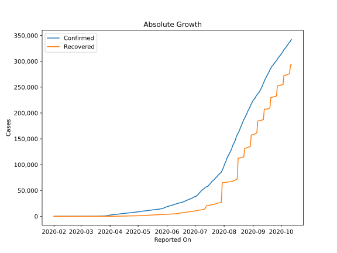
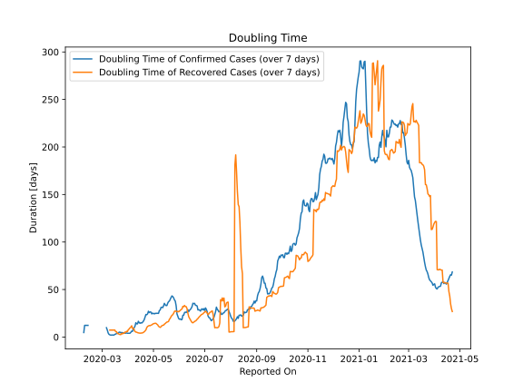

# Country Figures: Doubling Time of Infections for Philippines 

The doubling time below are calculated based on
* an exponential growth assumption
* for time difference of past seven (7) days.
The doubling time's unit is "days".

The first doubling time indicates the increase of confirmed (infected)
cases. There, the *higher* the number is, the better is to take control
of the disease.

The second doubling time indicates the increase of recovered (healed)
cases. There, the *lower* the number is, the better it is to take
control of the disease.

| Reported On | Confirmed | Doubling Time (Confirmed) | Recovered | Doubling Time (Recovered) |
|-------------|-----------|---------------------------|-----------|---------------------------|
| 2020-04-20 | 6459 |  18.3 days  | 613 |  5.6 days  | 
| 2020-04-19 | 6259 |  16.6 days  | 572 |  4.9 days  | 
| 2020-04-18 | 6087 |  15.6 days  | 516 |  4.4 days  | 
| 2020-04-17 | 5878 |  14.7 days  | 487 |  4.2 days  | 
| 2020-04-16 | 5660 |  15.1 days  | 435 |  4.2 days  | 
| 2020-04-15 | 5453 |  14.5 days  | 353 |  4.1 days  | 
| 2020-04-14 | 5223 |  15.2 days  | 295 |  4.2 days  | 
| 2020-04-13 | 4932 |  16.6 days  | 242 |  4.4 days  | 
| 2020-04-12 | 4648 |  13.9 days  | 197 |  4.7 days  | 
| 2020-04-11 | 4428 |  13.9 days  | 157 |  5.1 days  | 
| 2020-04-10 | 4195 |  15.1 days  | 140 |  5.2 days  | 
| 2020-04-09 | 4076 |  11.4 days  | 124 |  5.8 days  | 
| 2020-04-08 | 3870 |  9.8 days  | 96 |  7.8 days  | 
| 2020-04-07 | 3764 |  8.5 days  | 84 |  9.3 days  | 
| 2020-04-06 | 3660 |  6.0 days  | 73 |  9.1 days  | 
| 2020-04-05 | 3246 |  6.2 days  | 64 |  11.9 days  | 
| 2020-04-04 | 3094 |  4.9 days  | 57 |  10.3 days  | 
| 2020-04-03 | 3018 |  4.0 days  | 52 |  9.7 days  | 
| 2020-04-02 | 2633 |  4.0 days  | 51 |  8.4 days  | 
| 2020-04-01 | 2311 |  4.1 days  | 50 |  7.8 days  | 
| 2020-03-31 | 2084 |  4.0 days  | 49 |  5.8 days  | 
| 2020-03-30 | 1546 |  4.4 days  | 42 |  6.1 days  | 
| 2020-03-29 | 1418 |  4.0 days  | 42 |  5.1 days  | 
| 2020-03-28 | 1075 |  4.2 days  | 35 |  5.2 days  | 
| 2020-03-27 | 803 |  4.2 days  | 31 |  3.9 days  | 
| 2020-03-26 | 707 |  4.4 days  | 28 |  4.2 days  | 
| 2020-03-25 | 636 |  4.6 days  | 26 |  3.3 days  | 
| 2020-03-24 | 552 |  4.8 days  | 20 |  3.8 days  | 
| 2020-03-23 | 462 |  4.5 days  | 18 |  2.5 days  | 
| 2020-03-22 | 380 |  5.2 days  | 15 |  2.7 days  | 
| 2020-03-21 | 307 |  5.1 days  | 13 |  2.9 days  | 
| 2020-03-20 | 230 |  4.1 days  | 8 |  3.8 days  | 
| 2020-03-19 | 217 |  3.7 days  | 8 |  3.8 days  | 
| 2020-03-18 | 202 |  3.8 days  | 5 |  5.6 days  | 
| 2020-03-17 | 187 |  3.1 days  | 5 |  5.6 days  | 
| 2020-03-16 | 142 |  2.8 days  | 2 |  7.3 days  | 
| 2020-03-15 | 140 |  2.2 days  | 2 |  7.3 days  | 
| 2020-03-14 | 111 |  2.0 days  | 2 |  7.3 days  | 
| 2020-03-13 | 64 |  2.2 days  | 2 |  7.3 days  | 
| 2020-03-12 | 52 |  2.0 days  | 2 |  7.3 days  | 
| 2020-03-11 | 49 |  2.1 days  | 2 |  7.3 days  | 
| 2020-03-10 | 33 |  2.4 days  | 2 |  7.3 days  | 
| 2020-03-09 | 20 |  2.9 days  | 1 |  None  | 
| 2020-03-08 | 10 |  4.4 days  | 1 |  None  | 
| 2020-03-07 | 6 |  7.3 days  | 1 |  None  | 
| 2020-03-06 | 5 |  9.8 days  | 1 |  None  | 
| 2020-03-05 | 3 |  None  | 1 |  None  | 
| 2020-03-04 | 3 |  None  | 1 |  None  | 
| 2020-03-03 | 3 |  None  | 1 |  None  | 
| 2020-03-02 | 3 |  None  | 1 |  None  | 
| 2020-03-01 | 3 |  None  | 1 |  None  | 
| 2020-02-29 | 3 |  None  | 1 |  None  | 
| 2020-02-28 | 3 |  None  | 1 |  None  | 
| 2020-02-27 | 3 |  None  | 1 |  None  | 
| 2020-02-26 | 3 |  None  | 1 |  None  | 
| 2020-02-25 | 3 |  None  | 1 |  None  | 
| 2020-02-24 | 3 |  None  | 1 |  None  | 
| 2020-02-23 | 3 |  None  | 1 |  None  | 
| 2020-02-22 | 3 |  None  | 1 |  None  | 
| 2020-02-21 | 3 |  None  | 1 |  None  | 
| 2020-02-20 | 3 |  None  | 1 |  None  | 
| 2020-02-19 | 3 |  None  | 1 |  None  | 
| 2020-02-18 | 3 |  None  | 1 |  None  | 
| 2020-02-17 | 3 |  None  | 1 |  None  | 
| 2020-02-16 | 3 |  None  | 1 |  None  | 
| 2020-02-15 | 3 |  None  | 1 |  None  | 
| 2020-02-14 | 3 |  None  | 1 |  None  | 
| 2020-02-13 | 3 |  12.3 days  | 1 |  None  | 
| 2020-02-12 | 3 |  12.3 days  | 1 |  None  | 
| 2020-02-11 | 3 |  12.3 days  | 0 |  None  | 
| 2020-02-10 | 3 |  12.3 days  | 0 |  None  | 
| 2020-02-09 | 3 |  12.3 days  | 0 |  None  | 
| 2020-02-08 | 3 |  4.8 days  | 0 |  None  | 
| 2020-02-07 | 3 |  None  | 0 |  None  | 
| 2020-02-06 | 2 |  None  | 0 |  None  | 
| 2020-02-05 | 2 |  None  | 0 |  None  | 
| 2020-02-04 | 2 |  None  | 0 |  None  | 
| 2020-02-03 | 2 |  None  | 0 |  None  | 
| 2020-02-02 | 2 |  None  | 0 |  None  | 
| 2020-02-01 | 1 |  None  | 0 |  None  | 

