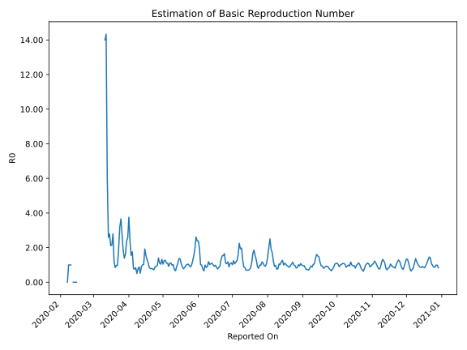

# Country Figures: Time Series for Basic Reproduction Number of Philippines 

| Reported On | &Delta; Confirmed | Total &Delta; Confirmed First Interval | Total &Delta; Confirmed Second Interval | Estimated Basic Reproduction Number R0 | 
|-------------|-------------------|----------------------------------------|-----------------------------------------|---------------------------------------------------|
| 2020-05-02 | 156 |  995  |  796  |  1.25  | 
| 2020-05-01 | 284 |  909  |  869  |  1.05  | 
| 2020-04-30 | 276 |  918  |  695  |  1.32  | 
| 2020-04-29 | 254 |  766  |  733  |  1.05  | 
| 2020-04-28 | 181 |  796  |  722  |  1.10  | 
| 2020-04-27 | 198 |  869  |  623  |  1.39  | 
| 2020-04-26 | 285 |  695  |  721  |  0.96  | 
| 2020-04-25 | 102 |  733  |  799  |  0.92  | 
| 2020-04-24 | 211 |  722  |  806  |  0.90  | 
| 2020-04-23 | 271 |  623  |  864  |  0.72  | 
| 2020-04-22 | 111 |  721  |  946  |  0.76  | 
| 2020-04-21 | 140 |  799  |  1012  |  0.79  | 
| 2020-04-20 | 200 |  806  |  1025  |  0.79  | 
| 2020-04-19 | 172 |  864  |  1028  |  0.84  | 
| 2020-04-18 | 209 |  946  |  856  |  1.11  | 
| 2020-04-17 | 218 |  1012  |  778  |  1.30  | 
| 2020-04-16 | 207 |  1025  |  664  |  1.54  | 
| 2020-04-15 | 230 |  1028  |  535  |  1.92  | 
| 2020-04-14 | 291 |  856  |  830  |  1.03  | 
| 2020-04-13 | 284 |  778  |  776  |  1.00  | 
| 2020-04-12 | 220 |  664  |  746  |  0.89  | 
| 2020-04-11 | 233 |  535  |  1027  |  0.52  | 
| 2020-04-10 | 119 |  830  |  935  |  0.89  | 
| 2020-04-09 | 206 |  776  |  1010  |  0.77  | 
| 2020-04-08 | 106 |  746  |  1472  |  0.51  | 
| 2020-04-07 | 104 |  1027  |  1215  |  0.85  | 
| 2020-04-06 | 414 |  935  |  1236  |  0.76  | 
| 2020-04-05 | 152 |  1010  |  1281  |  0.79  | 
| 2020-04-04 | 76 |  1472  |  839  |  1.75  | 
| 2020-04-03 | 385 |  1215  |  782  |  1.55  | 
| 2020-04-02 | 322 |  1236  |  523  |  2.36  | 
| 2020-04-01 | 227 |  1281  |  341  |  3.76  | 
| 2020-03-31 | 538 |  839  |  327  |  2.57  | 
| 2020-03-30 | 128 |  782  |  329  |  2.38  | 
| 2020-03-29 | 343 |  523  |  322  |  1.62  | 
| 2020-03-28 | 272 |  341  |  245  |  1.39  | 
| 2020-03-27 | 96 |  327  |  178  |  1.84  | 
| 2020-03-26 | 71 |  329  |  120  |  2.74  | 
| 2020-03-25 | 84 |  322  |  88  |  3.66  | 
| 2020-03-24 | 90 |  245  |  77  |  3.18  | 
| 2020-03-23 | 82 |  178  |  91  |  1.96  | 
| 2020-03-22 | 73 |  120  |  123  |  0.98  | 
| 2020-03-21 | 77 |  88  |  90  |  0.98  | 
| 2020-03-20 | 13 |  77  |  91  |  0.85  | 
| 2020-03-19 | 15 |  91  |  78  |  1.17  | 
| 2020-03-18 | 15 |  123  |  44  |  2.80  | 
| 2020-03-17 | 45 |  90  |  42  |  2.14  | 
| 2020-03-16 | 2 |  91  |  43  |  2.12  | 
| 2020-03-15 | 29 |  78  |  28  |  2.79  | 
| 2020-03-14 | 47 |  44  |  17  |  2.59  | 
| 2020-03-13 | 12 |  42  |  7  |  6.00  | 
| 2020-03-12 | 3 |  43  |  3  |  14.33  | 
| 2020-03-11 | 16 |  28  |  2  |  14.00  | 
| 2020-03-10 | 13 |  17  |  None  |  None  | 
| 2020-03-09 | 10 |  7  |  None  |  None  | 
| 2020-03-08 | 4 |  3  |  None  |  None  | 
| 2020-03-07 | 1 |  2  |  None  |  None  | 
| 2020-03-06 | 2 |  None  |  None  |  None  | 
| 2020-03-05 | 0 |  None  |  None  |  None  | 
| 2020-03-04 | 0 |  None  |  None  |  None  | 
| 2020-03-03 | 0 |  None  |  None  |  None  | 
| 2020-03-02 | 0 |  None  |  None  |  None  | 
| 2020-03-01 | 0 |  None  |  None  |  None  | 
| 2020-02-29 | 0 |  None  |  None  |  None  | 
| 2020-02-28 | 0 |  None  |  None  |  None  | 
| 2020-02-27 | 0 |  None  |  None  |  None  | 
| 2020-02-26 | 0 |  None  |  None  |  None  | 
| 2020-02-25 | 0 |  None  |  None  |  None  | 
| 2020-02-24 | 0 |  None  |  None  |  None  | 
| 2020-02-23 | 0 |  None  |  None  |  None  | 
| 2020-02-22 | 0 |  None  |  None  |  None  | 
| 2020-02-21 | 0 |  None  |  None  |  None  | 
| 2020-02-20 | 0 |  None  |  None  |  None  | 
| 2020-02-19 | 0 |  None  |  None  |  None  | 
| 2020-02-18 | 0 |  None  |  None  |  None  | 
| 2020-02-17 | 0 |  None  |  None  |  None  | 
| 2020-02-16 | 0 |  None  |  None  |  None  | 
| 2020-02-15 | 0 |  None  |  1  |  None  | 
| 2020-02-14 | 0 |  None  |  1  |  None  | 
| 2020-02-13 | 0 |  None  |  1  |  None  | 
| 2020-02-12 | 0 |  None  |  1  |  None  | 
| 2020-02-11 | 0 |  1  |  None  |  None  | 
| 2020-02-10 | 0 |  1  |  1  |  1.00  | 
| 2020-02-09 | 0 |  1  |  1  |  1.00  | 
| 2020-02-08 | 0 |  1  |  1  |  1.00  | 
| 2020-02-07 | 1 |  None  |  1  |  None  | 
| 2020-02-06 | 0 |  1  |  None  |  None  | 
| 2020-02-05 | 0 |  1  |  None  |  None  | 
| 2020-02-04 | 0 |  1  |  None  |  None  | 
| 2020-02-03 | 0 |  1  |  None  |  None  | 
| 2020-02-02 | 1 |  None  |  None  |  None  | 
| 2020-02-01 | 0 |  None  |  None  |  None  | 
| 2020-01-31 | 0 |  None  |  None  |  None  | 
| 2020-01-30 | None |  None  |  None  |  None  | 
| 2020-01-23 | None |  None  |  None  |  None  | 

