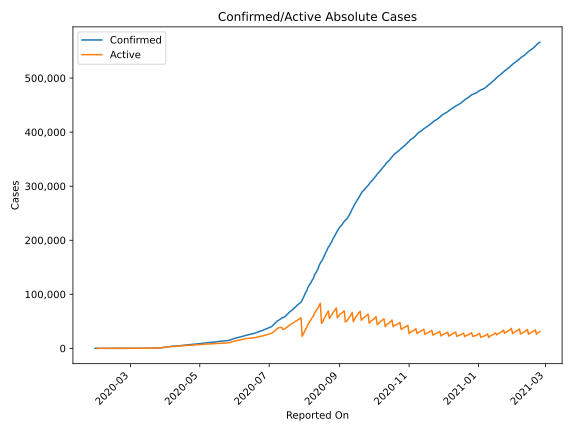
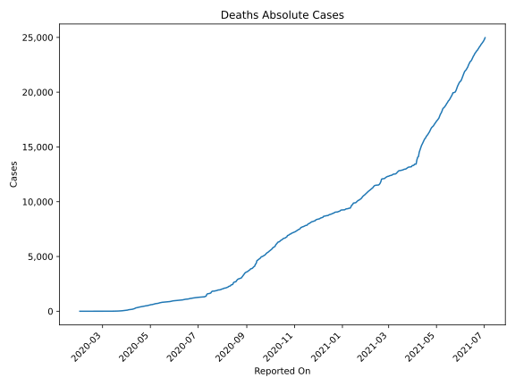
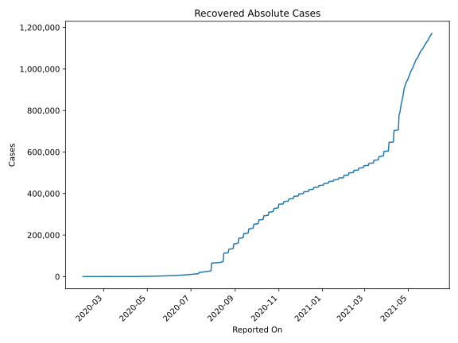
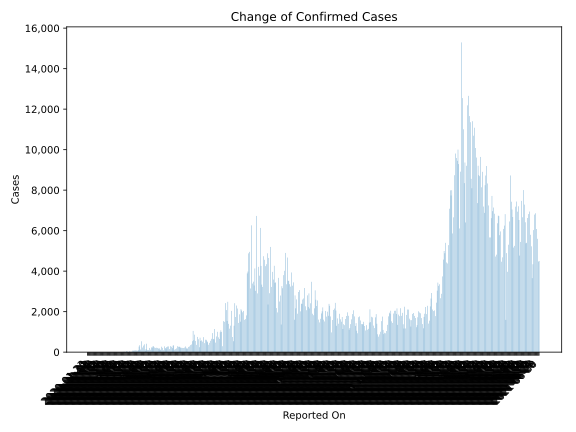
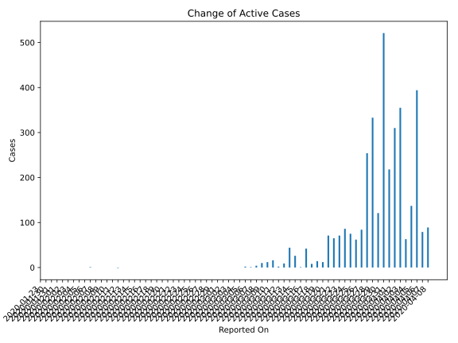
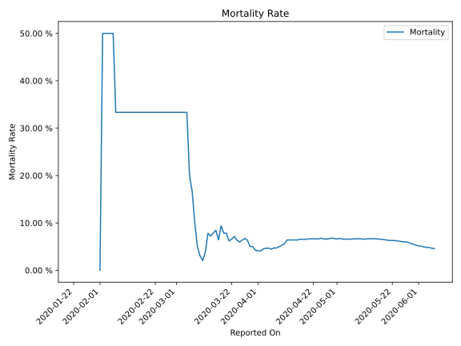

# Country Figures: Time Series for Philippines 

| Reported On | Confirmed | Deaths | Recovered | Active | Mortality | &Delta; Confirmed | &Delta; Deaths | &Delta; Recovered | &Delta; Active | % Active of Population |
|-------------|-----------|--------|-----------|--------|-----------|-------------------|----------------|-------------------|----------------|------------------------|
| 2020-04-25 | 7294 | 494 | 792 | 6008 |  6.77 %  | 102 | 17 | 30 | 55 |  0.006 %  | 
| 2020-04-24 | 7192 | 477 | 762 | 5953 |  6.63 %  | 211 | 15 | 40 | 156 |  0.006 %  | 
| 2020-04-23 | 6981 | 462 | 722 | 5797 |  6.62 %  | 271 | 16 | 29 | 226 |  0.005 %  | 
| 2020-04-22 | 6710 | 446 | 693 | 5571 |  6.65 %  | 111 | 9 | 39 | 63 |  0.005 %  | 
| 2020-04-21 | 6599 | 437 | 654 | 5508 |  6.62 %  | 140 | 9 | 41 | 90 |  0.005 %  | 
| 2020-04-20 | 6459 | 428 | 613 | 5418 |  6.63 %  | 200 | 19 | 41 | 140 |  0.005 %  | 
| 2020-04-19 | 6259 | 409 | 572 | 5278 |  6.53 %  | 172 | 12 | 56 | 104 |  0.005 %  | 
| 2020-04-18 | 6087 | 397 | 516 | 5174 |  6.52 %  | 209 | 10 | 29 | 170 |  0.005 %  | 
| 2020-04-17 | 5878 | 387 | 487 | 5004 |  6.58 %  | 218 | 25 | 52 | 141 |  0.005 %  | 
| 2020-04-16 | 5660 | 362 | 435 | 4863 |  6.40 %  | 207 | 13 | 82 | 112 |  0.005 %  | 
| 2020-04-15 | 5453 | 349 | 353 | 4751 |  6.40 %  | 230 | 14 | 58 | 158 |  0.004 %  | 
| 2020-04-14 | 5223 | 335 | 295 | 4593 |  6.41 %  | 291 | 20 | 53 | 218 |  0.004 %  | 
| 2020-04-13 | 4932 | 315 | 242 | 4375 |  6.39 %  | 284 | 18 | 45 | 221 |  0.004 %  | 
| 2020-04-12 | 4648 | 297 | 197 | 4154 |  6.39 %  | 220 | 50 | 40 | 130 |  0.004 %  | 
| 2020-04-11 | 4428 | 247 | 157 | 4024 |  5.58 %  | 233 | 26 | 17 | 190 |  0.004 %  | 
| 2020-04-10 | 4195 | 221 | 140 | 3834 |  5.27 %  | 119 | 18 | 16 | 85 |  0.004 %  | 
| 2020-04-09 | 4076 | 203 | 124 | 3749 |  4.98 %  | 206 | 21 | 28 | 157 |  0.004 %  | 
| 2020-04-08 | 3870 | 182 | 96 | 3592 |  4.70 %  | 106 | 5 | 12 | 89 |  0.003 %  | 
| 2020-04-07 | 3764 | 177 | 84 | 3503 |  4.70 %  | 104 | 14 | 11 | 79 |  0.003 %  | 
| 2020-04-06 | 3660 | 163 | 73 | 3424 |  4.45 %  | 414 | 11 | 9 | 394 |  0.003 %  | 
| 2020-04-05 | 3246 | 152 | 64 | 3030 |  4.68 %  | 152 | 8 | 7 | 137 |  0.003 %  | 
| 2020-04-04 | 3094 | 144 | 57 | 2893 |  4.65 %  | 76 | 8 | 5 | 63 |  0.003 %  | 
| 2020-04-03 | 3018 | 136 | 52 | 2830 |  4.51 %  | 385 | 29 | 1 | 355 |  0.003 %  | 
| 2020-04-02 | 2633 | 107 | 51 | 2475 |  4.06 %  | 322 | 11 | 1 | 310 |  0.002 %  | 
| 2020-04-01 | 2311 | 96 | 50 | 2165 |  4.15 %  | 227 | 8 | 1 | 218 |  0.002 %  | 
| 2020-03-31 | 2084 | 88 | 49 | 1947 |  4.22 %  | 538 | 10 | 7 | 521 |  0.002 %  | 
| 2020-03-30 | 1546 | 78 | 42 | 1426 |  5.05 %  | 128 | 7 | 0 | 121 |  0.001 %  | 
| 2020-03-29 | 1418 | 71 | 42 | 1305 |  5.01 %  | 343 | 3 | 7 | 333 |  0.001 %  | 
| 2020-03-28 | 1075 | 68 | 35 | 972 |  6.33 %  | 272 | 14 | 4 | 254 |  0.001 %  | 
| 2020-03-27 | 803 | 54 | 31 | 718 |  6.72 %  | 96 | 9 | 3 | 84 |  0.001 %  | 
| 2020-03-26 | 707 | 45 | 28 | 634 |  6.36 %  | 71 | 7 | 2 | 62 |  0.001 %  | 
| 2020-03-25 | 636 | 38 | 26 | 572 |  5.97 %  | 84 | 3 | 6 | 75 |  0.001 %  | 
| 2020-03-24 | 552 | 35 | 20 | 497 |  6.34 %  | 90 | 2 | 2 | 86 |  0.000 %  | 
| 2020-03-23 | 462 | 33 | 18 | 411 |  7.14 %  | 82 | 8 | 3 | 71 |  0.000 %  | 
| 2020-03-22 | 380 | 25 | 15 | 340 |  6.58 %  | 73 | 6 | 2 | 65 |  0.000 %  | 
| 2020-03-21 | 307 | 19 | 13 | 275 |  6.19 %  | 77 | 1 | 5 | 71 |  0.000 %  | 
| 2020-03-20 | 230 | 18 | 8 | 204 |  7.83 %  | 13 | 1 | 0 | 12 |  0.000 %  | 
| 2020-03-19 | 217 | 17 | 8 | 192 |  7.83 %  | 15 | -2 | 3 | 14 |  0.000 %  | 
| 2020-03-18 | 202 | 19 | 5 | 178 |  9.41 %  | 15 | 7 | 0 | 8 |  0.000 %  | 
| 2020-03-17 | 187 | 12 | 5 | 170 |  6.42 %  | 45 | 0 | 3 | 42 |  0.000 %  | 
| 2020-03-16 | 142 | 12 | 2 | 128 |  8.45 %  | 2 | 1 | 0 | 1 |  0.000 %  | 
| 2020-03-15 | 140 | 11 | 2 | 127 |  7.86 %  | 29 | 3 | 0 | 26 |  0.000 %  | 
| 2020-03-14 | 111 | 8 | 2 | 101 |  7.21 %  | 47 | 3 | 0 | 44 |  0.000 %  | 
| 2020-03-13 | 64 | 5 | 2 | 57 |  7.81 %  | 12 | 3 | 0 | 9 |  0.000 %  | 
| 2020-03-12 | 52 | 2 | 2 | 48 |  3.85 %  | 3 | 1 | 0 | 2 |  0.000 %  | 
| 2020-03-11 | 49 | 1 | 2 | 46 |  2.04 %  | 16 | 0 | 0 | 16 |  0.000 %  | 
| 2020-03-10 | 33 | 1 | 2 | 30 |  3.03 %  | 13 | 0 | 1 | 12 |  0.000 %  | 
| 2020-03-09 | 20 | 1 | 1 | 18 |  5.00 %  | 10 | 0 | 0 | 10 |  0.000 %  | 
| 2020-03-08 | 10 | 1 | 1 | 8 |  10.00 %  | 4 | 0 | 0 | 4 |  0.000 %  | 
| 2020-03-07 | 6 | 1 | 1 | 4 |  16.67 %  | 1 | 0 | 0 | 1 |  0.000 %  | 
| 2020-03-06 | 5 | 1 | 1 | 3 |  20.00 %  | 2 | 0 | 0 | 2 |  0.000 %  | 
| 2020-03-05 | 3 | 1 | 1 | 1 |  33.33 %  | 0 | 0 | 0 | 0 |  0.000 %  | 
| 2020-03-04 | 3 | 1 | 1 | 1 |  33.33 %  | 0 | 0 | 0 | 0 |  0.000 %  | 
| 2020-03-03 | 3 | 1 | 1 | 1 |  33.33 %  | 0 | 0 | 0 | 0 |  0.000 %  | 
| 2020-03-02 | 3 | 1 | 1 | 1 |  33.33 %  | 0 | 0 | 0 | 0 |  0.000 %  | 
| 2020-03-01 | 3 | 1 | 1 | 1 |  33.33 %  | 0 | 0 | 0 | 0 |  0.000 %  | 
| 2020-02-29 | 3 | 1 | 1 | 1 |  33.33 %  | 0 | 0 | 0 | 0 |  0.000 %  | 
| 2020-02-28 | 3 | 1 | 1 | 1 |  33.33 %  | 0 | 0 | 0 | 0 |  0.000 %  | 
| 2020-02-27 | 3 | 1 | 1 | 1 |  33.33 %  | 0 | 0 | 0 | 0 |  0.000 %  | 
| 2020-02-26 | 3 | 1 | 1 | 1 |  33.33 %  | 0 | 0 | 0 | 0 |  0.000 %  | 
| 2020-02-25 | 3 | 1 | 1 | 1 |  33.33 %  | 0 | 0 | 0 | 0 |  0.000 %  | 
| 2020-02-24 | 3 | 1 | 1 | 1 |  33.33 %  | 0 | 0 | 0 | 0 |  0.000 %  | 
| 2020-02-23 | 3 | 1 | 1 | 1 |  33.33 %  | 0 | 0 | 0 | 0 |  0.000 %  | 
| 2020-02-22 | 3 | 1 | 1 | 1 |  33.33 %  | 0 | 0 | 0 | 0 |  0.000 %  | 
| 2020-02-21 | 3 | 1 | 1 | 1 |  33.33 %  | 0 | 0 | 0 | 0 |  0.000 %  | 
| 2020-02-20 | 3 | 1 | 1 | 1 |  33.33 %  | 0 | 0 | 0 | 0 |  0.000 %  | 
| 2020-02-19 | 3 | 1 | 1 | 1 |  33.33 %  | 0 | 0 | 0 | 0 |  0.000 %  | 
| 2020-02-18 | 3 | 1 | 1 | 1 |  33.33 %  | 0 | 0 | 0 | 0 |  0.000 %  | 
| 2020-02-17 | 3 | 1 | 1 | 1 |  33.33 %  | 0 | 0 | 0 | 0 |  0.000 %  | 
| 2020-02-16 | 3 | 1 | 1 | 1 |  33.33 %  | 0 | 0 | 0 | 0 |  0.000 %  | 
| 2020-02-15 | 3 | 1 | 1 | 1 |  33.33 %  | 0 | 0 | 0 | 0 |  0.000 %  | 
| 2020-02-14 | 3 | 1 | 1 | 1 |  33.33 %  | 0 | 0 | 0 | 0 |  0.000 %  | 
| 2020-02-13 | 3 | 1 | 1 | 1 |  33.33 %  | 0 | 0 | 0 | 0 |  0.000 %  | 
| 2020-02-12 | 3 | 1 | 1 | 1 |  33.33 %  | 0 | 0 | 1 | -1 |  0.000 %  | 
| 2020-02-11 | 3 | 1 | 0 | 2 |  33.33 %  | 0 | 0 | 0 | 0 |  0.000 %  | 
| 2020-02-10 | 3 | 1 | 0 | 2 |  33.33 %  | 0 | 0 | 0 | 0 |  0.000 %  | 
| 2020-02-09 | 3 | 1 | 0 | 2 |  33.33 %  | 0 | 0 | 0 | 0 |  0.000 %  | 
| 2020-02-08 | 3 | 1 | 0 | 2 |  33.33 %  | 0 | 0 | 0 | 0 |  0.000 %  | 
| 2020-02-07 | 3 | 1 | 0 | 2 |  33.33 %  | 1 | 0 | 0 | 1 |  0.000 %  | 
| 2020-02-06 | 2 | 1 | 0 | 1 |  50.00 %  | 0 | 0 | 0 | 0 |  0.000 %  | 
| 2020-02-05 | 2 | 1 | 0 | 1 |  50.00 %  | 0 | 0 | 0 | 0 |  0.000 %  | 
| 2020-02-04 | 2 | 1 | 0 | 1 |  50.00 %  | 0 | 0 | 0 | 0 |  0.000 %  | 
| 2020-02-03 | 2 | 1 | 0 | 1 |  50.00 %  | 0 | 0 | 0 | 0 |  0.000 %  | 
| 2020-02-02 | 2 | 1 | 0 | 1 |  50.00 %  | 1 | 1 | 0 | 0 |  0.000 %  | 
| 2020-02-01 | 1 | 0 | 0 | 1 |  None  | 0 | None | None | None |  0.000 %  | 
| 2020-01-31 | 1 | None | None | None |  None  | 0 | None | None | None |  n/a  | 
| 2020-01-30 | 1 | None | None | None |  None  | None | None | None | None |  n/a  | 
| 2020-01-23 | None | None | None | None |  None  | None | None | None | None |  n/a  | 

