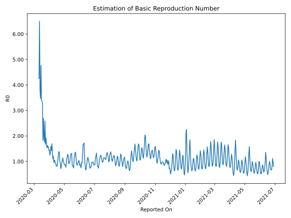

# Country Figures: Time Series for Basic Reproduction Number of Poland 

| Reported On | &Delta; Confirmed | Total &Delta; Confirmed First Interval | Total &Delta; Confirmed Second Interval | Estimated Basic Reproduction Number R0 | 
|-------------|-------------------|----------------------------------------|-----------------------------------------|---------------------------------------------------|
| 2020-05-06 | 309 |  1326  |  1203  |  1.10  | 
| 2020-05-05 | 425 |  1129  |  1260  |  0.90  | 
| 2020-05-04 | 313 |  1053  |  1367  |  0.77  | 
| 2020-05-03 | 318 |  1157  |  1326  |  0.87  | 
| 2020-05-02 | 270 |  1203  |  1391  |  0.86  | 
| 2020-05-01 | 228 |  1260  |  1448  |  0.87  | 
| 2020-04-30 | 237 |  1367  |  1417  |  0.96  | 
| 2020-04-29 | 422 |  1326  |  1299  |  1.02  | 
| 2020-04-28 | 316 |  1391  |  1224  |  1.14  | 
| 2020-04-27 | 285 |  1448  |  1427  |  1.01  | 
| 2020-04-26 | 344 |  1417  |  1477  |  0.96  | 
| 2020-04-25 | 381 |  1299  |  1675  |  0.78  | 
| 2020-04-24 | 381 |  1224  |  1705  |  0.72  | 
| 2020-04-23 | 342 |  1427  |  1540  |  0.93  | 
| 2020-04-22 | 313 |  1477  |  1445  |  1.02  | 
| 2020-04-21 | 263 |  1675  |  1244  |  1.35  | 
| 2020-04-20 | 306 |  1705  |  1226  |  1.39  | 
| 2020-04-19 | 545 |  1540  |  1247  |  1.23  | 
| 2020-04-18 | 363 |  1445  |  1359  |  1.06  | 
| 2020-04-17 | 461 |  1244  |  1469  |  0.85  | 
| 2020-04-16 | 336 |  1226  |  1508  |  0.81  | 
| 2020-04-15 | 380 |  1247  |  1542  |  0.81  | 
| 2020-04-14 | 268 |  1359  |  1473  |  0.92  | 
| 2020-04-13 | 260 |  1469  |  1578  |  0.93  | 
| 2020-04-12 | 318 |  1508  |  1465  |  1.03  | 
| 2020-04-11 | 401 |  1542  |  1467  |  1.05  | 
| 2020-04-10 | 380 |  1473  |  1548  |  0.95  | 
| 2020-04-09 | 370 |  1578  |  1316  |  1.20  | 
| 2020-04-08 | 357 |  1465  |  1328  |  1.10  | 
| 2020-04-07 | 435 |  1467  |  1084  |  1.35  | 
| 2020-04-06 | 311 |  1548  |  916  |  1.69  | 
| 2020-04-05 | 475 |  1316  |  922  |  1.43  | 
| 2020-04-04 | 244 |  1328  |  834  |  1.59  | 
| 2020-04-03 | 437 |  1084  |  811  |  1.34  | 
| 2020-04-02 | 392 |  916  |  737  |  1.24  | 
| 2020-04-01 | 243 |  922  |  640  |  1.44  | 
| 2020-03-31 | 256 |  834  |  587  |  1.42  | 
| 2020-03-30 | 193 |  811  |  515  |  1.57  | 
| 2020-03-29 | 224 |  737  |  476  |  1.55  | 
| 2020-03-28 | 249 |  640  |  394  |  1.62  | 
| 2020-03-27 | 168 |  587  |  383  |  1.53  | 
| 2020-03-26 | 170 |  515  |  298  |  1.73  | 
| 2020-03-25 | 150 |  476  |  248  |  1.92  | 
| 2020-03-24 | 152 |  394  |  236  |  1.67  | 
| 2020-03-23 | 115 |  383  |  148  |  2.59  | 
| 2020-03-22 | 98 |  298  |  170  |  1.75  | 
| 2020-03-21 | 111 |  248  |  128  |  1.94  | 
| 2020-03-20 | 70 |  236  |  88  |  2.68  | 
| 2020-03-19 | 104 |  148  |  81  |  1.83  | 
| 2020-03-18 | 13 |  170  |  52  |  3.27  | 
| 2020-03-17 | 61 |  128  |  38  |  3.37  | 
| 2020-03-16 | 58 |  88  |  26  |  3.38  | 
| 2020-03-15 | 16 |  81  |  17  |  4.76  | 
| 2020-03-14 | 35 |  52  |  15  |  3.47  | 
| 2020-03-13 | 19 |  38  |  10  |  3.80  | 
| 2020-03-12 | 18 |  26  |  4  |  6.50  | 
| 2020-03-11 | 9 |  17  |  4  |  4.25  | 
| 2020-03-10 | 6 |  15  |  None  |  None  | 
| 2020-03-09 | 5 |  10  |  None  |  None  | 
| 2020-03-08 | 6 |  4  |  None  |  None  | 
| 2020-03-07 | 0 |  4  |  None  |  None  | 
| 2020-03-06 | 4 |  None  |  None  |  None  | 
| 2020-03-05 | 0 |  None  |  None  |  None  | 
| 2020-03-04 | None |  None  |  None  |  None  | 

