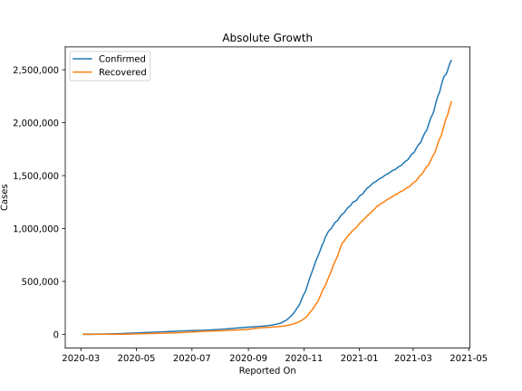
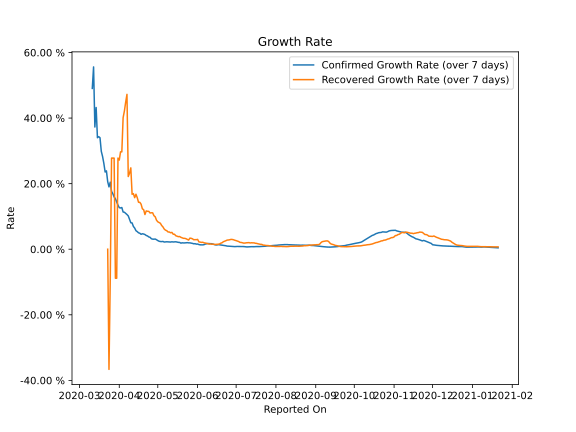

# Country Figures: Growth Rate for Poland 

The growth rates below are calculated based on
* an exponential growth assumption
* for time difference of past seven (7) days.

The first growth rate indicates the increase of confirmed (infected) cases.

The second growth rate indicates the increase of recovered (healed) cases.

| Reported On | Confirmed | Growth Rate (Confirmed) | Recovered | Growth Rate (Recovered) |
|-------------|-----------|-------------------------|-----------|-------------------------|
| 2020-03-22 | 634 |  23.90 %  | 1 |  None  | 
| 2020-03-21 | 536 |  23.56 %  | 1 |  None  | 
| 2020-03-20 | 425 |  26.18 %  | 1 |  None  | 
| 2020-03-19 | 355 |  28.29 %  | 1 |  None  | 
| 2020-03-18 | 251 |  29.88 %  | 13 |  None  | 
| 2020-03-17 | 238 |  34.02 %  | 13 |  None  | 
| 2020-03-16 | 177 |  34.34 %  | 13 |  None  | 
| 2020-03-15 | 119 |  34.02 %  | 0 |  None  | 
| 2020-03-14 | 103 |  43.22 %  | 0 |  None  | 
| 2020-03-13 | 68 |  37.29 %  | 0 |  None  | 
| 2020-03-12 | 49 |  None  | 0 |  None  | 
| 2020-03-11 | 31 |  None  | 0 |  None  | 
| 2020-03-10 | 22 |  None  | 0 |  None  | 
| 2020-03-09 | 16 |  None  | 0 |  None  | 
| 2020-03-08 | 11 |  None  | 0 |  None  | 
| 2020-03-07 | 5 |  None  | 0 |  None  | 
| 2020-03-06 | 5 |  None  | 0 |  None  | 
| 2020-03-05 | 1 |  None  | 0 |  None  | 
| 2020-03-04 | 1 |  None  | 0 |  None  | 

