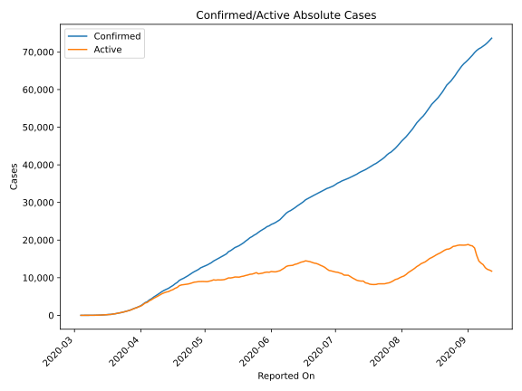
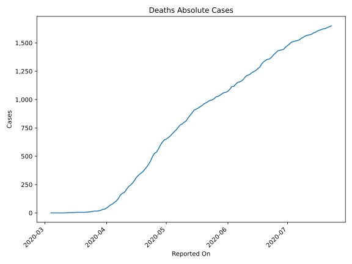
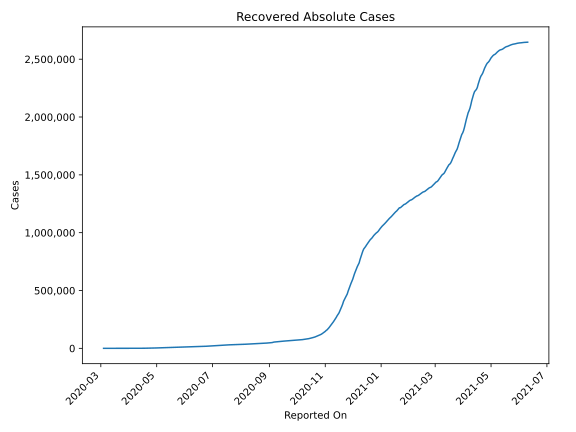
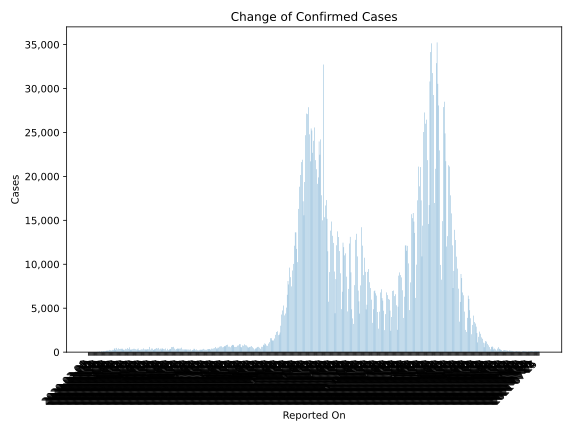
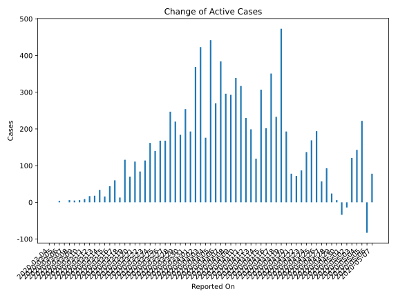
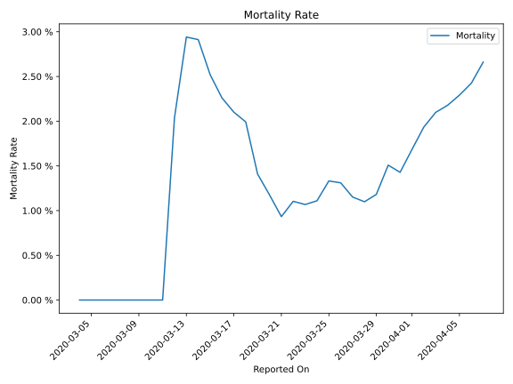

# Country Figures: Time Series for Poland 

| Reported On | Confirmed | Deaths | Recovered | Active | Mortality | &Delta; Confirmed | &Delta; Deaths | &Delta; Recovered | &Delta; Active | % Active of Population |
|-------------|-----------|--------|-----------|--------|-----------|-------------------|----------------|-------------------|----------------|------------------------|
| 2020-05-02 | 13375 | 664 | 3762 | 8949 |  4.96 %  | 270 | 13 | 271 | -14 |  0.024 %  | 
| 2020-05-01 | 13105 | 651 | 3491 | 8963 |  4.97 %  | 228 | 7 | 255 | -34 |  0.024 %  | 
| 2020-04-30 | 12877 | 644 | 3236 | 8997 |  5.00 %  | 237 | 20 | 211 | 6 |  0.024 %  | 
| 2020-04-29 | 12640 | 624 | 3025 | 8991 |  4.94 %  | 422 | 28 | 370 | 24 |  0.024 %  | 
| 2020-04-28 | 12218 | 596 | 2655 | 8967 |  4.88 %  | 316 | 34 | 189 | 93 |  0.024 %  | 
| 2020-04-27 | 11902 | 562 | 2466 | 8874 |  4.72 %  | 285 | 27 | 201 | 57 |  0.023 %  | 
| 2020-04-26 | 11617 | 535 | 2265 | 8817 |  4.61 %  | 344 | 11 | 139 | 194 |  0.023 %  | 
| 2020-04-25 | 11273 | 524 | 2126 | 8623 |  4.65 %  | 381 | 30 | 182 | 169 |  0.023 %  | 
| 2020-04-24 | 10892 | 494 | 1944 | 8454 |  4.54 %  | 381 | 40 | 204 | 137 |  0.022 %  | 
| 2020-04-23 | 10511 | 454 | 1740 | 8317 |  4.32 %  | 342 | 28 | 227 | 87 |  0.022 %  | 
| 2020-04-22 | 10169 | 426 | 1513 | 8230 |  4.19 %  | 313 | 25 | 216 | 72 |  0.022 %  | 
| 2020-04-21 | 9856 | 401 | 1297 | 8158 |  4.07 %  | 263 | 21 | 164 | 78 |  0.021 %  | 
| 2020-04-20 | 9593 | 380 | 1133 | 8080 |  3.96 %  | 306 | 20 | 93 | 193 |  0.021 %  | 
| 2020-04-19 | 9287 | 360 | 1040 | 7887 |  3.88 %  | 545 | 13 | 59 | 473 |  0.021 %  | 
| 2020-04-18 | 8742 | 347 | 981 | 7414 |  3.97 %  | 363 | 15 | 115 | 233 |  0.020 %  | 
| 2020-04-17 | 8379 | 332 | 866 | 7181 |  3.96 %  | 461 | 18 | 92 | 351 |  0.019 %  | 
| 2020-04-16 | 7918 | 314 | 774 | 6830 |  3.97 %  | 336 | 28 | 106 | 202 |  0.018 %  | 
| 2020-04-15 | 7582 | 286 | 668 | 6628 |  3.77 %  | 380 | 23 | 50 | 307 |  0.017 %  | 
| 2020-04-14 | 7202 | 263 | 618 | 6321 |  3.65 %  | 268 | 18 | 131 | 119 |  0.017 %  | 
| 2020-04-13 | 6934 | 245 | 487 | 6202 |  3.53 %  | 260 | 13 | 48 | 199 |  0.016 %  | 
| 2020-04-12 | 6674 | 232 | 439 | 6003 |  3.48 %  | 318 | 24 | 64 | 230 |  0.016 %  | 
| 2020-04-11 | 6356 | 208 | 375 | 5773 |  3.27 %  | 401 | 27 | 57 | 317 |  0.015 %  | 
| 2020-04-10 | 5955 | 181 | 318 | 5456 |  3.04 %  | 380 | 7 | 34 | 339 |  0.014 %  | 
| 2020-04-09 | 5575 | 174 | 284 | 5117 |  3.12 %  | 370 | 15 | 62 | 293 |  0.013 %  | 
| 2020-04-08 | 5205 | 159 | 222 | 4824 |  3.05 %  | 357 | 30 | 31 | 296 |  0.013 %  | 
| 2020-04-07 | 4848 | 129 | 191 | 4528 |  2.66 %  | 435 | 22 | 29 | 384 |  0.012 %  | 
| 2020-04-06 | 4413 | 107 | 162 | 4144 |  2.42 %  | 311 | 13 | 28 | 270 |  0.011 %  | 
| 2020-04-05 | 4102 | 94 | 134 | 3874 |  2.29 %  | 475 | 15 | 18 | 442 |  0.010 %  | 
| 2020-04-04 | 3627 | 79 | 116 | 3432 |  2.18 %  | 244 | 8 | 60 | 176 |  0.009 %  | 
| 2020-04-03 | 3383 | 71 | 56 | 3256 |  2.10 %  | 437 | 14 | 0 | 423 |  0.009 %  | 
| 2020-04-02 | 2946 | 57 | 56 | 2833 |  1.93 %  | 392 | 14 | 9 | 369 |  0.007 %  | 
| 2020-04-01 | 2554 | 43 | 47 | 2464 |  1.68 %  | 243 | 10 | 40 | 193 |  0.006 %  | 
| 2020-03-31 | 2311 | 33 | 7 | 2271 |  1.43 %  | 256 | 2 | 0 | 254 |  0.006 %  | 
| 2020-03-30 | 2055 | 31 | 7 | 2017 |  1.51 %  | 193 | 9 | 0 | 184 |  0.005 %  | 
| 2020-03-29 | 1862 | 22 | 7 | 1833 |  1.18 %  | 224 | 4 | 0 | 220 |  0.005 %  | 
| 2020-03-28 | 1638 | 18 | 7 | 1613 |  1.10 %  | 249 | 2 | 0 | 247 |  0.004 %  | 
| 2020-03-27 | 1389 | 16 | 7 | 1366 |  1.15 %  | 168 | 0 | 0 | 168 |  0.004 %  | 
| 2020-03-26 | 1221 | 16 | 7 | 1198 |  1.31 %  | 170 | 2 | 0 | 168 |  0.003 %  | 
| 2020-03-25 | 1051 | 14 | 7 | 1030 |  1.33 %  | 150 | 4 | 6 | 140 |  0.003 %  | 
| 2020-03-24 | 901 | 10 | 1 | 890 |  1.11 %  | 152 | 2 | -12 | 162 |  0.002 %  | 
| 2020-03-23 | 749 | 8 | 13 | 728 |  1.07 %  | 115 | 1 | 0 | 114 |  0.002 %  | 
| 2020-03-22 | 634 | 7 | 13 | 614 |  1.10 %  | 98 | 2 | 12 | 84 |  0.002 %  | 
| 2020-03-21 | 536 | 5 | 1 | 530 |  0.93 %  | 111 | 0 | 0 | 111 |  0.001 %  | 
| 2020-03-20 | 425 | 5 | 1 | 419 |  1.18 %  | 70 | 0 | 0 | 70 |  0.001 %  | 
| 2020-03-19 | 355 | 5 | 1 | 349 |  1.41 %  | 104 | 0 | -12 | 116 |  0.001 %  | 
| 2020-03-18 | 251 | 5 | 13 | 233 |  1.99 %  | 13 | 0 | 0 | 13 |  0.001 %  | 
| 2020-03-17 | 238 | 5 | 13 | 220 |  2.10 %  | 61 | 1 | 0 | 60 |  0.001 %  | 
| 2020-03-16 | 177 | 4 | 13 | 160 |  2.26 %  | 58 | 1 | 13 | 44 |  0.000 %  | 
| 2020-03-15 | 119 | 3 | 0 | 116 |  2.52 %  | 16 | 0 | 0 | 16 |  0.000 %  | 
| 2020-03-14 | 103 | 3 | 0 | 100 |  2.91 %  | 35 | 1 | 0 | 34 |  0.000 %  | 
| 2020-03-13 | 68 | 2 | 0 | 66 |  2.94 %  | 19 | 1 | 0 | 18 |  0.000 %  | 
| 2020-03-12 | 49 | 1 | 0 | 48 |  2.04 %  | 18 | 1 | 0 | 17 |  0.000 %  | 
| 2020-03-11 | 31 | 0 | 0 | 31 |  None  | 9 | 0 | 0 | 9 |  0.000 %  | 
| 2020-03-10 | 22 | 0 | 0 | 22 |  None  | 6 | 0 | 0 | 6 |  0.000 %  | 
| 2020-03-09 | 16 | 0 | 0 | 16 |  None  | 5 | 0 | 0 | 5 |  0.000 %  | 
| 2020-03-08 | 11 | 0 | 0 | 11 |  None  | 6 | 0 | 0 | 6 |  0.000 %  | 
| 2020-03-07 | 5 | 0 | 0 | 5 |  None  | 0 | 0 | 0 | 0 |  0.000 %  | 
| 2020-03-06 | 5 | 0 | 0 | 5 |  None  | 4 | 0 | 0 | 4 |  0.000 %  | 
| 2020-03-05 | 1 | 0 | 0 | 1 |  None  | 0 | 0 | 0 | 0 |  0.000 %  | 
| 2020-03-04 | 1 | 0 | 0 | 1 |  None  | None | None | None | None |  0.000 %  | 

