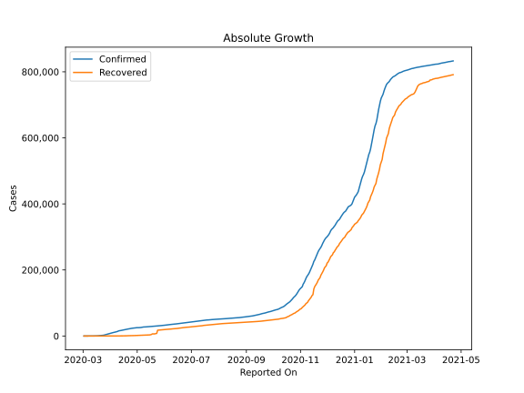
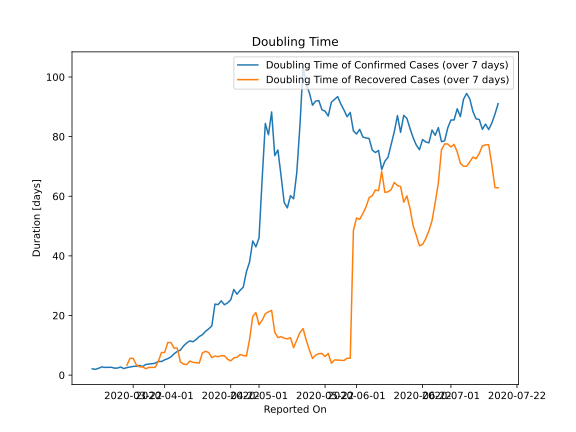

# Country Figures: Doubling Time of Infections for Portugal 

The doubling time below are calculated based on
* an exponential growth assumption
* for time difference of past seven (7) days.
The doubling time's unit is "days".

The first doubling time indicates the increase of confirmed (infected)
cases. There, the *higher* the number is, the better is to take control
of the disease.

The second doubling time indicates the increase of recovered (healed)
cases. There, the *lower* the number is, the better it is to take
control of the disease.

| Reported On | Confirmed | Doubling Time (Confirmed) | Recovered | Doubling Time (Recovered) |
|-------------|-----------|---------------------------|-----------|---------------------------|
| 2020-05-01 | 25351 |  46.0 days  | 1647 |  16.9 days  | 
| 2020-04-30 | 25045 |  43.0 days  | 1519 |  21.0 days  | 
| 2020-04-29 | 24505 |  45.0 days  | 1470 |  19.6 days  | 
| 2020-04-28 | 24322 |  38.0 days  | 1389 |  12.0 days  | 
| 2020-04-27 | 24027 |  34.7 days  | 1357 |  6.4 days  | 
| 2020-04-26 | 23864 |  29.5 days  | 1329 |  6.6 days  | 
| 2020-04-25 | 23392 |  28.5 days  | 1277 |  6.9 days  | 
| 2020-04-24 | 22797 |  27.1 days  | 1228 |  6.0 days  | 
| 2020-04-23 | 22353 |  28.7 days  | 1201 |  5.8 days  | 
| 2020-04-22 | 21982 |  25.3 days  | 1143 |  4.8 days  | 
| 2020-04-21 | 21379 |  24.2 days  | 917 |  5.3 days  | 
| 2020-04-20 | 20863 |  23.6 days  | 610 |  6.5 days  | 
| 2020-04-19 | 20206 |  24.9 days  | 610 |  6.5 days  | 
| 2020-04-18 | 19685 |  23.7 days  | 610 |  6.2 days  | 
| 2020-04-17 | 19022 |  23.8 days  | 519 |  6.4 days  | 
| 2020-04-16 | 18841 |  16.5 days  | 493 |  5.9 days  | 
| 2020-04-15 | 18091 |  15.5 days  | 383 |  7.6 days  | 
| 2020-04-14 | 17448 |  14.7 days  | 347 |  8.0 days  | 
| 2020-04-13 | 16934 |  13.6 days  | 277 |  7.5 days  | 
| 2020-04-12 | 16585 |  12.9 days  | 277 |  4.1 days  | 
| 2020-04-11 | 15987 |  11.9 days  | 266 |  4.2 days  | 
| 2020-04-10 | 15472 |  11.2 days  | 233 |  4.3 days  | 
| 2020-04-09 | 13956 |  11.5 days  | 205 |  4.7 days  | 
| 2020-04-08 | 13141 |  10.8 days  | 196 |  3.5 days  | 
| 2020-04-07 | 12442 |  9.8 days  | 184 |  3.7 days  | 
| 2020-04-06 | 11730 |  8.4 days  | 140 |  4.4 days  | 
| 2020-04-05 | 11278 |  8.0 days  | 75 |  9.1 days  | 
| 2020-04-04 | 10524 |  7.2 days  | 75 |  9.1 days  | 
| 2020-04-03 | 9886 |  6.1 days  | 68 |  10.9 days  | 
| 2020-04-02 | 9034 |  5.5 days  | 68 |  10.9 days  | 
| 2020-04-01 | 8251 |  5.1 days  | 43 |  7.6 days  | 
| 2020-03-31 | 7443 |  4.6 days  | 43 |  7.6 days  | 
| 2020-03-30 | 6408 |  4.6 days  | 43 |  4.7 days  | 
| 2020-03-29 | 5962 |  4.0 days  | 43 |  2.6 days  | 
| 2020-03-28 | 5170 |  3.8 days  | 43 |  2.6 days  | 
| 2020-03-27 | 4268 |  3.7 days  | 43 |  2.6 days  | 
| 2020-03-26 | 3544 |  3.6 days  | 43 |  2.2 days  | 
| 2020-03-25 | 2995 |  2.9 days  | 22 |  2.8 days  | 
| 2020-03-24 | 2362 |  3.3 days  | 22 |  2.8 days  | 
| 2020-03-23 | 2060 |  3.0 days  | 14 |  3.5 days  | 
| 2020-03-22 | 1600 |  2.9 days  | 5 |  5.6 days  | 
| 2020-03-21 | 1280 |  2.7 days  | 5 |  5.6 days  | 
| 2020-03-20 | 1020 |  2.5 days  | 5 |  3.3 days  | 
| 2020-03-19 | 785 |  2.2 days  | 3 |  None  | 
| 2020-03-18 | 448 |  2.7 days  | 3 |  None  | 
| 2020-03-17 | 448 |  2.4 days  | 3 |  None  | 
| 2020-03-16 | 331 |  2.4 days  | 3 |  None  | 
| 2020-03-15 | 245 |  2.6 days  | 2 |  None  | 
| 2020-03-14 | 169 |  2.6 days  | 2 |  None  | 
| 2020-03-13 | 112 |  2.6 days  | 1 |  None  | 
| 2020-03-12 | 59 |  2.8 days  | 0 |  None  | 
| 2020-03-11 | 59 |  2.3 days  | 0 |  None  | 
| 2020-03-10 | 41 |  1.9 days  | 0 |  None  | 
| 2020-03-09 | 30 |  2.1 days  | 0 |  None  | 
| 2020-03-08 | 30 |  None  | 0 |  None  | 
| 2020-03-07 | 20 |  None  | 0 |  None  | 
| 2020-03-06 | 13 |  None  | 0 |  None  | 
| 2020-03-05 | 8 |  None  | 0 |  None  | 
| 2020-03-04 | 5 |  None  | 0 |  None  | 
| 2020-03-03 | 2 |  None  | 0 |  None  | 
| 2020-03-02 | 2 |  None  | 0 |  None  | 

