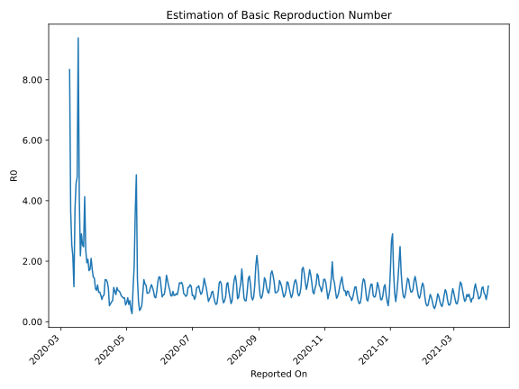

# Country Figures: Time Series for Basic Reproduction Number of Portugal 

| Reported On | &Delta; Confirmed | Total &Delta; Confirmed First Interval | Total &Delta; Confirmed Second Interval | Estimated Basic Reproduction Number R0 | 
|-------------|-------------------|----------------------------------------|-----------------------------------------|---------------------------------------------------|
| 2020-04-29 | 183 |  1525  |  1934  |  0.79  | 
| 2020-04-28 | 295 |  1674  |  2147  |  0.78  | 
| 2020-04-27 | 163 |  1882  |  2297  |  0.82  | 
| 2020-04-26 | 472 |  2013  |  2357  |  0.85  | 
| 2020-04-25 | 595 |  1934  |  2022  |  0.96  | 
| 2020-04-24 | 444 |  2147  |  2115  |  1.02  | 
| 2020-04-23 | 371 |  2297  |  2237  |  1.03  | 
| 2020-04-22 | 603 |  2357  |  2088  |  1.13  | 
| 2020-04-21 | 516 |  2022  |  2256  |  0.90  | 
| 2020-04-20 | 657 |  2115  |  2104  |  1.01  | 
| 2020-04-19 | 521 |  2237  |  1976  |  1.13  | 
| 2020-04-18 | 663 |  2088  |  2978  |  0.70  | 
| 2020-04-17 | 181 |  2256  |  3444  |  0.66  | 
| 2020-04-16 | 750 |  2104  |  3545  |  0.59  | 
| 2020-04-15 | 643 |  1976  |  3742  |  0.53  | 
| 2020-04-14 | 514 |  2978  |  2678  |  1.11  | 
| 2020-04-13 | 349 |  3444  |  2617  |  1.32  | 
| 2020-04-12 | 598 |  3545  |  2556  |  1.39  | 
| 2020-04-11 | 515 |  3742  |  2696  |  1.39  | 
| 2020-04-10 | 1516 |  2678  |  3027  |  0.88  | 
| 2020-04-09 | 815 |  2617  |  3081  |  0.85  | 
| 2020-04-08 | 699 |  2556  |  3478  |  0.73  | 
| 2020-04-07 | 712 |  2696  |  3072  |  0.88  | 
| 2020-04-06 | 452 |  3027  |  3081  |  0.98  | 
| 2020-04-05 | 754 |  3081  |  3175  |  0.97  | 
| 2020-04-04 | 638 |  3478  |  2864  |  1.21  | 
| 2020-04-03 | 852 |  3072  |  2967  |  1.04  | 
| 2020-04-02 | 783 |  3081  |  2808  |  1.10  | 
| 2020-04-01 | 808 |  3175  |  2208  |  1.44  | 
| 2020-03-31 | 1035 |  2864  |  1944  |  1.47  | 
| 2020-03-30 | 446 |  2967  |  1715  |  1.73  | 
| 2020-03-29 | 792 |  2808  |  1342  |  2.09  | 
| 2020-03-28 | 902 |  2208  |  1275  |  1.73  | 
| 2020-03-27 | 724 |  1944  |  1152  |  1.69  | 
| 2020-03-26 | 549 |  1715  |  832  |  2.06  | 
| 2020-03-25 | 633 |  1342  |  689  |  1.95  | 
| 2020-03-24 | 302 |  1275  |  540  |  2.36  | 
| 2020-03-23 | 460 |  1152  |  279  |  4.13  | 
| 2020-03-22 | 320 |  832  |  336  |  2.48  | 
| 2020-03-21 | 260 |  689  |  272  |  2.53  | 
| 2020-03-20 | 235 |  540  |  186  |  2.90  | 
| 2020-03-19 | 337 |  279  |  128  |  2.18  | 
| 2020-03-18 | 0 |  336  |  82  |  4.10  | 
| 2020-03-17 | 117 |  272  |  29  |  9.38  | 
| 2020-03-16 | 86 |  186  |  39  |  4.77  | 
| 2020-03-15 | 76 |  128  |  28  |  4.57  | 
| 2020-03-14 | 57 |  82  |  22  |  3.73  | 
| 2020-03-13 | 53 |  29  |  25  |  1.16  | 
| 2020-03-12 | 0 |  39  |  18  |  2.17  | 
| 2020-03-11 | 18 |  28  |  11  |  2.55  | 
| 2020-03-10 | 11 |  22  |  6  |  3.67  | 
| 2020-03-09 | 0 |  25  |  3  |  8.33  | 
| 2020-03-08 | 10 |  18  |  None  |  None  | 
| 2020-03-07 | 7 |  11  |  None  |  None  | 
| 2020-03-06 | 5 |  6  |  None  |  None  | 
| 2020-03-05 | 3 |  3  |  None  |  None  | 
| 2020-03-04 | 3 |  None  |  None  |  None  | 
| 2020-03-03 | 0 |  None  |  None  |  None  | 
| 2020-03-02 | None |  None  |  None  |  None  | 

