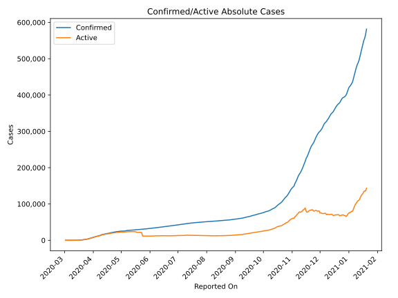
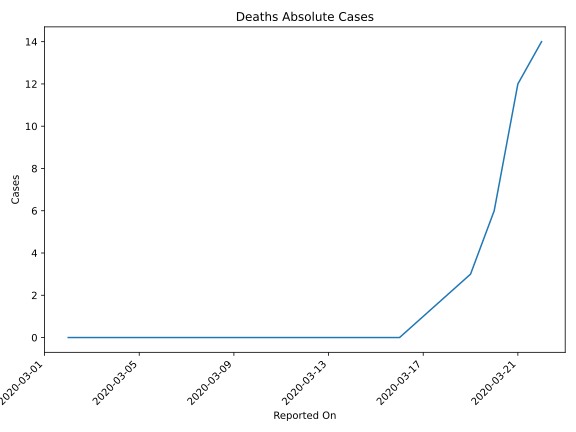
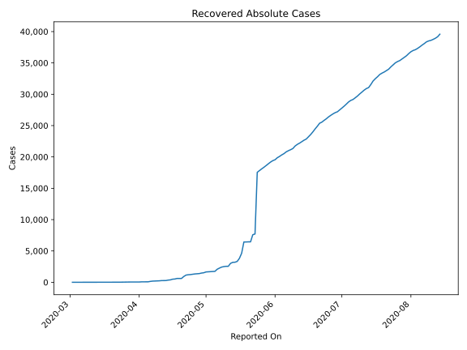
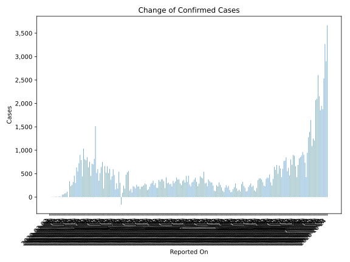
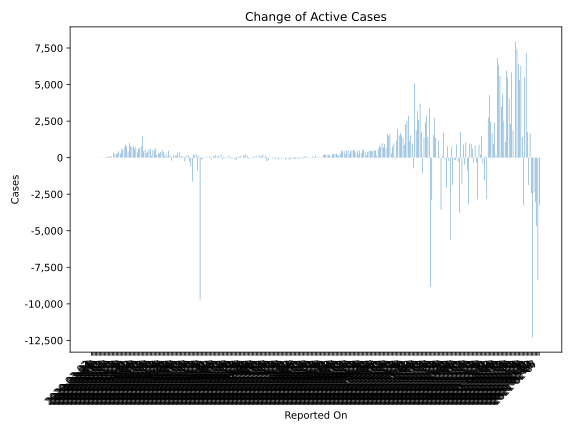
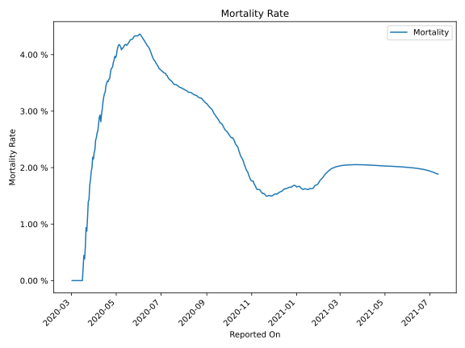

# Country Figures: Time Series for Portugal 

| Reported On | Confirmed | Deaths | Recovered | Active | Mortality | &Delta; Confirmed | &Delta; Deaths | &Delta; Recovered | &Delta; Active | % Active of Population |
|-------------|-----------|--------|-----------|--------|-----------|-------------------|----------------|-------------------|----------------|------------------------|
| 2020-05-03 | 25282 | 1043 | 1689 | 22550 |  4.13 %  | 92 | 20 | 18 | 54 |  0.219 %  | 
| 2020-05-02 | 25190 | 1023 | 1671 | 22496 |  4.06 %  | -161 | 16 | 24 | -201 |  0.219 %  | 
| 2020-05-01 | 25351 | 1007 | 1647 | 22697 |  3.97 %  | 306 | 18 | 128 | 160 |  0.221 %  | 
| 2020-04-30 | 25045 | 989 | 1519 | 22537 |  3.95 %  | 540 | 16 | 49 | 475 |  0.219 %  | 
| 2020-04-29 | 24505 | 973 | 1470 | 22062 |  3.97 %  | 183 | 25 | 81 | 77 |  0.215 %  | 
| 2020-04-28 | 24322 | 948 | 1389 | 21985 |  3.90 %  | 295 | 20 | 32 | 243 |  0.214 %  | 
| 2020-04-27 | 24027 | 928 | 1357 | 21742 |  3.86 %  | 163 | 25 | 28 | 110 |  0.211 %  | 
| 2020-04-26 | 23864 | 903 | 1329 | 21632 |  3.78 %  | 472 | 23 | 52 | 397 |  0.210 %  | 
| 2020-04-25 | 23392 | 880 | 1277 | 21235 |  3.76 %  | 595 | 26 | 49 | 520 |  0.207 %  | 
| 2020-04-24 | 22797 | 854 | 1228 | 20715 |  3.75 %  | 444 | 34 | 27 | 383 |  0.201 %  | 
| 2020-04-23 | 22353 | 820 | 1201 | 20332 |  3.67 %  | 371 | 35 | 58 | 278 |  0.198 %  | 
| 2020-04-22 | 21982 | 785 | 1143 | 20054 |  3.57 %  | 603 | 23 | 226 | 354 |  0.195 %  | 
| 2020-04-21 | 21379 | 762 | 917 | 19700 |  3.56 %  | 516 | 27 | 307 | 182 |  0.192 %  | 
| 2020-04-20 | 20863 | 735 | 610 | 19518 |  3.52 %  | 657 | 21 | 0 | 636 |  0.190 %  | 
| 2020-04-19 | 20206 | 714 | 610 | 18882 |  3.53 %  | 521 | 27 | 0 | 494 |  0.184 %  | 
| 2020-04-18 | 19685 | 687 | 610 | 18388 |  3.49 %  | 663 | 30 | 91 | 542 |  0.179 %  | 
| 2020-04-17 | 19022 | 657 | 519 | 17846 |  3.45 %  | 181 | 28 | 26 | 127 |  0.174 %  | 
| 2020-04-16 | 18841 | 629 | 493 | 17719 |  3.34 %  | 750 | 30 | 110 | 610 |  0.172 %  | 
| 2020-04-15 | 18091 | 599 | 383 | 17109 |  3.31 %  | 643 | 32 | 36 | 575 |  0.166 %  | 
| 2020-04-14 | 17448 | 567 | 347 | 16534 |  3.25 %  | 514 | 32 | 70 | 412 |  0.161 %  | 
| 2020-04-13 | 16934 | 535 | 277 | 16122 |  3.16 %  | 349 | 31 | 0 | 318 |  0.157 %  | 
| 2020-04-12 | 16585 | 504 | 277 | 15804 |  3.04 %  | 598 | 34 | 11 | 553 |  0.154 %  | 
| 2020-04-11 | 15987 | 470 | 266 | 15251 |  2.94 %  | 515 | 35 | 33 | 447 |  0.148 %  | 
| 2020-04-10 | 15472 | 435 | 233 | 14804 |  2.81 %  | 1516 | 26 | 28 | 1462 |  0.144 %  | 
| 2020-04-09 | 13956 | 409 | 205 | 13342 |  2.93 %  | 815 | 29 | 9 | 777 |  0.130 %  | 
| 2020-04-08 | 13141 | 380 | 196 | 12565 |  2.89 %  | 699 | 35 | 12 | 652 |  0.122 %  | 
| 2020-04-07 | 12442 | 345 | 184 | 11913 |  2.77 %  | 712 | 34 | 44 | 634 |  0.116 %  | 
| 2020-04-06 | 11730 | 311 | 140 | 11279 |  2.65 %  | 452 | 16 | 65 | 371 |  0.110 %  | 
| 2020-04-05 | 11278 | 295 | 75 | 10908 |  2.62 %  | 754 | 29 | 0 | 725 |  0.106 %  | 
| 2020-04-04 | 10524 | 266 | 75 | 10183 |  2.53 %  | 638 | 20 | 7 | 611 |  0.099 %  | 
| 2020-04-03 | 9886 | 246 | 68 | 9572 |  2.49 %  | 852 | 37 | 0 | 815 |  0.093 %  | 
| 2020-04-02 | 9034 | 209 | 68 | 8757 |  2.31 %  | 783 | 22 | 25 | 736 |  0.085 %  | 
| 2020-04-01 | 8251 | 187 | 43 | 8021 |  2.27 %  | 808 | 27 | 0 | 781 |  0.078 %  | 
| 2020-03-31 | 7443 | 160 | 43 | 7240 |  2.15 %  | 1035 | 20 | 0 | 1015 |  0.070 %  | 
| 2020-03-30 | 6408 | 140 | 43 | 6225 |  2.18 %  | 446 | 21 | 0 | 425 |  0.061 %  | 
| 2020-03-29 | 5962 | 119 | 43 | 5800 |  2.00 %  | 792 | 19 | 0 | 773 |  0.056 %  | 
| 2020-03-28 | 5170 | 100 | 43 | 5027 |  1.93 %  | 902 | 24 | 0 | 878 |  0.049 %  | 
| 2020-03-27 | 4268 | 76 | 43 | 4149 |  1.78 %  | 724 | 16 | 0 | 708 |  0.040 %  | 
| 2020-03-26 | 3544 | 60 | 43 | 3441 |  1.69 %  | 549 | 17 | 21 | 511 |  0.033 %  | 
| 2020-03-25 | 2995 | 43 | 22 | 2930 |  1.44 %  | 633 | 10 | 0 | 623 |  0.028 %  | 
| 2020-03-24 | 2362 | 33 | 22 | 2307 |  1.40 %  | 302 | 10 | 8 | 284 |  0.022 %  | 
| 2020-03-23 | 2060 | 23 | 14 | 2023 |  1.12 %  | 460 | 9 | 9 | 442 |  0.020 %  | 
| 2020-03-22 | 1600 | 14 | 5 | 1581 |  0.88 %  | 320 | 2 | 0 | 318 |  0.015 %  | 
| 2020-03-21 | 1280 | 12 | 5 | 1263 |  0.94 %  | 260 | 6 | 0 | 254 |  0.012 %  | 
| 2020-03-20 | 1020 | 6 | 5 | 1009 |  0.59 %  | 235 | 3 | 2 | 230 |  0.010 %  | 
| 2020-03-19 | 785 | 3 | 3 | 779 |  0.38 %  | 337 | 1 | 0 | 336 |  0.008 %  | 
| 2020-03-18 | 448 | 2 | 3 | 443 |  0.45 %  | 0 | 1 | 0 | -1 |  0.004 %  | 
| 2020-03-17 | 448 | 1 | 3 | 444 |  0.22 %  | 117 | 1 | 0 | 116 |  0.004 %  | 
| 2020-03-16 | 331 | 0 | 3 | 328 |  None  | 86 | 0 | 1 | 85 |  0.003 %  | 
| 2020-03-15 | 245 | 0 | 2 | 243 |  None  | 76 | 0 | 0 | 76 |  0.002 %  | 
| 2020-03-14 | 169 | 0 | 2 | 167 |  None  | 57 | 0 | 1 | 56 |  0.002 %  | 
| 2020-03-13 | 112 | 0 | 1 | 111 |  None  | 53 | 0 | 1 | 52 |  0.001 %  | 
| 2020-03-12 | 59 | 0 | 0 | 59 |  None  | 0 | 0 | 0 | 0 |  0.001 %  | 
| 2020-03-11 | 59 | 0 | 0 | 59 |  None  | 18 | 0 | 0 | 18 |  0.001 %  | 
| 2020-03-10 | 41 | 0 | 0 | 41 |  None  | 11 | 0 | 0 | 11 |  0.000 %  | 
| 2020-03-09 | 30 | 0 | 0 | 30 |  None  | 0 | 0 | 0 | 0 |  0.000 %  | 
| 2020-03-08 | 30 | 0 | 0 | 30 |  None  | 10 | 0 | 0 | 10 |  0.000 %  | 
| 2020-03-07 | 20 | 0 | 0 | 20 |  None  | 7 | 0 | 0 | 7 |  0.000 %  | 
| 2020-03-06 | 13 | 0 | 0 | 13 |  None  | 5 | 0 | 0 | 5 |  0.000 %  | 
| 2020-03-05 | 8 | 0 | 0 | 8 |  None  | 3 | 0 | 0 | 3 |  0.000 %  | 
| 2020-03-04 | 5 | 0 | 0 | 5 |  None  | 3 | 0 | 0 | 3 |  0.000 %  | 
| 2020-03-03 | 2 | 0 | 0 | 2 |  None  | 0 | 0 | 0 | 0 |  0.000 %  | 
| 2020-03-02 | 2 | 0 | 0 | 2 |  None  | None | None | None | None |  0.000 %  | 

