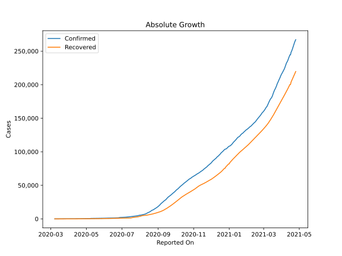
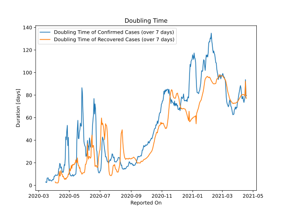

# Country Figures: Doubling Time of Infections for Paraguay 

The doubling time below are calculated based on
* an exponential growth assumption
* for time difference of past seven (7) days.
The doubling time's unit is "days".

The first doubling time indicates the increase of confirmed (infected)
cases. There, the *higher* the number is, the better is to take control
of the disease.

The second doubling time indicates the increase of recovered (healed)
cases. There, the *lower* the number is, the better it is to take
control of the disease.

| Reported On | Confirmed | Doubling Time (Confirmed) | Recovered | Doubling Time (Recovered) |
|-------------|-----------|---------------------------|-----------|---------------------------|
| 2020-04-13 | 147 |  18.8 days  | 22 |  8.3 days  | 
| 2020-04-12 | 134 |  19.5 days  | 22 |  8.3 days  | 
| 2020-04-11 | 133 |  15.2 days  | 18 |  12.3 days  | 
| 2020-04-10 | 129 |  14.7 days  | 18 |  4.8 days  | 
| 2020-04-09 | 124 |  10.5 days  | 18 |  2.5 days  | 
| 2020-04-08 | 119 |  9.2 days  | 15 |  2.1 days  | 
| 2020-04-07 | 115 |  8.8 days  | 15 |  2.1 days  | 
| 2020-04-06 | 113 |  8.9 days  | 12 |  2.3 days  | 
| 2020-04-05 | 104 |  8.9 days  | 12 |  2.3 days  | 
| 2020-04-04 | 96 |  9.3 days  | 12 |  2.3 days  | 
| 2020-04-03 | 92 |  8.8 days  | 6 |  3.0 days  | 
| 2020-04-02 | 77 |  8.0 days  | 2 |  None  | 
| 2020-04-01 | 69 |  8.1 days  | 1 |  None  | 
| 2020-03-31 | 65 |  5.9 days  | 1 |  None  | 
| 2020-03-30 | 64 |  4.9 days  | 1 |  None  | 
| 2020-03-29 | 59 |  5.3 days  | 1 |  None  | 
| 2020-03-28 | 56 |  4.6 days  | 1 |  None  | 
| 2020-03-27 | 52 |  3.8 days  | 1 |  None  | 
| 2020-03-26 | 41 |  4.0 days  | 0 |  None  | 
| 2020-03-25 | 37 |  4.3 days  | 0 |  None  | 
| 2020-03-24 | 27 |  4.8 days  | 0 |  None  | 
| 2020-03-23 | 22 |  5.1 days  | 0 |  None  | 
| 2020-03-22 | 22 |  4.1 days  | 0 |  None  | 
| 2020-03-21 | 18 |  4.8 days  | 0 |  None  | 
| 2020-03-20 | 13 |  6.6 days  | 0 |  None  | 
| 2020-03-19 | 11 |  6.5 days  | 0 |  None  | 
| 2020-03-18 | 11 |  6.5 days  | 0 |  None  | 
| 2020-03-17 | 9 |  2.5 days  | 0 |  None  | 
| 2020-03-16 | 8 |  2.7 days  | 0 |  None  | 
| 2020-03-15 | 6 |  3.0 days  | 0 |  None  | 
| 2020-03-14 | 6 |  None  | 0 |  None  | 
| 2020-03-13 | 6 |  None  | 0 |  None  | 
| 2020-03-12 | 5 |  None  | 0 |  None  | 
| 2020-03-11 | 5 |  None  | 0 |  None  | 
| 2020-03-10 | 1 |  None  | 0 |  None  | 
| 2020-03-09 | 1 |  None  | 0 |  None  | 
| 2020-03-08 | 1 |  None  | 0 |  None  | 

