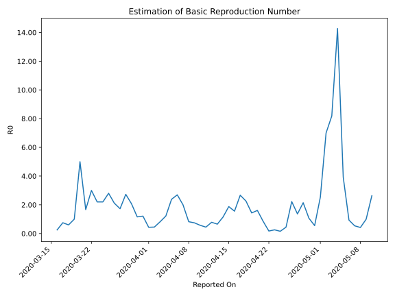

# Country Figures: Time Series for Basic Reproduction Number of Paraguay 

| Reported On | &Delta; Confirmed | Total &Delta; Confirmed First Interval | Total &Delta; Confirmed Second Interval | Estimated Basic Reproduction Number R0 | 
|-------------|-------------------|----------------------------------------|-----------------------------------------|---------------------------------------------------|
| 2020-04-27 | 0 |  15  |  11  |  1.36  | 
| 2020-04-26 | 0 |  20  |  9  |  2.22  | 
| 2020-04-25 | 5 |  15  |  34  |  0.44  | 
| 2020-04-24 | 10 |  7  |  45  |  0.16  | 
| 2020-04-23 | 0 |  11  |  43  |  0.26  | 
| 2020-04-22 | 5 |  9  |  52  |  0.17  | 
| 2020-04-21 | 0 |  34  |  40  |  0.85  | 
| 2020-04-20 | 2 |  45  |  28  |  1.61  | 
| 2020-04-19 | 4 |  43  |  30  |  1.43  | 
| 2020-04-18 | 3 |  52  |  23  |  2.26  | 
| 2020-04-17 | 25 |  40  |  15  |  2.67  | 
| 2020-04-16 | 13 |  28  |  18  |  1.56  | 
| 2020-04-15 | 2 |  30  |  16  |  1.88  | 
| 2020-04-14 | 12 |  23  |  20  |  1.15  | 
| 2020-04-13 | 13 |  15  |  23  |  0.65  | 
| 2020-04-12 | 1 |  18  |  23  |  0.78  | 
| 2020-04-11 | 4 |  16  |  36  |  0.44  | 
| 2020-04-10 | 5 |  20  |  35  |  0.57  | 
| 2020-04-09 | 5 |  23  |  31  |  0.74  | 
| 2020-04-08 | 4 |  23  |  28  |  0.82  | 
| 2020-04-07 | 2 |  36  |  18  |  2.00  | 
| 2020-04-06 | 9 |  35  |  13  |  2.69  | 
| 2020-04-05 | 8 |  31  |  13  |  2.38  | 
| 2020-04-04 | 4 |  28  |  23  |  1.22  | 
| 2020-04-03 | 15 |  18  |  22  |  0.82  | 
| 2020-04-02 | 8 |  13  |  29  |  0.45  | 
| 2020-04-01 | 4 |  13  |  30  |  0.43  | 
| 2020-03-31 | 1 |  23  |  19  |  1.21  | 
| 2020-03-30 | 5 |  22  |  19  |  1.16  | 
| 2020-03-29 | 3 |  29  |  14  |  2.07  | 
| 2020-03-28 | 4 |  30  |  11  |  2.73  | 
| 2020-03-27 | 11 |  19  |  11  |  1.73  | 
| 2020-03-26 | 4 |  19  |  9  |  2.11  | 
| 2020-03-25 | 10 |  14  |  5  |  2.80  | 
| 2020-03-24 | 5 |  11  |  5  |  2.20  | 
| 2020-03-23 | 0 |  11  |  5  |  2.20  | 
| 2020-03-22 | 4 |  9  |  3  |  3.00  | 
| 2020-03-21 | 5 |  5  |  3  |  1.67  | 
| 2020-03-20 | 2 |  5  |  1  |  5.00  | 
| 2020-03-19 | 0 |  5  |  5  |  1.00  | 
| 2020-03-18 | 2 |  3  |  5  |  0.60  | 
| 2020-03-17 | 1 |  3  |  4  |  0.75  | 
| 2020-03-16 | 2 |  1  |  4  |  0.25  | 
| 2020-03-15 | 0 |  5  |  None  |  None  | 
| 2020-03-14 | 0 |  5  |  None  |  None  | 
| 2020-03-13 | 1 |  4  |  None  |  None  | 
| 2020-03-12 | 0 |  4  |  None  |  None  | 
| 2020-03-11 | 4 |  None  |  None  |  None  | 
| 2020-03-10 | 0 |  None  |  None  |  None  | 
| 2020-03-09 | 0 |  None  |  None  |  None  | 
| 2020-03-08 | None |  None  |  None  |  None  | 

