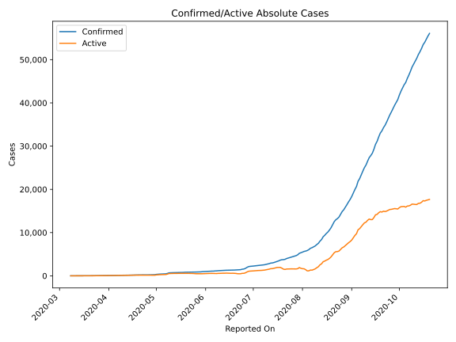
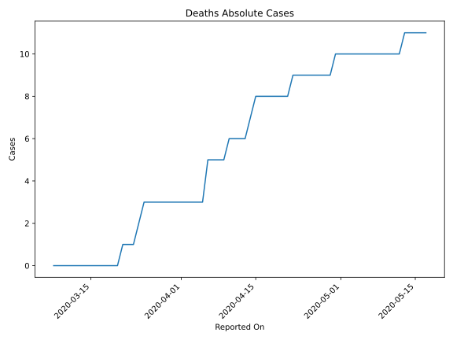
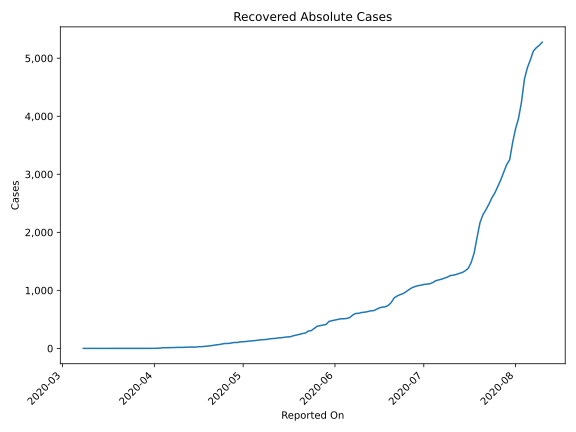
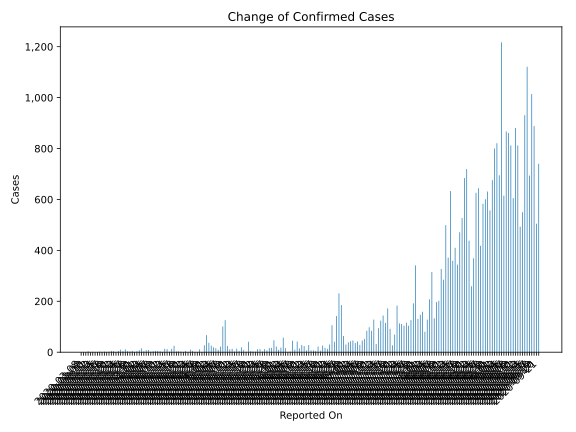
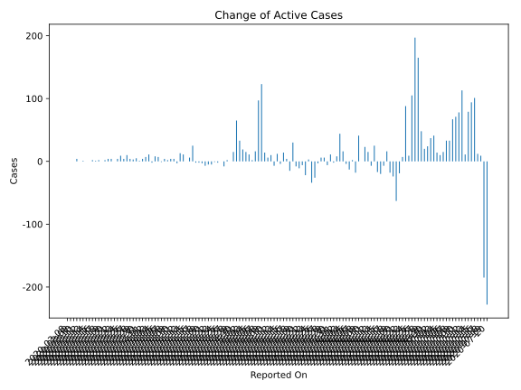
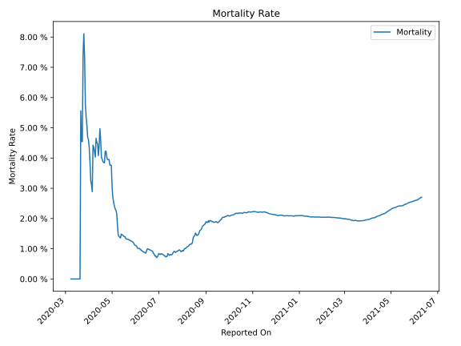

# Country Figures: Time Series for Paraguay 

| Reported On | Confirmed | Deaths | Recovered | Active | Mortality | &Delta; Confirmed | &Delta; Deaths | &Delta; Recovered | &Delta; Active | % Active of Population |
|-------------|-----------|--------|-----------|--------|-----------|-------------------|----------------|-------------------|----------------|------------------------|
| 2020-05-08 | 563 | 10 | 152 | 401 |  1.78 %  | 101 | 0 | 4 | 97 |  0.006 %  | 
| 2020-05-07 | 462 | 10 | 148 | 304 |  2.16 %  | 22 | 0 | 6 | 16 |  0.004 %  | 
| 2020-05-06 | 440 | 10 | 142 | 288 |  2.27 %  | 9 | 0 | 7 | 2 |  0.004 %  | 
| 2020-05-05 | 431 | 10 | 135 | 286 |  2.32 %  | 16 | 0 | 5 | 11 |  0.004 %  | 
| 2020-05-04 | 415 | 10 | 130 | 275 |  2.41 %  | 19 | 0 | 4 | 15 |  0.004 %  | 
| 2020-05-03 | 396 | 10 | 126 | 260 |  2.53 %  | 26 | 0 | 7 | 19 |  0.004 %  | 
| 2020-05-02 | 370 | 10 | 119 | 241 |  2.70 %  | 37 | 0 | 4 | 33 |  0.003 %  | 
| 2020-05-01 | 333 | 10 | 115 | 208 |  3.00 %  | 67 | 0 | 2 | 65 |  0.003 %  | 
| 2020-04-30 | 266 | 10 | 113 | 143 |  3.76 %  | 27 | 1 | 11 | 15 |  0.002 %  | 
| 2020-04-29 | 239 | 9 | 102 | 128 |  3.77 %  | 0 | 0 | 0 | 0 |  0.002 %  | 
| 2020-04-28 | 239 | 9 | 102 | 128 |  3.77 %  | 11 | 0 | 9 | 2 |  0.002 %  | 
| 2020-04-27 | 228 | 9 | 93 | 126 |  3.95 %  | 0 | 0 | 8 | -8 |  0.002 %  | 
| 2020-04-26 | 228 | 9 | 85 | 134 |  3.95 %  | 0 | 0 | 0 | 0 |  0.002 %  | 
| 2020-04-25 | 228 | 9 | 85 | 134 |  3.95 %  | 5 | 0 | 7 | -2 |  0.002 %  | 
| 2020-04-24 | 223 | 9 | 78 | 136 |  4.04 %  | 10 | 0 | 11 | -1 |  0.002 %  | 
| 2020-04-23 | 213 | 9 | 67 | 137 |  4.23 %  | 0 | 0 | 5 | -5 |  0.002 %  | 
| 2020-04-22 | 213 | 9 | 62 | 142 |  4.23 %  | 5 | 1 | 9 | -5 |  0.002 %  | 
| 2020-04-21 | 208 | 8 | 53 | 147 |  3.85 %  | 0 | 0 | 7 | -7 |  0.002 %  | 
| 2020-04-20 | 208 | 8 | 46 | 154 |  3.85 %  | 2 | 0 | 5 | -3 |  0.002 %  | 
| 2020-04-19 | 206 | 8 | 41 | 157 |  3.88 %  | 4 | 0 | 6 | -2 |  0.002 %  | 
| 2020-04-18 | 202 | 8 | 35 | 159 |  3.96 %  | 3 | 0 | 5 | -2 |  0.002 %  | 
| 2020-04-17 | 199 | 8 | 30 | 161 |  4.02 %  | 25 | 0 | 0 | 25 |  0.002 %  | 
| 2020-04-16 | 174 | 8 | 30 | 136 |  4.60 %  | 13 | 0 | 7 | 6 |  0.002 %  | 
| 2020-04-15 | 161 | 8 | 23 | 130 |  4.97 %  | 2 | 1 | 1 | 0 |  0.002 %  | 
| 2020-04-14 | 159 | 7 | 22 | 130 |  4.40 %  | 12 | 1 | 0 | 11 |  0.002 %  | 
| 2020-04-13 | 147 | 6 | 22 | 119 |  4.08 %  | 13 | 0 | 0 | 13 |  0.002 %  | 
| 2020-04-12 | 134 | 6 | 22 | 106 |  4.48 %  | 1 | 0 | 4 | -3 |  0.002 %  | 
| 2020-04-11 | 133 | 6 | 18 | 109 |  4.51 %  | 4 | 0 | 0 | 4 |  0.002 %  | 
| 2020-04-10 | 129 | 6 | 18 | 105 |  4.65 %  | 5 | 1 | 0 | 4 |  0.002 %  | 
| 2020-04-09 | 124 | 5 | 18 | 101 |  4.03 %  | 5 | 0 | 3 | 2 |  0.001 %  | 
| 2020-04-08 | 119 | 5 | 15 | 99 |  4.20 %  | 4 | 0 | 0 | 4 |  0.001 %  | 
| 2020-04-07 | 115 | 5 | 15 | 95 |  4.35 %  | 2 | 0 | 3 | -1 |  0.001 %  | 
| 2020-04-06 | 113 | 5 | 12 | 96 |  4.42 %  | 9 | 2 | 0 | 7 |  0.001 %  | 
| 2020-04-05 | 104 | 3 | 12 | 89 |  2.88 %  | 8 | 0 | 0 | 8 |  0.001 %  | 
| 2020-04-04 | 96 | 3 | 12 | 81 |  3.12 %  | 4 | 0 | 6 | -2 |  0.001 %  | 
| 2020-04-03 | 92 | 3 | 6 | 83 |  3.26 %  | 15 | 0 | 4 | 11 |  0.001 %  | 
| 2020-04-02 | 77 | 3 | 2 | 72 |  3.90 %  | 8 | 0 | 1 | 7 |  0.001 %  | 
| 2020-04-01 | 69 | 3 | 1 | 65 |  4.35 %  | 4 | 0 | 0 | 4 |  0.001 %  | 
| 2020-03-31 | 65 | 3 | 1 | 61 |  4.62 %  | 1 | 0 | 0 | 1 |  0.001 %  | 
| 2020-03-30 | 64 | 3 | 1 | 60 |  4.69 %  | 5 | 0 | 0 | 5 |  0.001 %  | 
| 2020-03-29 | 59 | 3 | 1 | 55 |  5.08 %  | 3 | 0 | 0 | 3 |  0.001 %  | 
| 2020-03-28 | 56 | 3 | 1 | 52 |  5.36 %  | 4 | 0 | 0 | 4 |  0.001 %  | 
| 2020-03-27 | 52 | 3 | 1 | 48 |  5.77 %  | 11 | 0 | 1 | 10 |  0.001 %  | 
| 2020-03-26 | 41 | 3 | 0 | 38 |  7.32 %  | 4 | 0 | 0 | 4 |  0.001 %  | 
| 2020-03-25 | 37 | 3 | 0 | 34 |  8.11 %  | 10 | 1 | 0 | 9 |  0.000 %  | 
| 2020-03-24 | 27 | 2 | 0 | 25 |  7.41 %  | 5 | 1 | 0 | 4 |  0.000 %  | 
| 2020-03-23 | 22 | 1 | 0 | 21 |  4.55 %  | 0 | 0 | 0 | 0 |  0.000 %  | 
| 2020-03-22 | 22 | 1 | 0 | 21 |  4.55 %  | 4 | 0 | 0 | 4 |  0.000 %  | 
| 2020-03-21 | 18 | 1 | 0 | 17 |  5.56 %  | 5 | 1 | 0 | 4 |  0.000 %  | 
| 2020-03-20 | 13 | 0 | 0 | 13 |  None  | 2 | 0 | 0 | 2 |  0.000 %  | 
| 2020-03-19 | 11 | 0 | 0 | 11 |  None  | 0 | 0 | 0 | 0 |  0.000 %  | 
| 2020-03-18 | 11 | 0 | 0 | 11 |  None  | 2 | 0 | 0 | 2 |  0.000 %  | 
| 2020-03-17 | 9 | 0 | 0 | 9 |  None  | 1 | 0 | 0 | 1 |  0.000 %  | 
| 2020-03-16 | 8 | 0 | 0 | 8 |  None  | 2 | 0 | 0 | 2 |  0.000 %  | 
| 2020-03-15 | 6 | 0 | 0 | 6 |  None  | 0 | 0 | 0 | 0 |  0.000 %  | 
| 2020-03-14 | 6 | 0 | 0 | 6 |  None  | 0 | 0 | 0 | 0 |  0.000 %  | 
| 2020-03-13 | 6 | 0 | 0 | 6 |  None  | 1 | 0 | 0 | 1 |  0.000 %  | 
| 2020-03-12 | 5 | 0 | 0 | 5 |  None  | 0 | 0 | 0 | 0 |  0.000 %  | 
| 2020-03-11 | 5 | 0 | 0 | 5 |  None  | 4 | 0 | 0 | 4 |  0.000 %  | 
| 2020-03-10 | 1 | 0 | 0 | 1 |  None  | 0 | 0 | 0 | 0 |  0.000 %  | 
| 2020-03-09 | 1 | 0 | 0 | 1 |  None  | 0 | 0 | 0 | 0 |  0.000 %  | 
| 2020-03-08 | 1 | 0 | 0 | 1 |  None  | None | None | None | None |  0.000 %  | 

