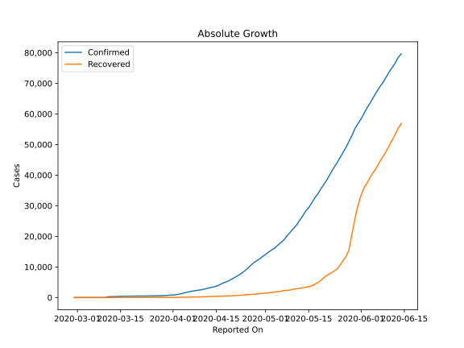
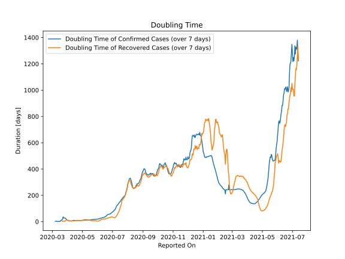

# Country Figures: Doubling Time of Infections for Qatar 

The doubling time below are calculated based on
* an exponential growth assumption
* for time difference of past seven (7) days.
The doubling time's unit is "days".

The first doubling time indicates the increase of confirmed (infected)
cases. There, the *higher* the number is, the better is to take control
of the disease.

The second doubling time indicates the increase of recovered (healed)
cases. There, the *lower* the number is, the better it is to take
control of the disease.

| Reported On | Confirmed | Doubling Time (Confirmed) | Recovered | Doubling Time (Recovered) |
|-------------|-----------|---------------------------|-----------|---------------------------|
| 2020-04-28 | 11921 |  8.4 days  | 1134 |  8.3 days  | 
| 2020-04-27 | 11244 |  8.1 days  | 1066 |  7.8 days  | 
| 2020-04-26 | 10287 |  8.0 days  | 1012 |  7.6 days  | 
| 2020-04-25 | 9358 |  8.1 days  | 929 |  8.4 days  | 
| 2020-04-24 | 8525 |  8.4 days  | 809 |  9.1 days  | 
| 2020-04-23 | 7764 |  7.9 days  | 750 |  8.5 days  | 
| 2020-04-22 | 7141 |  7.8 days  | 689 |  9.5 days  | 
| 2020-04-21 | 6533 |  7.9 days  | 614 |  10.1 days  | 
| 2020-04-20 | 6015 |  8.1 days  | 555 |  9.9 days  | 
| 2020-04-19 | 5448 |  8.4 days  | 518 |  8.0 days  | 
| 2020-04-18 | 5008 |  8.3 days  | 510 |  7.0 days  | 
| 2020-04-17 | 4663 |  8.2 days  | 464 |  7.1 days  | 
| 2020-04-16 | 4103 |  9.2 days  | 415 |  7.3 days  | 
| 2020-04-15 | 3711 |  9.7 days  | 406 |  6.2 days  | 
| 2020-04-14 | 3428 |  9.8 days  | 373 |  5.7 days  | 
| 2020-04-13 | 3231 |  8.9 days  | 334 |  5.5 days  | 
| 2020-04-12 | 2979 |  8.2 days  | 275 |  6.4 days  | 
| 2020-04-11 | 2728 |  7.1 days  | 247 |  6.3 days  | 
| 2020-04-10 | 2512 |  6.1 days  | 227 |  5.8 days  | 
| 2020-04-09 | 2376 |  5.6 days  | 206 |  5.0 days  | 
| 2020-04-08 | 2210 |  5.3 days  | 178 |  5.6 days  | 
| 2020-04-07 | 2057 |  5.3 days  | 150 |  5.8 days  | 
| 2020-04-06 | 1832 |  5.3 days  | 131 |  5.5 days  | 
| 2020-04-05 | 1604 |  5.6 days  | 123 |  5.5 days  | 
| 2020-04-04 | 1325 |  6.3 days  | 109 |  5.8 days  | 
| 2020-04-03 | 1075 |  7.8 days  | 93 |  6.6 days  | 
| 2020-04-02 | 949 |  9.2 days  | 72 |  9.8 days  | 
| 2020-04-01 | 835 |  11.3 days  | 71 |  9.2 days  | 
| 2020-03-31 | 781 |  12.6 days  | 62 |  12.1 days  | 
| 2020-03-30 | 693 |  15.3 days  | 51 |  11.5 days  | 
| 2020-03-29 | 634 |  19.8 days  | 48 |  13.3 days  | 
| 2020-03-28 | 590 |  24.1 days  | 45 |  9.8 days  | 
| 2020-03-27 | 562 |  27.5 days  | 43 |  3.7 days  | 
| 2020-03-26 | 549 |  27.8 days  | 43 |  2.4 days  | 
| 2020-03-25 | 537 |  28.5 days  | 41 |  2.4 days  | 
| 2020-03-24 | 526 |  27.2 days  | 41 |  2.4 days  | 
| 2020-03-23 | 501 |  37.1 days  | 33 |  2.6 days  | 
| 2020-03-22 | 494 |  23.6 days  | 33 |  2.6 days  | 
| 2020-03-21 | 481 |  14.0 days  | 27 |  2.9 days  | 
| 2020-03-20 | 470 |  13.0 days  | 10 |  None  | 
| 2020-03-19 | 460 |  9.0 days  | 4 |  None  | 
| 2020-03-18 | 452 |  9.2 days  | 4 |  None  | 
| 2020-03-17 | 439 |  2.0 days  | 4 |  None  | 
| 2020-03-16 | 439 |  1.8 days  | 4 |  None  | 
| 2020-03-15 | 401 |  1.8 days  | 4 |  None  | 
| 2020-03-14 | 337 |  1.6 days  | 4 |  None  | 
| 2020-03-13 | 320 |  1.6 days  | 0 |  None  | 
| 2020-03-12 | 262 |  1.7 days  | 0 |  None  | 
| 2020-03-11 | 262 |  1.7 days  | 0 |  None  | 
| 2020-03-10 | 24 |  4.3 days  | 0 |  None  | 
| 2020-03-09 | 18 |  3.0 days  | 0 |  None  | 
| 2020-03-08 | 15 |  3.3 days  | 0 |  None  | 
| 2020-03-07 | 8 |  2.7 days  | 0 |  None  | 
| 2020-03-06 | 8 |  None  | 0 |  None  | 
| 2020-03-05 | 8 |  None  | 0 |  None  | 
| 2020-03-04 | 8 |  None  | 0 |  None  | 
| 2020-03-03 | 7 |  None  | 0 |  None  | 
| 2020-03-02 | 3 |  None  | 0 |  None  | 
| 2020-03-01 | 3 |  None  | 0 |  None  | 
| 2020-02-29 | 1 |  None  | 0 |  None  | 

