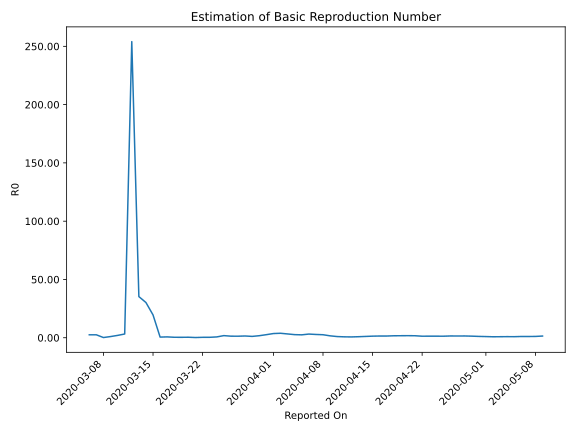

# Country Figures: Time Series for Basic Reproduction Number of Qatar 

| Reported On | &Delta; Confirmed | Total &Delta; Confirmed First Interval | Total &Delta; Confirmed Second Interval | Estimated Basic Reproduction Number R0 | 
|-------------|-------------------|----------------------------------------|-----------------------------------------|---------------------------------------------------|
| 2020-05-01 | 687 |  3122  |  3146  |  0.99  | 
| 2020-04-30 | 845 |  3206  |  2825  |  1.13  | 
| 2020-04-29 | 643 |  3396  |  2510  |  1.35  | 
| 2020-04-28 | 677 |  3480  |  2316  |  1.50  | 
| 2020-04-27 | 957 |  3146  |  2133  |  1.47  | 
| 2020-04-26 | 929 |  2825  |  1870  |  1.51  | 
| 2020-04-25 | 833 |  2510  |  1912  |  1.31  | 
| 2020-04-24 | 761 |  2316  |  1737  |  1.33  | 
| 2020-04-23 | 623 |  2133  |  1580  |  1.35  | 
| 2020-04-22 | 608 |  1870  |  1432  |  1.31  | 
| 2020-04-21 | 518 |  1912  |  1124  |  1.70  | 
| 2020-04-20 | 567 |  1737  |  983  |  1.77  | 
| 2020-04-19 | 440 |  1580  |  916  |  1.72  | 
| 2020-04-18 | 345 |  1432  |  855  |  1.67  | 
| 2020-04-17 | 560 |  1124  |  769  |  1.46  | 
| 2020-04-16 | 392 |  983  |  671  |  1.46  | 
| 2020-04-15 | 283 |  916  |  680  |  1.35  | 
| 2020-04-14 | 197 |  855  |  772  |  1.11  | 
| 2020-04-13 | 252 |  769  |  885  |  0.87  | 
| 2020-04-12 | 251 |  671  |  982  |  0.68  | 
| 2020-04-11 | 216 |  680  |  883  |  0.77  | 
| 2020-04-10 | 136 |  772  |  769  |  1.00  | 
| 2020-04-09 | 166 |  885  |  544  |  1.63  | 
| 2020-04-08 | 153 |  982  |  382  |  2.57  | 
| 2020-04-07 | 225 |  883  |  315  |  2.80  | 
| 2020-04-06 | 228 |  769  |  245  |  3.14  | 
| 2020-04-05 | 279 |  544  |  219  |  2.48  | 
| 2020-04-04 | 250 |  382  |  144  |  2.65  | 
| 2020-04-03 | 126 |  315  |  97  |  3.25  | 
| 2020-04-02 | 114 |  245  |  64  |  3.83  | 
| 2020-04-01 | 54 |  219  |  61  |  3.59  | 
| 2020-03-31 | 88 |  144  |  55  |  2.62  | 
| 2020-03-30 | 59 |  97  |  56  |  1.73  | 
| 2020-03-29 | 44 |  64  |  56  |  1.14  | 
| 2020-03-28 | 28 |  61  |  41  |  1.49  | 
| 2020-03-27 | 13 |  55  |  42  |  1.31  | 
| 2020-03-26 | 12 |  56  |  42  |  1.33  | 
| 2020-03-25 | 11 |  56  |  31  |  1.81  | 
| 2020-03-24 | 25 |  41  |  59  |  0.69  | 
| 2020-03-23 | 7 |  42  |  115  |  0.37  | 
| 2020-03-22 | 13 |  42  |  119  |  0.35  | 
| 2020-03-21 | 11 |  31  |  177  |  0.18  | 
| 2020-03-20 | 10 |  59  |  139  |  0.42  | 
| 2020-03-19 | 8 |  115  |  313  |  0.37  | 
| 2020-03-18 | 13 |  119  |  302  |  0.39  | 
| 2020-03-17 | 0 |  177  |  247  |  0.72  | 
| 2020-03-16 | 38 |  139  |  254  |  0.55  | 
| 2020-03-15 | 64 |  313  |  16  |  19.56  | 
| 2020-03-14 | 17 |  302  |  10  |  30.20  | 
| 2020-03-13 | 58 |  247  |  7  |  35.29  | 
| 2020-03-12 | 0 |  254  |  1  |  254.00  | 
| 2020-03-11 | 238 |  16  |  5  |  3.20  | 
| 2020-03-10 | 6 |  10  |  5  |  2.00  | 
| 2020-03-09 | 3 |  7  |  7  |  1.00  | 
| 2020-03-08 | 7 |  1  |  6  |  0.17  | 
| 2020-03-07 | 0 |  5  |  2  |  2.50  | 
| 2020-03-06 | 0 |  5  |  2  |  2.50  | 
| 2020-03-05 | 0 |  7  |  None  |  None  | 
| 2020-03-04 | 1 |  6  |  None  |  None  | 
| 2020-03-03 | 4 |  2  |  None  |  None  | 
| 2020-03-02 | 0 |  2  |  None  |  None  | 
| 2020-03-01 | 2 |  None  |  None  |  None  | 
| 2020-02-29 | None |  None  |  None  |  None  | 

