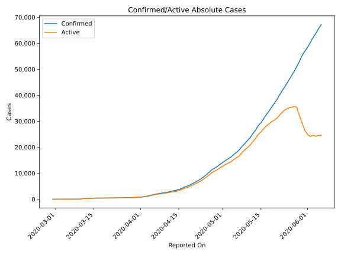
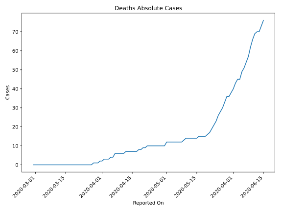
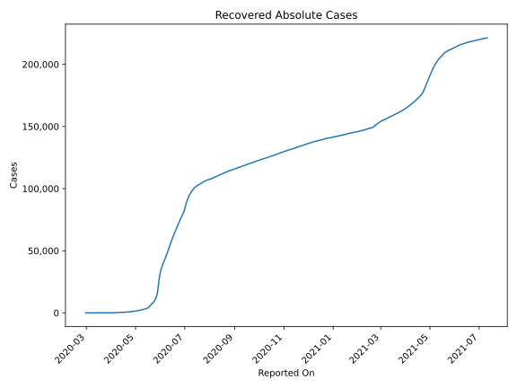
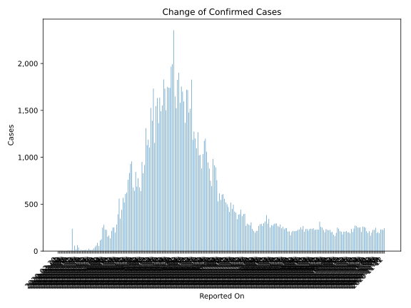
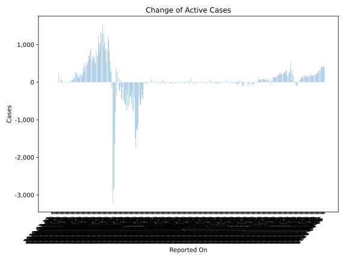
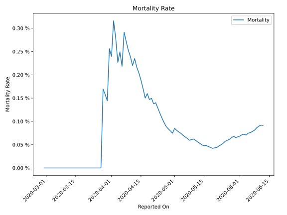

# Country Figures: Time Series for Qatar 

| Reported On | Confirmed | Deaths | Recovered | Active | Mortality | &Delta; Confirmed | &Delta; Deaths | &Delta; Recovered | &Delta; Active | % Active of Population |
|-------------|-----------|--------|-----------|--------|-----------|-------------------|----------------|-------------------|----------------|------------------------|
| 2020-05-06 | 17972 | 12 | 2070 | 15890 |  0.07 %  | 830 | 0 | 146 | 684 |  0.571 %  | 
| 2020-05-05 | 17142 | 12 | 1924 | 15206 |  0.07 %  | 951 | 0 | 114 | 837 |  0.547 %  | 
| 2020-05-04 | 16191 | 12 | 1810 | 14369 |  0.07 %  | 640 | 0 | 146 | 494 |  0.517 %  | 
| 2020-05-03 | 15551 | 12 | 1664 | 13875 |  0.08 %  | 679 | 0 | 130 | 549 |  0.499 %  | 
| 2020-05-02 | 14872 | 12 | 1534 | 13326 |  0.08 %  | 776 | 0 | 98 | 678 |  0.479 %  | 
| 2020-05-01 | 14096 | 12 | 1436 | 12648 |  0.09 %  | 687 | 2 | 64 | 621 |  0.455 %  | 
| 2020-04-30 | 13409 | 10 | 1372 | 12027 |  0.07 %  | 845 | 0 | 129 | 716 |  0.432 %  | 
| 2020-04-29 | 12564 | 10 | 1243 | 11311 |  0.08 %  | 643 | 0 | 109 | 534 |  0.407 %  | 
| 2020-04-28 | 11921 | 10 | 1134 | 10777 |  0.08 %  | 677 | 0 | 68 | 609 |  0.387 %  | 
| 2020-04-27 | 11244 | 10 | 1066 | 10168 |  0.09 %  | 957 | 0 | 54 | 903 |  0.366 %  | 
| 2020-04-26 | 10287 | 10 | 1012 | 9265 |  0.10 %  | 929 | 0 | 83 | 846 |  0.333 %  | 
| 2020-04-25 | 9358 | 10 | 929 | 8419 |  0.11 %  | 833 | 0 | 120 | 713 |  0.303 %  | 
| 2020-04-24 | 8525 | 10 | 809 | 7706 |  0.12 %  | 761 | 0 | 59 | 702 |  0.277 %  | 
| 2020-04-23 | 7764 | 10 | 750 | 7004 |  0.13 %  | 623 | 0 | 61 | 562 |  0.252 %  | 
| 2020-04-22 | 7141 | 10 | 689 | 6442 |  0.14 %  | 608 | 1 | 75 | 532 |  0.232 %  | 
| 2020-04-21 | 6533 | 9 | 614 | 5910 |  0.14 %  | 518 | 0 | 59 | 459 |  0.212 %  | 
| 2020-04-20 | 6015 | 9 | 555 | 5451 |  0.15 %  | 567 | 1 | 37 | 529 |  0.196 %  | 
| 2020-04-19 | 5448 | 8 | 518 | 4922 |  0.15 %  | 440 | 0 | 8 | 432 |  0.177 %  | 
| 2020-04-18 | 5008 | 8 | 510 | 4490 |  0.16 %  | 345 | 1 | 46 | 298 |  0.161 %  | 
| 2020-04-17 | 4663 | 7 | 464 | 4192 |  0.15 %  | 560 | 0 | 49 | 511 |  0.151 %  | 
| 2020-04-16 | 4103 | 7 | 415 | 3681 |  0.17 %  | 392 | 0 | 9 | 383 |  0.132 %  | 
| 2020-04-15 | 3711 | 7 | 406 | 3298 |  0.19 %  | 283 | 0 | 33 | 250 |  0.119 %  | 
| 2020-04-14 | 3428 | 7 | 373 | 3048 |  0.20 %  | 197 | 0 | 39 | 158 |  0.110 %  | 
| 2020-04-13 | 3231 | 7 | 334 | 2890 |  0.22 %  | 252 | 0 | 59 | 193 |  0.104 %  | 
| 2020-04-12 | 2979 | 7 | 275 | 2697 |  0.23 %  | 251 | 1 | 28 | 222 |  0.097 %  | 
| 2020-04-11 | 2728 | 6 | 247 | 2475 |  0.22 %  | 216 | 0 | 20 | 196 |  0.089 %  | 
| 2020-04-10 | 2512 | 6 | 227 | 2279 |  0.24 %  | 136 | 0 | 21 | 115 |  0.082 %  | 
| 2020-04-09 | 2376 | 6 | 206 | 2164 |  0.25 %  | 166 | 0 | 28 | 138 |  0.078 %  | 
| 2020-04-08 | 2210 | 6 | 178 | 2026 |  0.27 %  | 153 | 0 | 28 | 125 |  0.073 %  | 
| 2020-04-07 | 2057 | 6 | 150 | 1901 |  0.29 %  | 225 | 2 | 19 | 204 |  0.068 %  | 
| 2020-04-06 | 1832 | 4 | 131 | 1697 |  0.22 %  | 228 | 0 | 8 | 220 |  0.061 %  | 
| 2020-04-05 | 1604 | 4 | 123 | 1477 |  0.25 %  | 279 | 1 | 14 | 264 |  0.053 %  | 
| 2020-04-04 | 1325 | 3 | 109 | 1213 |  0.23 %  | 250 | 0 | 16 | 234 |  0.044 %  | 
| 2020-04-03 | 1075 | 3 | 93 | 979 |  0.28 %  | 126 | 0 | 21 | 105 |  0.035 %  | 
| 2020-04-02 | 949 | 3 | 72 | 874 |  0.32 %  | 114 | 1 | 1 | 112 |  0.031 %  | 
| 2020-04-01 | 835 | 2 | 71 | 762 |  0.24 %  | 54 | 0 | 9 | 45 |  0.027 %  | 
| 2020-03-31 | 781 | 2 | 62 | 717 |  0.26 %  | 88 | 1 | 11 | 76 |  0.026 %  | 
| 2020-03-30 | 693 | 1 | 51 | 641 |  0.14 %  | 59 | 0 | 3 | 56 |  0.023 %  | 
| 2020-03-29 | 634 | 1 | 48 | 585 |  0.16 %  | 44 | 0 | 3 | 41 |  0.021 %  | 
| 2020-03-28 | 590 | 1 | 45 | 544 |  0.17 %  | 28 | 1 | 2 | 25 |  0.020 %  | 
| 2020-03-27 | 562 | 0 | 43 | 519 |  None  | 13 | 0 | 0 | 13 |  0.019 %  | 
| 2020-03-26 | 549 | 0 | 43 | 506 |  None  | 12 | 0 | 2 | 10 |  0.018 %  | 
| 2020-03-25 | 537 | 0 | 41 | 496 |  None  | 11 | 0 | 0 | 11 |  0.018 %  | 
| 2020-03-24 | 526 | 0 | 41 | 485 |  None  | 25 | 0 | 8 | 17 |  0.017 %  | 
| 2020-03-23 | 501 | 0 | 33 | 468 |  None  | 7 | 0 | 0 | 7 |  0.017 %  | 
| 2020-03-22 | 494 | 0 | 33 | 461 |  None  | 13 | 0 | 6 | 7 |  0.017 %  | 
| 2020-03-21 | 481 | 0 | 27 | 454 |  None  | 11 | 0 | 17 | -6 |  0.016 %  | 
| 2020-03-20 | 470 | 0 | 10 | 460 |  None  | 10 | 0 | 6 | 4 |  0.017 %  | 
| 2020-03-19 | 460 | 0 | 4 | 456 |  None  | 8 | 0 | 0 | 8 |  0.016 %  | 
| 2020-03-18 | 452 | 0 | 4 | 448 |  None  | 13 | 0 | 0 | 13 |  0.016 %  | 
| 2020-03-17 | 439 | 0 | 4 | 435 |  None  | 0 | 0 | 0 | 0 |  0.016 %  | 
| 2020-03-16 | 439 | 0 | 4 | 435 |  None  | 38 | 0 | 0 | 38 |  0.016 %  | 
| 2020-03-15 | 401 | 0 | 4 | 397 |  None  | 64 | 0 | 0 | 64 |  0.014 %  | 
| 2020-03-14 | 337 | 0 | 4 | 333 |  None  | 17 | 0 | 4 | 13 |  0.012 %  | 
| 2020-03-13 | 320 | 0 | 0 | 320 |  None  | 58 | 0 | 0 | 58 |  0.012 %  | 
| 2020-03-12 | 262 | 0 | 0 | 262 |  None  | 0 | 0 | 0 | 0 |  0.009 %  | 
| 2020-03-11 | 262 | 0 | 0 | 262 |  None  | 238 | 0 | 0 | 238 |  0.009 %  | 
| 2020-03-10 | 24 | 0 | 0 | 24 |  None  | 6 | 0 | 0 | 6 |  0.001 %  | 
| 2020-03-09 | 18 | 0 | 0 | 18 |  None  | 3 | 0 | 0 | 3 |  0.001 %  | 
| 2020-03-08 | 15 | 0 | 0 | 15 |  None  | 7 | 0 | 0 | 7 |  0.001 %  | 
| 2020-03-07 | 8 | 0 | 0 | 8 |  None  | 0 | 0 | 0 | 0 |  0.000 %  | 
| 2020-03-06 | 8 | 0 | 0 | 8 |  None  | 0 | 0 | 0 | 0 |  0.000 %  | 
| 2020-03-05 | 8 | 0 | 0 | 8 |  None  | 0 | 0 | 0 | 0 |  0.000 %  | 
| 2020-03-04 | 8 | 0 | 0 | 8 |  None  | 1 | 0 | 0 | 1 |  0.000 %  | 
| 2020-03-03 | 7 | 0 | 0 | 7 |  None  | 4 | 0 | 0 | 4 |  0.000 %  | 
| 2020-03-02 | 3 | 0 | 0 | 3 |  None  | 0 | 0 | 0 | 0 |  0.000 %  | 
| 2020-03-01 | 3 | 0 | 0 | 3 |  None  | 2 | 0 | 0 | 2 |  0.000 %  | 
| 2020-02-29 | 1 | 0 | 0 | 1 |  None  | None | None | None | None |  0.000 %  | 

