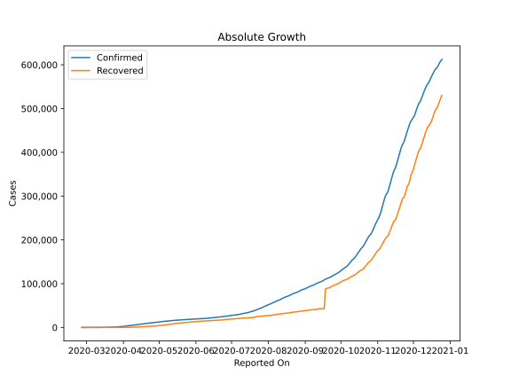
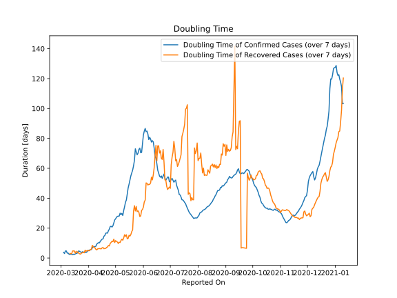

# Country Figures: Doubling Time of Infections for Romania 

The doubling time below are calculated based on
* an exponential growth assumption
* for time difference of past seven (7) days.
The doubling time's unit is "days".

The first doubling time indicates the increase of confirmed (infected)
cases. There, the *higher* the number is, the better is to take control
of the disease.

The second doubling time indicates the increase of recovered (healed)
cases. There, the *lower* the number is, the better it is to take
control of the disease.

| Reported On | Confirmed | Doubling Time (Confirmed) | Recovered | Doubling Time (Recovered) |
|-------------|-----------|---------------------------|-----------|---------------------------|
| 2020-04-15 | 7216 |  12.0 days  | 1217 |  6.2 days  | 
| 2020-04-14 | 6879 |  11.3 days  | 1051 |  6.2 days  | 
| 2020-04-13 | 6633 |  10.2 days  | 914 |  6.3 days  | 
| 2020-04-12 | 6300 |  10.3 days  | 852 |  6.2 days  | 
| 2020-04-11 | 5990 |  9.9 days  | 758 |  6.2 days  | 
| 2020-04-10 | 5467 |  9.3 days  | 729 |  5.5 days  | 
| 2020-04-09 | 5202 |  7.9 days  | 647 |  5.8 days  | 
| 2020-04-08 | 4761 |  7.7 days  | 528 |  6.9 days  | 
| 2020-04-07 | 4417 |  7.5 days  | 460 |  6.9 days  | 
| 2020-04-06 | 4057 |  7.8 days  | 406 |  7.6 days  | 
| 2020-04-05 | 3864 |  6.8 days  | 374 |  8.5 days  | 
| 2020-04-04 | 3613 |  5.7 days  | 329 |  6.0 days  | 
| 2020-04-03 | 3183 |  5.7 days  | 283 |  5.7 days  | 
| 2020-04-02 | 2738 |  5.3 days  | 267 |  5.0 days  | 
| 2020-04-01 | 2460 |  5.2 days  | 252 |  4.9 days  | 
| 2020-03-31 | 2245 |  5.0 days  | 220 |  5.1 days  | 
| 2020-03-30 | 2109 |  4.1 days  | 209 |  5.0 days  | 
| 2020-03-29 | 1815 |  3.7 days  | 206 |  4.5 days  | 
| 2020-03-28 | 1452 |  3.9 days  | 139 |  5.3 days  | 
| 2020-03-27 | 1292 |  3.7 days  | 115 |  3.5 days  | 
| 2020-03-26 | 1029 |  4.0 days  | 94 |  4.0 days  | 
| 2020-03-25 | 906 |  4.2 days  | 86 |  3.5 days  | 
| 2020-03-24 | 794 |  3.7 days  | 79 |  3.4 days  | 
| 2020-03-23 | 576 |  4.1 days  | 73 |  2.6 days  | 
| 2020-03-22 | 433 |  4.4 days  | 64 |  2.8 days  | 
| 2020-03-21 | 367 |  4.8 days  | 52 |  3.1 days  | 
| 2020-03-20 | 308 |  4.2 days  | 25 |  4.1 days  | 
| 2020-03-19 | 277 |  3.1 days  | 25 |  3.7 days  | 
| 2020-03-18 | 260 |  3.1 days  | 19 |  4.5 days  | 
| 2020-03-17 | 184 |  2.8 days  | 16 |  3.2 days  | 
| 2020-03-16 | 158 |  2.4 days  | 9 |  4.8 days  | 
| 2020-03-15 | 131 |  2.6 days  | 9 |  4.8 days  | 
| 2020-03-14 | 123 |  2.2 days  | 9 |  4.8 days  | 
| 2020-03-13 | 89 |  2.4 days  | 7 |  2.8 days  | 
| 2020-03-12 | 49 |  2.6 days  | 6 |  3.0 days  | 
| 2020-03-11 | 45 |  2.3 days  | 6 |  3.0 days  | 
| 2020-03-10 | 25 |  2.6 days  | 3 |  None  | 
| 2020-03-09 | 15 |  3.3 days  | 3 |  None  | 
| 2020-03-08 | 15 |  3.3 days  | 3 |  None  | 
| 2020-03-07 | 9 |  4.8 days  | 3 |  None  | 
| 2020-03-06 | 9 |  4.8 days  | 1 |  None  | 
| 2020-03-05 | 6 |  3.0 days  | 1 |  None  | 
| 2020-03-04 | 4 |  3.8 days  | 1 |  None  | 
| 2020-03-03 | 3 |  None  | 0 |  None  | 
| 2020-03-02 | 3 |  None  | 0 |  None  | 
| 2020-03-01 | 3 |  None  | 0 |  None  | 
| 2020-02-29 | 3 |  None  | 0 |  None  | 
| 2020-02-28 | 3 |  None  | 0 |  None  | 
| 2020-02-27 | 1 |  None  | 0 |  None  | 
| 2020-02-26 | 1 |  None  | 0 |  None  | 

