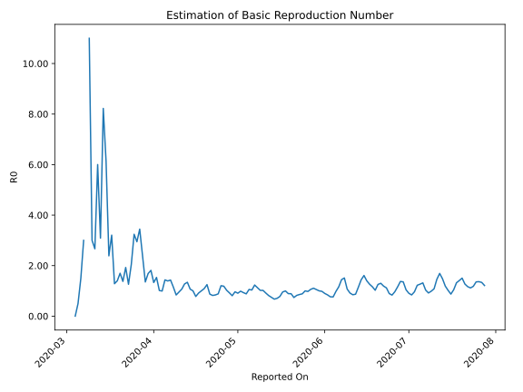

# Country Figures: Time Series for Basic Reproduction Number of Romania 

| Reported On | &Delta; Confirmed | Total &Delta; Confirmed First Interval | Total &Delta; Confirmed Second Interval | Estimated Basic Reproduction Number R0 | 
|-------------|-------------------|----------------------------------------|-----------------------------------------|---------------------------------------------------|
| 2020-05-02 | 165 |  1228  |  1243  |  0.99  | 
| 2020-05-01 | 327 |  1204  |  1326  |  0.91  | 
| 2020-04-30 | 262 |  1343  |  1393  |  0.96  | 
| 2020-04-29 | 362 |  1199  |  1481  |  0.81  | 
| 2020-04-28 | 277 |  1243  |  1350  |  0.92  | 
| 2020-04-27 | 303 |  1326  |  1292  |  1.03  | 
| 2020-04-26 | 401 |  1393  |  1175  |  1.19  | 
| 2020-04-25 | 218 |  1481  |  1229  |  1.21  | 
| 2020-04-24 | 321 |  1350  |  1530  |  0.88  | 
| 2020-04-23 | 386 |  1292  |  1539  |  0.84  | 
| 2020-04-22 | 468 |  1175  |  1434  |  0.82  | 
| 2020-04-21 | 306 |  1229  |  1407  |  0.87  | 
| 2020-04-20 | 190 |  1530  |  1226  |  1.25  | 
| 2020-04-19 | 328 |  1539  |  1412  |  1.09  | 
| 2020-04-18 | 351 |  1434  |  1431  |  1.00  | 
| 2020-04-17 | 360 |  1407  |  1539  |  0.91  | 
| 2020-04-16 | 491 |  1226  |  1573  |  0.78  | 
| 2020-04-15 | 337 |  1412  |  1410  |  1.00  | 
| 2020-04-14 | 246 |  1431  |  1338  |  1.07  | 
| 2020-04-13 | 333 |  1539  |  1148  |  1.34  | 
| 2020-04-12 | 310 |  1573  |  1234  |  1.27  | 
| 2020-04-11 | 523 |  1410  |  1319  |  1.07  | 
| 2020-04-10 | 265 |  1338  |  1404  |  0.95  | 
| 2020-04-09 | 441 |  1148  |  1368  |  0.84  | 
| 2020-04-08 | 344 |  1234  |  1074  |  1.15  | 
| 2020-04-07 | 360 |  1319  |  923  |  1.43  | 
| 2020-04-06 | 193 |  1404  |  1008  |  1.39  | 
| 2020-04-05 | 251 |  1368  |  953  |  1.44  | 
| 2020-04-04 | 430 |  1074  |  1080  |  0.99  | 
| 2020-04-03 | 445 |  923  |  909  |  1.02  | 
| 2020-04-02 | 278 |  1008  |  658  |  1.53  | 
| 2020-04-01 | 215 |  953  |  716  |  1.33  | 
| 2020-03-31 | 136 |  1080  |  596  |  1.81  | 
| 2020-03-30 | 294 |  909  |  539  |  1.69  | 
| 2020-03-29 | 363 |  658  |  486  |  1.35  | 
| 2020-03-28 | 160 |  716  |  299  |  2.39  | 
| 2020-03-27 | 263 |  596  |  173  |  3.45  | 
| 2020-03-26 | 123 |  539  |  183  |  2.95  | 
| 2020-03-25 | 112 |  486  |  150  |  3.24  | 
| 2020-03-24 | 218 |  299  |  146  |  2.05  | 
| 2020-03-23 | 143 |  173  |  137  |  1.26  | 
| 2020-03-22 | 66 |  183  |  95  |  1.93  | 
| 2020-03-21 | 59 |  150  |  109  |  1.38  | 
| 2020-03-20 | 31 |  146  |  86  |  1.70  | 
| 2020-03-19 | 17 |  137  |  98  |  1.40  | 
| 2020-03-18 | 76 |  95  |  74  |  1.28  | 
| 2020-03-17 | 26 |  109  |  34  |  3.21  | 
| 2020-03-16 | 27 |  86  |  36  |  2.39  | 
| 2020-03-15 | 8 |  98  |  16  |  6.12  | 
| 2020-03-14 | 34 |  74  |  9  |  8.22  | 
| 2020-03-13 | 40 |  34  |  11  |  3.09  | 
| 2020-03-12 | 4 |  36  |  6  |  6.00  | 
| 2020-03-11 | 20 |  16  |  6  |  2.67  | 
| 2020-03-10 | 10 |  9  |  3  |  3.00  | 
| 2020-03-09 | 0 |  11  |  1  |  11.00  | 
| 2020-03-08 | 6 |  6  |  None  |  None  | 
| 2020-03-07 | 0 |  6  |  2  |  3.00  | 
| 2020-03-06 | 3 |  3  |  2  |  1.50  | 
| 2020-03-05 | 2 |  1  |  2  |  0.50  | 
| 2020-03-04 | 1 |  None  |  2  |  None  | 
| 2020-03-03 | 0 |  2  |  None  |  None  | 
| 2020-03-02 | 0 |  2  |  None  |  None  | 
| 2020-03-01 | 0 |  2  |  None  |  None  | 
| 2020-02-29 | 0 |  2  |  None  |  None  | 
| 2020-02-28 | 2 |  None  |  None  |  None  | 
| 2020-02-27 | 0 |  None  |  None  |  None  | 
| 2020-02-26 | None |  None  |  None  |  None  | 

